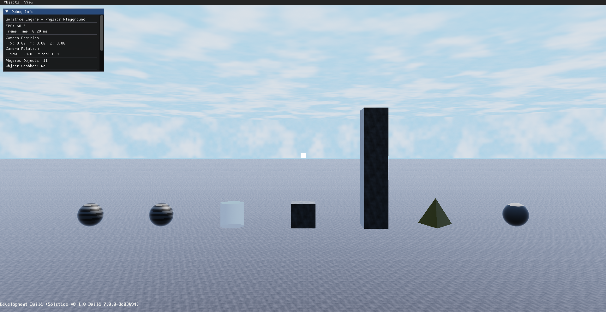
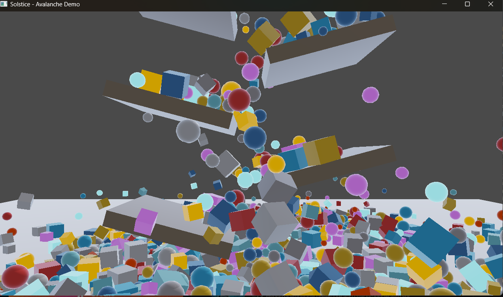
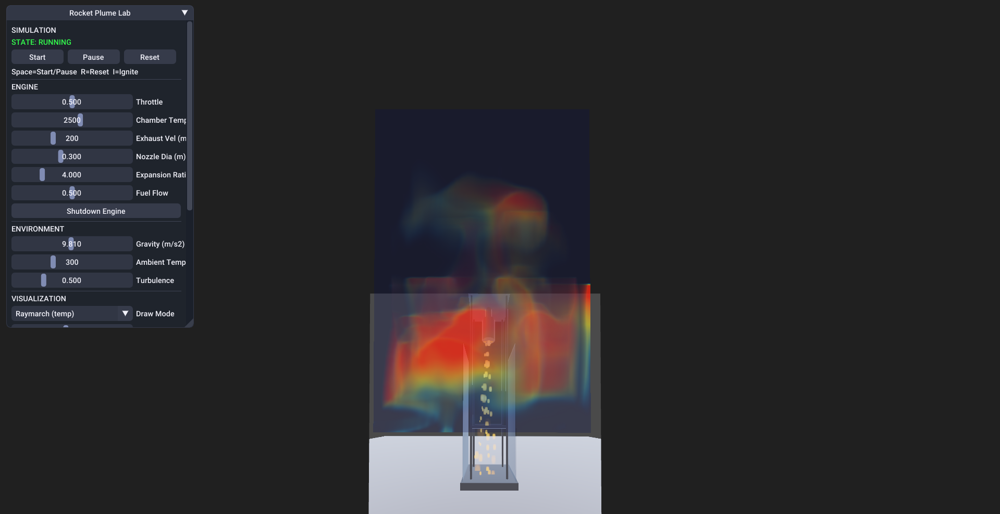

# Solstice

A CPU-first game engine for projects that want PS2-era constraints with modern throughput: low internal resolutions, baked or lightly dynamic lighting, and software rasterization, but with SIMD, SoA layouts, and job-style parallelism where it pays off. Optional GPU paths exist (bgfx), but the design assumes the interesting work often happens on the CPU.





## What you get

The tree is large. In practice Solstice bundles:

- **Rendering:** Tile-based software rasterizer, G-buffer–lite materials, frustum and software occlusion culling, BSP/octree, baked lightmaps plus a small number of dynamic lights, bitmask-style ray queries, upscaling and TAA, bloom, fog, volumetrics, glTF loading, and debug overlays (wireframe, physics shapes, picking).
- **Physics:** ReactPhysics3D for rigid bodies, custom broadphase (including bitmask grids), GJK/CCD, manifolds, plus a grid **Navier–Stokes fluid** step (`NSSolver`) with optional spectral diffusion, MacCormack advection, and sparse raymarch paths.
- **Everything else:** ECS, Moonwalk scripting VM, ImGui UI and motion-graphics helpers, Arzachel procedural meshes, navmesh pathfinding, small NN utilities, audio via SDL_mixer, saves and profiling (including flame graph export).

If you need API-level detail, start with the docs under `docs/` rather than this file.

## Design stance

Solstice is not trying to be a general-purpose “modern PBR engine.” It is deliberately scoped: cap resolution and texture size, spend budget on culling and layout, and use the CPU hard. The sweet spot is stylized 3D or “next-gen retro” games at roughly **480p–720p** on a decent multicore machine, with **1080p** as more of a stress or demo mode.

Rough budgets people aim for in-tree: on the order of tens of thousands of visible triangles per frame, a handful of dynamic lights with baked fill, and about **1–2 ms** for gameplay collision when things are tuned.

## Architecture sketch

**Scene:** BSP and octree for spatial structure; SIMD frustum tests; aggressive LOD; SoA/AoSoA where SIMD matters.

**Raster:** 8×8 or 16×16 tiles, fixed-point edges, early-Z, SIMD attribute interpolation, then lighting (baked first, small dynamic set per tile) and post (upscale, TAA, optional bloom/tonemap/fog).

**Physics:** Quantized broadphase, BVH midphase, SIMD GJK narrowphase; fluid is a separate grid solver documented in [docs/NSSolver.md](docs/NSSolver.md).

**Jobs and memory:** Lock-free job queues, frame allocators, mmap-friendly asset paths—same ideas as elsewhere in the codebase, documented in more detail in [docs/Renderer.md](docs/Renderer.md) and related files.

## Documentation

| Doc | Topic |
| --- | --- |
| [docs/ECS.md](docs/ECS.md) | Entity component system |
| [docs/Renderer.md](docs/Renderer.md) | Rendering pipeline and APIs |
| [docs/Physics.md](docs/Physics.md) | Rigid body physics integration |
| [docs/NSSolver.md](docs/NSSolver.md) | Grid fluid solver |
| [docs/UI.md](docs/UI.md) | UI, ImGui, viewport layers |
| [docs/MotionGraphics.md](docs/MotionGraphics.md) | Animation and transitions |
| [docs/Scripting.md](docs/Scripting.md) | Moonwalk VM and bindings |
| [docs/GameLayer.md](docs/GameLayer.md) | Gameplay and menus |
| [docs/Arzachel.md](docs/Arzachel.md) | Procedural generation |

## Examples

- **PhysicsPlayground** — spawn and manipulate bodies.
- **Maze** — procedural maze.
- **Blizzard** — particles / weather.
- **Hyperbourne** — FPS-style combat and HUD demo.

## Building

**Requirements:** CMake 3.20+, C++20 (MSVC 2019+, GCC 10+, Clang 12+), Python 3 (shaders), Git.

Dependencies are pulled at configure time with **CPM**; you do not need a manual 3rdparty checkout for a normal build.

```bash
git clone https://github.com/bumbelbee777/Solstice.git
cd Solstice
cmake --preset default
cmake --build out/build/default
```

Optional: set `CPM_SOURCE_CACHE` (CMake variable or environment) to reuse downloads across machines or CI.

**Linux / macOS scripts** (install deps + preset build + usual runtime folders):

```bash
bash tools/setup_env_linux.sh && bash tools/build_linux.sh
# or
bash tools/setup_env_macos.sh && bash tools/build_macos.sh
```

Release example: `bash tools/build_linux.sh --release`

## Dependencies (via CPM)

bgfx (bx, bimg), SDL3, SDL_mixer, ReactPhysics3D, ImGui, tinygltf (and nlohmann/json through it), plus other transitive fetches as the CMake graph requires.

## License

See [LICENSE](LICENSE).

## Contributing

See [CONTRIBUTING.md](CONTRIBUTING.md).
