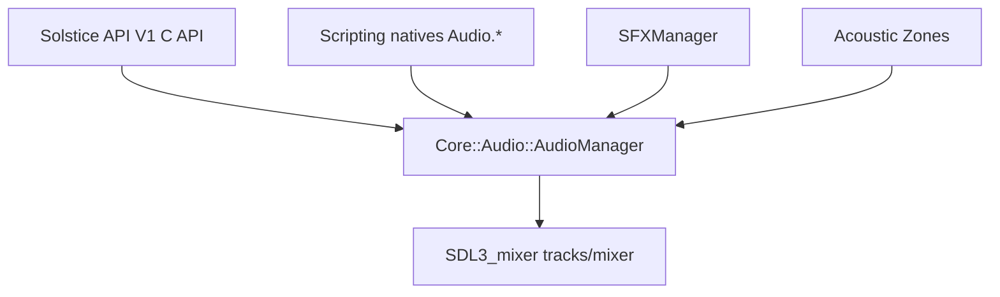

# Audio System

## Overview

Solstice audio is built around `Core::Audio::AudioManager` with an SDL3_mixer backend. It supports:

- one-shot and looping SFX
- streaming music
- 3D emitter spatialization
- acoustic zones (reverb/wetness + optional zone-driven BGM/ambience)
- gameplay clarity controls (dialogue/critical cue ducking + priority shaping)
- advanced immersion controls (cones, doppler, focus, diffraction, motion-adaptive spread)

`SFXManager` in the game layer adds category volumes, sound pools, event hooks, and higher-level spatial profiles for quick integration.

## Architecture



## Core Runtime Model

### Listener

`Listener` provides:

- `Position`
- `Forward`
- `Up`
- current/target reverb state

The listener is updated through `SetListener(...)`. Orientation affects panning, cone evaluation, focus, immersion, and rear/side shaping.

### Emitters

Managed emitters use `AudioEmitterHandle` and are updated each frame by `UpdateEmitters(dt)`.

Key emitter controls include:

- **Distance model**: linear/inverse/exponential rolloff
- **Directional cone**: inner/outer angle + outer gain
- **Doppler**: factor + speed of sound + smoothed frequency ratio
- **Velocity**: auto-derived from transform or manually set
- **Focus**: listener-forward intelligibility boost
- **Immersion**: rear/side depth + distance/rear reverb bloom
- **Diffraction**: occlusion edge-bleed gain recovery + pitch damping proxy
- **Motion adaptation**: listener-speed adaptive ambience/spread response
- **Air absorption**: distance high-frequency style attenuation
- **Occlusion/obstruction**: direct attenuation and wet/clarity effects
- **Flags/priority**: dialogue/critical cue routing and perceptual weighting

### Spatialization Stack

Per active emitter, `ApplySpatialization(...)` computes and applies:

1. local 3D position (`MIX_SetTrack3DPosition`)
2. smoothed occlusion and wetness targets
3. gain terms: distance, cone, focus, immersion, diffraction, priority, near-field, air absorption, wet penalty, ducking
4. clamped final gain (`MIX_SetTrackGain`)
5. doppler + pitch + damping + motion spread, smoothed (`MIX_SetTrackFrequencyRatio`)

This produces a stable, high-detail spatial response instead of a simple distance-only falloff.

## Acoustic Zones

`AcousticZone` supports:

- box or sphere volumes
- reverb preset + wetness
- obstruction multiplier
- zone priority
- optional `MusicPath` and `AmbiencePath`

When a listener enters a zone, the system can automatically:

- cross behavior toward zone reverb target
- drive zone BGM
- spawn/update a looping zone ambience emitter

## Gameplay Layer (`SFXManager`)

`SFXManager` adds:

- category-based volume (`UI`, `Combat`, `Ambient`, `Footsteps`, `Voice`, `Music`)
- simple pooling for repeated sounds
- active sound bookkeeping
- profile-driven spatial tuning via `SpatialProfile`

`SpatialProfile` values:

- `Default`
- `AmbientBed`
- `Footstep`
- `Weapon`
- `Voice`
- `Vehicle`

Use `PlaySound3DProfiled(...)` or `ConfigureEmitterSpatial(...)` to apply tuned behavior quickly.

## C++ API (Core)

Main entry points (`source/Core/Audio/Audio.hxx`):

- lifecycle: `Initialize`, `Shutdown`, `Update`
- music/sfx: `PlayMusic`, `StopMusic`, `PlaySound`, `SetMasterVolume`, etc.
- spatial:
  - emitter lifecycle: `CreateEmitter`, `DestroyEmitter`, `UpdateEmitterTransform`
  - common controls: `SetEmitterVolume`, `SetEmitterOcclusion`, `SetEmitterRolloff`
  - advanced controls:
    - `SetEmitterDirection`
    - `SetEmitterCone`
    - `SetEmitterDoppler`
    - `SetEmitterVelocity`, `ClearEmitterVelocity`
    - `SetEmitterFocus`
    - `SetEmitterImmersion`
    - `SetEmitterDiffraction`
    - `SetEmitterMotionAdaptation`
    - `SetEmitterAirAbsorption`
    - `SetEmitterPitchVariance`
    - `SetEmitterFlags`
  - debug/state: `GetEmitterSnapshot`, `IsEmitterValid`

## C API (V1)

Header: `SDK/SolsticeAPI/V1/Audio.h`

Core calls:

- `SolsticeV1_AudioPlayMusic`
- `SolsticeV1_AudioStopMusic`
- `SolsticeV1_AudioPlaySound`
- `SolsticeV1_AudioSetMasterVolume`
- `SolsticeV1_AudioUpdate`

Emitter calls:

- `SolsticeV1_AudioCreateEmitter`
- `SolsticeV1_AudioUpdateEmitterTransform`
- `SolsticeV1_AudioDestroyEmitter`
- `SolsticeV1_AudioSetEmitterVolume`
- `SolsticeV1_AudioSetEmitterOcclusion`
- `SolsticeV1_AudioSetEmitterRolloff` (`DistanceModel`: 0=Linear, 1=Inverse, 2=Exponential)
- `SolsticeV1_AudioSetEmitterDirection`
- `SolsticeV1_AudioSetEmitterCone`
- `SolsticeV1_AudioSetEmitterDoppler`
- `SolsticeV1_AudioSetEmitterVelocity`
- `SolsticeV1_AudioClearEmitterVelocity`
- `SolsticeV1_AudioSetEmitterFocus`
- `SolsticeV1_AudioSetEmitterImmersion`
- `SolsticeV1_AudioSetEmitterDiffraction`
- `SolsticeV1_AudioSetEmitterMotionAdaptation`
- `SolsticeV1_AudioSetEmitterAirAbsorption`
- `SolsticeV1_AudioSetEmitterPitchVariance`
- `SolsticeV1_AudioSetEmitterFlags`
- `SolsticeV1_AudioApplySpatialProfile` (`Profile`: 0=Default, 1=AmbientBed, 2=Footstep, 3=Weapon, 4=Voice, 5=Vehicle)

Listener/reverb:

- `SolsticeV1_AudioSetListener`
- `SolsticeV1_AudioSetReverbPreset`

## Scripting API

Registered in `source/Scripting/Bindings/ScriptBindings.cxx` as `Audio.*` natives.

Core:

- `Audio.PlayMusic(path, loops?)`
- `Audio.PlaySound3D(path, x, y, z, maxDistance?, loop?)`
- `Audio.CreateEmitter(path, x, y, z, maxDistance?, loop?)`
- `Audio.UpdateEmitterTransform(handle, x, y, z)`
- `Audio.DestroyEmitter(handle)`
- `Audio.SetListener(px, py, pz, fx, fy, fz, ux, uy, uz)`
- `Audio.SetReverbPreset(preset)`
- `Audio.SetVolume(volume)`

Spatial controls:

- `Audio.SetEmitterVolume(handle, volume)`
- `Audio.SetEmitterOcclusion(handle, occlusion)`
- `Audio.SetEmitterRolloff(handle, minDist, maxDist, rolloff, model)`
- `Audio.SetEmitterDirection(handle, dx, dy, dz)`
- `Audio.SetEmitterCone(handle, innerDeg, outerDeg, outerGain)`
- `Audio.SetEmitterDoppler(handle, dopplerFactor, speedOfSound)`
- `Audio.SetEmitterVelocity(handle, vx, vy, vz, manual?)`
- `Audio.ClearEmitterVelocity(handle)`
- `Audio.SetEmitterFocus(handle, focus, nearFieldGain, maxGain)`
- `Audio.SetEmitterImmersion(handle, immersion, distanceReverb, rearReverb)`
- `Audio.SetEmitterDiffraction(handle, diffraction, occlusionPitchDamping)`
- `Audio.SetEmitterMotionAdaptation(handle, adaptiveMotion)`
- `Audio.SetEmitterAirAbsorption(handle, factor)`
- `Audio.SetEmitterPitchVariance(handle, variance)`
- `Audio.SetEmitterFlags(handle, isDialogue, isCriticalCue, priority)`
- `Audio.ApplySpatialProfile(handle, profile)`

Supercharged namespaces:

- `Audio.HRTF.Enable(enabled)`
- `Audio.HRTF.LoadDatabase(path)`
- `Audio.HRTF.SetHeadRadius(radius)`
- `Audio.WaveTracing.Enable(enabled)`
- `Audio.WaveTracing.SetMaxRays(perSource)`
- `Audio.WaveTracing.SetMaxBounces(bounces)`
- `Audio.Ambisonics.SetOrder(order)`
- `Audio.Ambisonics.GetOrder()`
- `Audio.FluidCoupling.Enable(enabled)`
- `Audio.Portal.SetTransform(m00..m33, enabled?)`
- `Audio.Portal.ClearTransform()`
- `Audio.MLSpatialization.Enable(enabled)`
- `Audio.MLSpatialization.Train()`
- `Audio.MLSpatialization.SaveWeights(path)`
- `Audio.MLSpatialization.LoadWeights(path)`

## Supercharged Architecture

The supercharged stack extends the base SDL_mixer pipeline with CPU-first optional modules.

### Core Modules

- `source/Core/Audio/HRTF/`
  - `HRTFDatabase` (SOFA entry path + default fallback)
  - `HRTFRenderer` (filter lookup + convolution)
- `source/Core/Audio/Ambisonics/`
  - `AmbisonicCodec` (1st/2nd/3rd order encode/decode)
- `source/Core/Audio/WaveTracing/`
  - `SoundRayPacket4`, `SoundRayResult`, `WaveTracer`
- `source/Core/Audio/PortalAudio/`
  - `PortalAudio` (portal-space transform helpers)
- `source/Core/Audio/FluidCoupling/`
  - `FluidCoupling`, `FluidAudioCoupler`
- `source/Core/Audio/MLSpatialization/`
  - `MLSpatializer` (in-house MLP-backed prediction hooks)

### AudioManager Integration

`AudioManager` owns the supercharged subsystem instances and exposes runtime toggles:

- HRTF: enable, database load, head radius
- wave tracing: enable, max rays, max bounces
- ambisonics: order set/get
- fluid coupling: enable
- portal audio: set/clear transform
- ML spatialization: enable/train/save/load

`UpdateEmitters(...)` can run wave tracing and apply ray-driven occlusion/immersion shaping to active emitters.

### ECS Integration

- New components in `source/Entity/Components/AudioComponents.hxx`:
  - `ECS::AudioSource`
  - `ECS::AudioListener`
  - `ECS::AcousticZoneVolume`
- New system in `source/Game/Systems/AudioSystem.*`:
  - syncs transforms to emitter/listener state
  - creates/manages emitter lifetimes
  - projects ECS zone volumes into `AcousticZone`

`FPSGame` and `ThirdPersonGame` register this system in simulation phase.

### C API Supercharged Extensions

Additional V1 exports in `SDK/SolsticeAPI/V1/Audio.h`:

- HRTF:
  - `SolsticeV1_AudioSetHRTFEnabled`
  - `SolsticeV1_AudioIsHRTFEnabled`
  - `SolsticeV1_AudioLoadHRTFDatabase`
  - `SolsticeV1_AudioSetHeadRadius`
- Wave tracing:
  - `SolsticeV1_AudioSetWaveTracingEnabled`
  - `SolsticeV1_AudioIsWaveTracingEnabled`
  - `SolsticeV1_AudioSetMaxRays`
  - `SolsticeV1_AudioSetMaxBounces`
- Ambisonics:
  - `SolsticeV1_AudioSetAmbisonicOrder`
  - `SolsticeV1_AudioGetAmbisonicOrder`
- Fluid coupling:
  - `SolsticeV1_AudioSetFluidCouplingEnabled`
  - `SolsticeV1_AudioIsFluidCouplingEnabled`
- Portal:
  - `SolsticeV1_AudioSetPortalTransform`
  - `SolsticeV1_AudioClearPortalTransform`
- ML:
  - `SolsticeV1_AudioSetMLSpatializationEnabled`
  - `SolsticeV1_AudioIsMLSpatializationEnabled`
  - `SolsticeV1_AudioTrainMLModel`
  - `SolsticeV1_AudioSaveMLWeights`
  - `SolsticeV1_AudioLoadMLWeights`

### In-house ML Uplift

`source/Core/ML/MLP` now includes lightweight real-time usability helpers:

- deterministic seeding via `SetDeterministicSeed`
- random init path via `InitializeRandomWeights`
- lightweight persistence via `SaveWeights` and `LoadWeights`

These are used by `MLSpatializer` while keeping dependency footprint unchanged.

### Supercharged Tests

Added coverage:

- `tests/AudioHRTFTest.cxx`
- `tests/AudioWaveTracingTest.cxx`
- `tests/AudioAmbisonicsTest.cxx`

All are registered in `tests/CMakeLists.txt` and included in `quick` CTest label.

## Tuning Guidelines

- Use **inverse** rolloff for natural point sources; use **linear** for beds/atmospheres.
- Keep `ConeOuterGain` above `0.3` for readability unless you need hard directionality.
- Keep `DopplerFactor` conservative (`0.6`–`1.2`) unless velocity gameplay is central.
- Increase `FocusFactor` for speech/critical cues; lower it for ambience.
- Increase `ImmersionFactor` + `DistanceReverbFactor` for large spaces and outdoor atmospheres.
- Increase `DiffractionFactor` if hard occlusion sounds too binary.
- Keep `AdaptiveMotionFactor` higher on ambience/vehicle layers than on dialogue.

## Example (C++)

```cpp
using namespace Solstice;
using namespace Solstice::Core::Audio;

auto& audio = AudioManager::Instance();
AudioEmitterHandle h = audio.CreateEmitter("assets/audio/demo_room.wav", Math::Vec3(12, 2, -8), 120.0f, true);
audio.SetEmitterRolloff(h, 1.0f, 120.0f, 1.0f, DistanceModel::Inverse);
audio.SetEmitterCone(h, 75.0f, 170.0f, 0.45f);
audio.SetEmitterFocus(h, 0.5f, 0.08f, 1.05f);
audio.SetEmitterImmersion(h, 0.7f, 0.5f, 0.35f);
audio.SetEmitterDiffraction(h, 0.55f, 0.16f);
audio.SetEmitterMotionAdaptation(h, 0.4f);
audio.SetEmitterFlags(h, false, true, 2);
```

## Example (Script)

```txt
let h = Audio.CreateEmitter("assets/audio/demo_hall.wav", 0, 1.8, -6, 150, 1)
Audio.ApplySpatialProfile(h, 1)                // AmbientBed
Audio.SetEmitterImmersion(h, 0.85, 0.7, 0.5)
Audio.SetEmitterDiffraction(h, 0.6, 0.2)
Audio.SetEmitterMotionAdaptation(h, 0.9)
```

## Related

- `source/Core/Audio/Audio.hxx`
- `source/Core/Audio/Audio.cxx`
- `source/Game/Gameplay/SFXManager.hxx`
- `SDK/SolsticeAPI/V1/Audio.h`
- `source/API/V1/Audio.cxx`
- `source/Scripting/Bindings/ScriptBindings.cxx`
