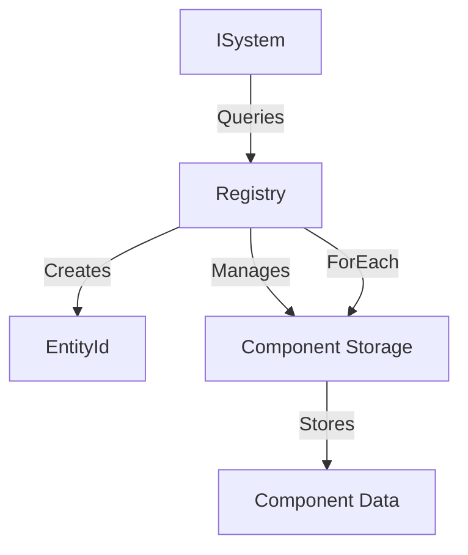

# Entity Component System (ECS)

## Overview

The Solstice engine uses an Entity Component System (ECS) architecture for organizing game objects and their behaviors. The ECS pattern separates data (components) from logic (systems), providing a flexible and performant foundation for game development.

## Architecture

The ECS system consists of three core concepts:

- **Entities**: Unique identifiers (EntityId) representing game objects
- **Components**: Plain data structures attached to entities
- **Systems**: Logic that operates on entities with specific component combinations



### Core Components

- **Registry**: Central manager for entities and components
- **ComponentStorage**: Type-safe storage for component instances
- **EntityId**: 32-bit unsigned integer identifying entities
- **ISystem**: Interface for game logic systems

## Core Concepts

### Entity Lifecycle

Entities are created and destroyed through the Registry:

```cpp
using namespace Solstice::ECS;

Registry registry;

// Create an entity
EntityId player = registry.Create();

// Check if entity is valid
if (registry.Valid(player)) {
    // Entity exists
}

// Destroy an entity (removes all components)
registry.Destroy(player);
```

### Component System

Components are plain data structures (POD types or structs). They contain no logic, only data:

```cpp
// Example component
struct Health {
    float CurrentHealth = 100.0f;
    float MaxHealth = 100.0f;
    float Armor = 0.0f;
};

// Add component to entity
registry.Add<Health>(player, 100.0f, 100.0f, 50.0f);

// Or with default constructor
auto& health = registry.Add<Health>(player);
health.CurrentHealth = 100.0f;
```

### Component Storage

Components are stored in type-safe containers using `std::type_index` for type identification. Each component type has its own `ComponentStorage<T>` instance:

- Components are stored in `std::unordered_map<EntityId, T>`
- Fast O(1) lookup by EntityId
- Automatic cleanup when entities are destroyed

## API Reference

### Registry Class

The `Registry` class is the central manager for all entities and components.

#### Entity Management

```cpp
// Create a new entity
EntityId Create();

// Destroy an entity and all its components
void Destroy(EntityId e);

// Check if entity exists
bool Valid(EntityId e) const;
```

#### Component Management

```cpp
// Add component to entity (constructs with arguments)
template<class T, class... A>
T& Add(EntityId e, A&&... a);

// Check if entity has component
template<class T>
bool Has(EntityId e) const;

// Get component reference (throws if not found)
template<class T>
T& Get(EntityId e);

template<class T>
const T& Get(EntityId e) const;

// Remove component from entity
template<class T>
void Remove(EntityId e);
```

#### Component Queries

```cpp
// Iterate all entities with component T
template<class T, class F>
void ForEach(F&& fn);

// Iterate entities with both T1 and T2 components
template<class T1, class T2, class F>
void ForEach(F&& fn);
```

The `ForEach` methods iterate only over entities that are still valid (not destroyed). The two-component version optimizes by iterating over the smaller component set.

## Usage Examples

### Creating Entities with Components

```cpp
using namespace Solstice::ECS;
using namespace Solstice::Math;

Registry registry;

// Create a player entity
EntityId player = registry.Create();

// Add Transform component
Transform& transform = registry.Add<Transform>(player);
transform.Position = Vec3(0, 1.75f, 0);
transform.Scale = Vec3(1, 1, 1);

// Add Name component
Name& name = registry.Add<Name>(player);
name.Value = "Player";

// Add Health component
Health& health = registry.Add<Health>(player);
health.CurrentHealth = 100.0f;
health.MaxHealth = 100.0f;
```

### Iterating Over Components

```cpp
// Iterate all entities with Health component
registry.ForEach<Health>([](EntityId entity, Health& health) {
    if (health.CurrentHealth <= 0.0f) {
        // Entity is dead
    }
});

// Iterate entities with both Transform and Health
registry.ForEach<Transform, Health>([](
    EntityId entity,
    Transform& transform,
    Health& health
) {
    // Process entities with both components
    if (health.CurrentHealth < 50.0f) {
        // Low health - maybe change color or play sound
    }
});
```

### System Pattern

Systems implement the `ISystem` interface and operate on entities:

```cpp
class HealthSystem : public ISystem {
public:
    void Update(Registry& registry, float deltaTime) override {
        registry.ForEach<Health>([](EntityId entity, Health& health) {
            // Regenerate health over time
            if (health.CurrentHealth < health.MaxHealth) {
                health.CurrentHealth += 1.0f * deltaTime;
                health.CurrentHealth = std::min(
                    health.CurrentHealth,
                    health.MaxHealth
                );
            }
        });
    }
};
```

### Component Removal

```cpp
// Remove a specific component
registry.Remove<Health>(player);

// Entity still exists, just without Health component
if (registry.Has<Health>(player)) {
    // This won't execute
}

// Destroy entity (removes all components automatically)
registry.Destroy(player);
```

## Integration

### With Physics System

The ECS integrates with the physics system through the `RigidBody` component:

```cpp
#include <Physics/RigidBody.hxx>

// Add physics body to entity
auto& rb = registry.Add<Physics::RigidBody>(player);
rb.Position = Vec3(0, 1.75f, 0);
rb.Type = Physics::ColliderType::Capsule;
rb.SetMass(67.0f);
```

### With Rendering System

Entities can be linked to scene objects through components:

```cpp
// Sync ECS transforms to scene
registry.ForEach<Transform>([&](EntityId entity, Transform& transform) {
    // Update scene object position
    scene.SetPosition(sceneObjectId, transform.Position);
});
```

## Best Practices

1. **Keep Components Simple**: Components should be plain data structures. Avoid logic in components.

2. **Use Appropriate Component Types**: 
   - Use built-in components (`Transform`, `Name`, `Kind`) when applicable
   - Create custom components for game-specific data

3. **Efficient Queries**: 
   - Use single-component `ForEach` when possible
   - Two-component queries optimize automatically by iterating the smaller set

4. **Entity Validation**: 
   - Always check `Valid()` before accessing entity components if the entity might have been destroyed
   - The `ForEach` methods automatically skip destroyed entities

5. **Component Lifecycle**: 
   - Components are automatically cleaned up when entities are destroyed
   - Explicitly remove components if you need to free resources before entity destruction

6. **System Organization**: 
   - Create systems that operate on specific component combinations
   - Keep systems focused on a single responsibility

## Built-in Components

The engine provides several built-in components:

- **Transform**: Position, rotation (via Matrix), and scale
- **Name**: String identifier for entities
- **Kind**: Entity type classification (`EntityKind` enum)
- **PlayerTag**: Marker component for player entities
- **CurrentPlayer**: Marks the active player entity

## Performance Considerations

- Component storage uses hash maps for O(1) lookup
- `ForEach` iterates only over existing components (no sparse iteration)
- Two-component queries optimize by choosing the smaller component set
- Entity destruction is O(n) where n is the number of component types (typically small)

