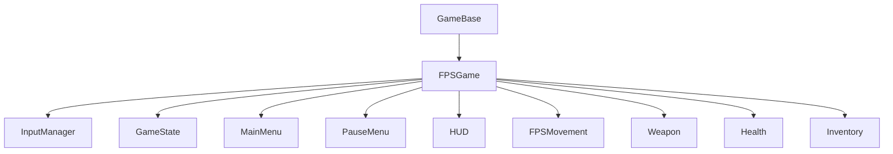

# Game Layer Systems

## Overview

The Game Layer provides high-level game systems built on top of the core engine. It includes game lifecycle management, input handling, game state management, FPS gameplay systems, menus, HUD, and various game components. The layer is designed to make it easy to create games using the Solstice engine.

## Architecture

The Game Layer consists of:

- **GameBase**: Base class for game applications
- **FPSGame**: FPS game implementation
- **InputManager**: Centralized input handling
- **GameState**: State machine for game states
- **MainMenu**: Main menu system with level selector and settings
- **PauseMenu**: Pause menu system
- **HUD**: Heads-up display system
- **Game Components**: Health, Stamina, Weapon, Inventory, etc.



## Core Concepts

### Game Lifecycle

Games inherit from `GameBase` and implement the game loop:

```cpp
class MyGame : public GameBase {
    void Initialize() override {
        // Setup game
    }
    
    void Update(float deltaTime) override {
        // Update game logic
    }
    
    void Render() override {
        // Render game
    }
    
    void HandleInput() override {
        // Handle input
    }
};

// Run game
MyGame game;
game.SetWindow(std::make_unique<UI::Window>(1280, 720, "My Game"));
return game.Run();
```

### Input System

The `InputManager` provides action-based input mapping:

```cpp
using namespace Solstice::Game;

InputManager input;

// Bind actions
input.BindAction(InputAction::MoveForward, SDL_SCANCODE_W);
input.BindAction(InputAction::Jump, SDL_SCANCODE_SPACE);

// Check actions
if (input.IsActionPressed(InputAction::MoveForward)) {
    // Move forward
}

if (input.IsActionJustPressed(InputAction::Jump)) {
    // Jump
}
```

### Game State Management

The `GameState` system manages game state transitions:

```cpp
GameState gameState;

// Set initial state
gameState.SetState(GameStateType::MainMenu);

// Register transitions
gameState.RegisterTransition(GameStateType::MainMenu, GameStateType::Playing,
    []() { return true; });  // Always allow

// Register callbacks
gameState.RegisterStateEnterCallback(GameStateType::Playing, []() {
    // Enter playing state
});

// Update
gameState.Update(deltaTime);
```

## API Reference

### GameBase

Base class for game applications.

#### Lifecycle

```cpp
GameBase();
virtual ~GameBase();

// Main entry point
int Run();

// Override these in derived classes
virtual void Initialize();
virtual void Shutdown();
virtual void Update(float deltaTime);
virtual void Render();
virtual void HandleInput();
```

#### Window Management

```cpp
void SetWindow(std::unique_ptr<UI::Window> window);
UI::Window* GetWindow() const;
```

#### Timing

```cpp
void SetMaxFPS(float maxFPS);
float GetMaxFPS() const;
float GetCurrentFPS() const;
float GetGameTime() const;
float GetDeltaTime() const;
```

#### Control

```cpp
void RequestClose();
bool ShouldClose() const;
void SetShowDebugOverlay(bool enable);
bool IsDebugOverlayVisible() const;
```

### FPSGame

FPS game base class.

#### Lifecycle

```cpp
FPSGame();
virtual ~FPSGame() = default;

// Override these
void Initialize() override;
void Update(float deltaTime) override;
void Render() override;
void HandleInput() override;
```

#### FPS-Specific Initialization

```cpp
virtual void InitializeFPSSystems();
virtual void InitializePlayer();
virtual void InitializeWeapons();
```

#### FPS-Specific Updates

```cpp
virtual void UpdateFPSMovement(float deltaTime);
virtual void UpdateWeapons(float deltaTime);
void RenderFPSHUD();
```

#### Systems

```cpp
std::unique_ptr<InputManager> m_InputManager;
std::unique_ptr<GameState> m_GameState;
std::unique_ptr<HUD> m_HUD;
std::unique_ptr<LoadingScreen> m_LoadingScreen;
std::unique_ptr<MainMenu> m_MainMenu;
```

#### ECS and Camera

```cpp
ECS::Registry m_Registry;
ECS::EntityId m_PlayerEntity;
Render::Camera m_Camera;
```

### InputManager

Centralized input handling system.

#### Lifecycle

```cpp
InputManager();
void Update(UI::Window* window);
```

#### Action Mapping

```cpp
// Bind action to key
void BindAction(InputAction action, int scancode);
void UnbindAction(InputAction action);
int GetActionScancode(InputAction action) const;
```

#### Action Queries

```cpp
bool IsActionPressed(InputAction action) const;
bool IsActionJustPressed(InputAction action) const;
bool IsActionJustReleased(InputAction action) const;
```

#### Key Queries

```cpp
bool IsKeyPressed(int scancode) const;
bool IsKeyJustPressed(int scancode) const;
bool IsKeyJustReleased(int scancode) const;
```

#### Mouse State

```cpp
void SetMousePosition(float x, float y);
void UpdateMouseDelta(float deltaX, float deltaY);
std::pair<float, float> GetMousePosition() const;
std::pair<float, float> GetMouseDelta() const;
bool IsMouseButtonPressed(int button) const;
bool IsMouseButtonJustPressed(int button) const;
bool IsMouseButtonJustReleased(int button) const;
```

#### Callbacks

```cpp
using ActionCallback = std::function<void()>;
void RegisterActionCallback(InputAction action, ActionCallback callback);
void UnregisterActionCallback(InputAction action);
```

### GameState

Game state management system.

#### Lifecycle

```cpp
GameState();
void Update(float deltaTime);
```

#### State Management

```cpp
void SetState(GameStateType state);
GameStateType GetCurrentState() const;
```

#### Transitions

```cpp
void RegisterTransition(GameStateType from, GameStateType to,
                       std::function<bool()> condition = nullptr);
bool CanTransition(GameStateType to) const;
bool TryTransition(GameStateType to);
```

#### State Callbacks

```cpp
using StateCallback = std::function<void()>;
void RegisterStateEnterCallback(GameStateType state, StateCallback callback);
void RegisterStateExitCallback(GameStateType state, StateCallback callback);
void RegisterStateUpdateCallback(GameStateType state, StateCallback callback);
```

#### Persistence

```cpp
void SaveState(const std::string& filePath);
void LoadState(const std::string& filePath);
```

### MainMenu

Main menu system with enhanced features.

#### Lifecycle

```cpp
MainMenu();
void Show();
void Hide();
bool IsVisible() const;
```

#### Rendering and Updates

```cpp
void Render(int screenWidth, int screenHeight, float deltaTime);
void Update(float deltaTime, InputManager& inputManager, GameState& gameState);
```

#### Menu Callbacks

```cpp
using MenuCallback = std::function<void()>;
void SetNewGameCallback(MenuCallback callback);
void SetLoadGameCallback(MenuCallback callback);
void SetSettingsCallback(MenuCallback callback);
void SetQuitCallback(MenuCallback callback);
```

#### Customization

```cpp
void SetTitle(const std::string& title);
void SetSubtitle(const std::string& subtitle);
void SetShowLevelSelector(bool show);
void SetPrimaryColor(float r, float g, float b, float a = 1.0f);
void SetSecondaryColor(float r, float g, float b, float a = 1.0f);
void SetAccentColor(float r, float g, float b, float a = 1.0f);
```

#### Level Selector Integration

```cpp
void SetLevelSelector(LevelSelector* selector);
void CloseLevelSelector();
bool IsLevelSelectorMenuVisible() const;
```

#### Settings Integration

```cpp
void CloseSettingsMenu();
```

### PauseMenu

Pause menu system.

#### Lifecycle

```cpp
PauseMenu();
void Show();
void Hide();
void Toggle();
bool IsVisible() const;
```

#### Rendering and Updates

```cpp
void Render(int screenWidth, int screenHeight);
void Update(float deltaTime, InputManager& inputManager, GameState& gameState);
```

#### Menu Callbacks

```cpp
using MenuCallback = std::function<void()>;
void SetResumeCallback(MenuCallback callback);
void SetSettingsCallback(MenuCallback callback);
void SetSaveCallback(MenuCallback callback);
void SetQuitCallback(MenuCallback callback);
```

#### Customization

```cpp
void SetTitle(const std::string& title);
void SetBackgroundAlpha(float alpha);
```

#### Settings State

```cpp
void SetSettingsOpen(bool open);
bool IsSettingsOpen() const;
```

### HUD

Heads-up display system with direct rendering.

#### Rendering

```cpp
void Render(ECS::Registry& registry, const Render::Camera& camera,
           int screenWidth, int screenHeight);
```

#### Element Rendering

```cpp
void RenderHealthBar(ECS::Registry& registry, ECS::EntityId entity,
                    const Math::Vec2& position, const Math::Vec2& size);
void RenderInventory(ECS::Registry& registry, ECS::EntityId entity,
                    const Math::Vec2& position, const Math::Vec2& size);
void RenderMinimap(ECS::Registry& registry, const Render::Camera& camera,
                   const Math::Vec2& position, const Math::Vec2& size);
void RenderCrosshair(const Math::Vec2& center, float size = 20.0f);
void RenderAmmo(ECS::Registry& registry, ECS::EntityId entity,
               const Math::Vec2& position);
```

#### Enhanced Elements

```cpp
void RenderStaminaBar(ECS::Registry& registry, ECS::EntityId entity,
                     const Math::Vec2& position, const Math::Vec2& size);
void RenderSpeedIndicator(ECS::Registry& registry, ECS::EntityId entity,
                         const Math::Vec2& position);
void RenderEquippedWeapon(ECS::Registry& registry, ECS::EntityId entity,
                         const Math::Vec2& position);
void RenderHealthDisplay(ECS::Registry& registry, ECS::EntityId entity,
                        const Math::Vec2& position);
void RenderObjective(const std::string& text, const Math::Vec2& position);
```

#### Damage Indicators

```cpp
void AddDamageIndicator(const Math::Vec3& worldPos, float damage,
                       bool isCritical = false);
void UpdateDamageIndicators(float deltaTime, const Render::Camera& camera,
                           int screenWidth, int screenHeight);
```

#### Configuration

```cpp
void SetHealthBarVisible(bool visible);
void SetInventoryVisible(bool visible);
void SetMinimapVisible(bool visible);
void SetCrosshairVisible(bool visible);
void SetStaminaBarVisible(bool visible);
void SetSpeedIndicatorVisible(bool visible);
void SetWeaponDisplayVisible(bool visible);
```

### FPSMovement

FPS movement component and system.

#### Component

```cpp
struct FPSMovement : public FirstPersonController {
    // Movement parameters
    float GroundAcceleration{20.0f};
    float GroundFriction{6.0f};
    float AirAcceleration{1.0f};
    float AirFriction{0.0f};
    float MaxGroundSpeed{7.0f};
    float MaxAirSpeed{10.0f};
    
    // Bunny hopping
    bool EnableBunnyHopping{true};
    float BhopSpeedGain{1.1f};
    
    // Ground detection
    float GroundCheckDistance{0.5f};
    float GroundCheckRadius{0.3f};
    bool IsGrounded{false};
    
    // Jump mechanics
    float CoyoteTime{0.1f};
    float JumpBufferTime{0.1f};
    
    // Movement presets
    std::string MovementPreset{"Quake"};
};
```

#### System

```cpp
class FPSMovementSystem {
    // Update movement
    static void Update(ECS::Registry& registry, float deltaTime,
                     Render::Camera& camera, SnowSystem* snowSys = nullptr);
    
    // Process input
    static void ProcessInput(ECS::Registry& registry, ECS::EntityId entity,
                            const Math::Vec3& moveDirection, bool jump,
                            bool crouch, bool sprint);
    
    // Apply preset
    static void ApplyPreset(FPSMovement& movement, const std::string& presetName);
};
```

### Weapon

Weapon component and system.

#### Component

```cpp
struct Weapon {
    WeaponType Type{WeaponType::Rifle};
    std::string Name;
    
    // Damage and range
    float Damage{25.0f};
    float Range{100.0f};
    float FireRate{10.0f};
    
    // Ammo
    int CurrentAmmo{30};
    int MaxAmmo{30};
    int ReserveAmmo{90};
    float ReloadTime{2.0f};
    
    // Spread/accuracy
    float BaseSpread{0.02f};
    float MaxSpread{0.1f};
    float CurrentSpread{0.02f};
    
    // Projectile
    float ProjectileSpeed{500.0f};
    bool IsHitscan{true};
};
```

#### System

```cpp
class WeaponSystem {
    // Update weapons
    static void Update(ECS::Registry& registry, float deltaTime);
    
    // Fire weapon
    static bool Fire(ECS::Registry& registry, ECS::EntityId entity,
                    const Math::Vec3& direction);
    
    // Reload weapon
    static bool Reload(ECS::Registry& registry, ECS::EntityId entity);
    
    // Check capabilities
    static bool CanFire(ECS::Registry& registry, ECS::EntityId entity);
    static bool CanReload(ECS::Registry& registry, ECS::EntityId entity);
};
```

### LevelBase

Base class for procedural levels.

#### Interface

```cpp
class LevelBase {
    // Initialize level
    virtual void Initialize(
        Render::Scene* scene,
        Render::MeshLibrary* meshLibrary,
        Core::MaterialLibrary* materialLibrary,
        ECS::Registry* registry,
        const Arzachel::Seed& seed
    ) = 0;
    
    // Level info
    virtual std::string GetName() const = 0;
    virtual std::string GetDescription() const = 0;
    
    // Level state
    virtual void Update(float deltaTime) {}
    virtual void Shutdown() {}
};
```

## Usage Examples

### Creating a Game

```cpp
class MyGame : public FPSGame {
    void Initialize() override {
        FPSGame::Initialize();
        
        // Custom initialization
        // ...
    }
    
    void Update(float deltaTime) override {
        FPSGame::Update(deltaTime);
        
        // Custom update logic
        // ...
    }
    
    void Render() override {
        FPSGame::Render();
        
        // Custom rendering
        // ...
    }
};

// Main
int main() {
    MyGame game;
    game.SetWindow(std::make_unique<UI::Window>(1280, 720, "My Game"));
    return game.Run();
}
```

### Input Handling

```cpp
// In game update
InputManager& input = *m_InputManager;

// Movement input
Math::Vec3 moveDir(0, 0, 0);
if (input.IsActionPressed(InputAction::MoveForward)) {
    moveDir.z -= 1.0f;
}
if (input.IsActionPressed(InputAction::MoveBackward)) {
    moveDir.z += 1.0f;
}
if (input.IsActionPressed(InputAction::MoveLeft)) {
    moveDir.x -= 1.0f;
}
if (input.IsActionPressed(InputAction::MoveRight)) {
    moveDir.x += 1.0f;
}

// Process movement
FPSMovementSystem::ProcessInput(m_Registry, m_PlayerEntity, moveDir,
                                input.IsActionPressed(InputAction::Jump),
                                input.IsActionPressed(InputAction::Crouch),
                                input.IsActionPressed(InputAction::Sprint));
```

### Game State Management

```cpp
// Setup game state
m_GameState->SetState(GameStateType::MainMenu);

// Register transitions
m_GameState->RegisterTransition(GameStateType::MainMenu, GameStateType::Playing,
    []() { return true; });

m_GameState->RegisterTransition(GameStateType::Playing, GameStateType::Paused,
    []() { return true; });

// Register callbacks
m_GameState->RegisterStateEnterCallback(GameStateType::Playing, [this]() {
    // Start game
});

m_GameState->RegisterStateExitCallback(GameStateType::Playing, [this]() {
    // Stop game
});

// Update
m_GameState->Update(deltaTime);
```

### Main Menu Setup

```cpp
// Setup main menu
m_MainMenu->SetTitle("MY GAME");
m_MainMenu->SetSubtitle("Main Menu");
m_MainMenu->SetShowLevelSelector(true);
m_MainMenu->SetLevelSelector(&m_LevelSelector);

// Set callbacks
m_MainMenu->SetNewGameCallback([this]() {
    m_GameState->SetState(GameStateType::Playing);
});

m_MainMenu->SetQuitCallback([this]() {
    m_ShouldClose = true;
});

// Render
m_MainMenu->Render(screenWidth, screenHeight, deltaTime);
m_MainMenu->Update(deltaTime, *m_InputManager, *m_GameState);
```

### HUD Rendering

```cpp
// Render HUD with UIRenderSettings
UISystem::Instance().NewFrame();

// Render HUD elements (uses ImGui::GetBackgroundDrawList())
m_HUD->Render(m_Registry, m_Camera, screenWidth, screenHeight);

// Render with HUD settings
UIRenderSettings hudSettings = UIRenderSettings::HUD();
UISystem::Instance().RenderWithSettings(hudSettings);
```

### Damage Indicators

```cpp
// Add damage indicator
m_HUD->AddDamageIndicator(hitPosition, damageAmount, isCritical);

// Update (called automatically in HUD::Render)
m_HUD->UpdateDamageIndicators(deltaTime, m_Camera, screenWidth, screenHeight);
```

## Integration

### With ECS System

Game components integrate with the ECS:

```cpp
// Add components to player
m_Registry.Add<Health>(m_PlayerEntity, 100.0f, 100.0f);
m_Registry.Add<FPSMovement>(m_PlayerEntity);
m_Registry.Add<Weapon>(m_PlayerEntity, WeaponType::Rifle);
m_Registry.Add<Stamina>(m_PlayerEntity, 100.0f);
```

### With Rendering System

Games use the rendering system for scene rendering:

```cpp
// In Render()
m_Renderer->RenderScene(m_Scene, m_Camera);
m_Renderer->Present();
```

### With Physics System

Games integrate with physics:

```cpp
// Start physics
PhysicsSystem::Instance().Start(m_Registry);

// Update physics
PhysicsSystem::Instance().Update(deltaTime);
```

### With UI System

Games use the UI system for menus and HUD:

```cpp
// Initialize UI
UISystem::Instance().Initialize(m_Window->NativeWindow());

// Render UI
UISystem::Instance().NewFrame();
// ... build UI ...
UISystem::Instance().Render();
```

## Best Practices

1. **Game Lifecycle**: 
   - Always call base class methods in overrides
   - Initialize engine systems before game systems
   - Clean up resources in Shutdown()

2. **Input Management**: 
   - Use action-based input for flexibility
   - Update InputManager once per frame
   - Check `WantCaptureMouse()`/`WantCaptureKeyboard()` before processing

3. **Game State**: 
   - Use GameState for state management
   - Register transitions with conditions
   - Use callbacks for state-specific logic

4. **HUD Rendering**: 
   - Use `ImGui::GetBackgroundDrawList()` for direct rendering
   - Use `UIRenderSettings::HUD()` for pixel-perfect rendering
   - Update damage indicators each frame

5. **Main Menu**: 
   - Set up callbacks before showing menu
   - Integrate with LevelSelector for level selection
   - Use color customization for branding

6. **Pause Menu**: 
   - Toggle pause menu with input
   - Integrate with GameState
   - Handle settings menu state

7. **FPS Movement**: 
   - Use movement presets (Quake, CS, Default)
   - Configure ground/air acceleration appropriately
   - Enable bunny hopping for Quake-style movement

8. **Weapon System**: 
   - Update weapons each frame
   - Check CanFire() before firing
   - Handle reload timing properly

9. **Level System**: 
   - Inherit from LevelBase
   - Use procedural generation with Seeds
   - Initialize with required libraries

10. **Performance**: 
    - Limit FPS with SetMaxFPS() if needed
    - Use delta time for frame-independent updates
    - Update systems in appropriate order

## Modular Folder Layout

The game layer is now organized by responsibility:

- `source/Game/App` - lifecycle, state, input, preferences, autosave
- `source/Game/UI` - HUD, menus, presenters
- `source/Game/Gameplay` - gameplay components/systems
- `source/Game/AI` - AI and ML-connected logic
- `source/Game/World` - scene/content/preset tooling
- `source/Game/Integration` - script and engine bridge services
- `source/Game/Dialogue` - `DialogueTree`, JSON/YAML `solstice.narrative.v1`, `NarrativeRuntime`, script bindings; see `docs/Narrative.md`
- `source/Game/Cutscene` - `CutscenePlayer` (JSON timelines, dialogue jump hooks)
- mode packages remain under `source/Game/FPS`, `source/Game/ThirdPerson`, `source/Game/Strategy`, `source/Game/VisualNovel`

`source/Game/CMakeLists.txt` now reflects this structure directly, and include paths are hard-cut to the new subfolder names.

## ECS Phase Execution in Game Modes

`FPSGame` and `ThirdPersonGame` now use `ECS::PhaseScheduler` to run deterministic ECS phases. `FPSGame` also ensures the active physics world is bound to its registry before simulation updates.

