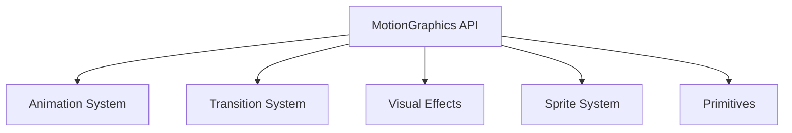

# Motion Graphics System

## Overview

The Motion Graphics system provides animation, transitions, visual effects, and sprite rendering for UI elements. It supports keyframe-based animations, smooth transitions, visual effects (shadows, blur, glow), and both 2D and world-space sprite rendering.

## Architecture

The Motion Graphics system consists of:

- **Animation System**: Keyframe-based animation with easing functions
- **Transition System**: State transitions for UI elements
- **Visual Effects**: Shadows, blur, and glow effects
- **Sprite System**: 2D and world-space sprite rendering
- **Primitives**: Animated shapes and gradients



## Core Concepts

### Animation System

The animation system uses keyframe-based tracks with easing functions:

```cpp
using namespace Solstice::UI::Animation;

// Create animation clip
AnimationClip clip;

// Add keyframes to position track
clip.GetPositionTrack().AddKeyframe(Keyframe<ImVec2>(0.0f, ImVec2(0, 0)));
clip.GetPositionTrack().AddKeyframe(Keyframe<ImVec2>(1.0f, ImVec2(100, 100), EasingType::EaseOut));

// Evaluate at time
ImVec2 pos, scale;
float rotation;
ImVec4 color;
float alpha;
clip.Evaluate(0.5f, pos, scale, rotation, color, alpha);
```

### Transition System

Transitions provide smooth state changes for UI elements:

```cpp
using namespace Solstice::UI;

// Fade transition
FadeTransition fade(0.0f, 1.0f);  // From 0 to 1 alpha
fade.SetDuration(0.5f);
fade.SetEasing(EasingType::EaseInOut);
fade.Start();

// Update
fade.Update(deltaTime);
float alpha = 1.0f;
fade.Apply(alpha);
```

## API Reference

### Animation System

#### Easing Types

```cpp
enum class EasingType {
    Linear,      // No easing
    EaseIn,      // Slow start
    EaseOut,     // Slow end
    EaseInOut,   // Slow start and end
    Bounce,      // Bouncing effect
    Elastic,     // Elastic effect
    Back,        // Overshoot effect
    Circ,        // Circular easing
    Expo,        // Exponential easing
    Quad,        // Quadratic easing
    Cubic,       // Cubic easing
    Quart,       // Quartic easing
    Quint,       // Quintic easing
    Bezier       // Custom bezier curve
};
```

#### Easing Functions

```cpp
// Apply easing to time value
float Ease(float t, EasingType type, float strength = 1.0f);

// Bezier curve easing
float EaseBezier(float t, float p1X, float p1Y, float p2X, float p2Y);
```

#### Keyframe

```cpp
template<typename T>
struct Keyframe {
    float Time;              // Time in seconds
    T Value;                 // Keyframe value
    EasingType Easing;       // Easing type
    
    Keyframe(float time, const T& value, EasingType easing = EasingType::Linear);
};
```

#### AnimationTrack

```cpp
template<typename T>
class AnimationTrack {
    // Add keyframe
    void AddKeyframe(const Keyframe<T>& kf);
    
    // Evaluate at time
    T Evaluate(float time) const;
    
    // Properties
    float GetDuration() const;
    void SetLoop(bool loop);
    bool GetLoop() const;
    size_t GetKeyframeCount() const;
    const Keyframe<T>& GetKeyframe(size_t index) const;
};
```

#### AnimationClip

Multi-property animation container:

```cpp
class AnimationClip {
    // Track access
    AnimationTrack<ImVec2>& GetPositionTrack();
    AnimationTrack<ImVec2>& GetScaleTrack();
    AnimationTrack<float>& GetRotationTrack();
    AnimationTrack<ImVec4>& GetColorTrack();
    AnimationTrack<float>& GetAlphaTrack();
    
    // Evaluate all tracks
    void Evaluate(float time, ImVec2& position, ImVec2& scale,
                  float& rotation, ImVec4& color, float& alpha) const;
    
    float GetDuration() const;
};
```

#### AnimationPlayer

Animation playback control:

```cpp
class AnimationPlayer {
    void SetClip(const AnimationClip& clip);
    const AnimationClip& GetClip() const;
    
    // Playback control
    void Play();
    void Pause();
    void Stop();
    void Seek(float time);
    
    // Update
    void Update(float deltaTime);
    
    // Properties
    bool IsPlaying() const;
    float GetCurrentTime() const;
    void SetLoop(bool loop);
    bool GetLoop() const;
};
```

### Transition System

#### Transition Base Class

```cpp
class Transition {
    // Lifecycle
    void Start();
    void Update(float deltaTime);
    void Pause();
    void Resume();
    void Reset();
    
    // Properties
    TransitionState GetState() const;
    float GetProgress() const;
    bool IsCompleted() const;
    void SetDuration(float duration);
    void SetEasing(Animation::EasingType easing);
    void SetOnStart(std::function<void()> callback);
    void SetOnComplete(std::function<void()> callback);
};
```

#### FadeTransition

```cpp
class FadeTransition : public Transition {
    FadeTransition(float fromAlpha, float toAlpha);
    void Apply(float& alpha) const;
    void SetFrom(float from);
    void SetTo(float to);
    float GetFrom() const;
    float GetTo() const;
};
```

#### SlideTransition

```cpp
class SlideTransition : public Transition {
    SlideTransition(const ImVec2& from, const ImVec2& to);
    void Apply(ImVec2& position) const;
    void SetFrom(const ImVec2& from);
    void SetTo(const ImVec2& to);
    ImVec2 GetFrom() const;
    ImVec2 GetTo() const;
};
```

#### ScaleTransition

```cpp
class ScaleTransition : public Transition {
    ScaleTransition(const ImVec2& from, const ImVec2& to);
    void Apply(ImVec2& scale) const;
    void SetFrom(const ImVec2& from);
    void SetTo(const ImVec2& to);
    ImVec2 GetFrom() const;
    ImVec2 GetTo() const;
};
```

#### RotateTransition

```cpp
class RotateTransition : public Transition {
    RotateTransition(float from, float to);
    void Apply(float& rotation) const;
    void SetFrom(float from);
    void SetTo(float to);
    float GetFrom() const;
    float GetTo() const;
};
```

#### CombinedTransition

```cpp
class CombinedTransition {
    void AddTransition(std::shared_ptr<Transition> transition);
    void Start();
    void Update(float deltaTime);
    void Pause();
    void Resume();
    void Reset();
    bool IsCompleted() const;
    size_t GetTransitionCount() const;
    std::shared_ptr<Transition> GetTransition(size_t index) const;
};
```

### MotionGraphics API

#### Animated Widgets

```cpp
namespace Solstice::UI::MotionGraphics {

// Animated button
bool AnimatedButton(const std::string& label,
                   const Animation::AnimationClip& animation,
                   const std::function<void()>& onClick = nullptr);

// Animated text
void AnimatedText(const std::string& text,
                  const Animation::AnimationClip& animation);

// Animated image
void AnimatedImage(ImTextureID texture, const ImVec2& size,
                   const Animation::AnimationClip& animation);
}
```

#### Transitioning Widgets

```cpp
// Transitioning window
bool TransitioningWindow(const std::string& title, bool* open,
                         Transition& transition);

// Transitioning panel
void TransitioningPanel(const std::string& id, Transition& transition,
                        const std::function<void()>& content);
```

#### World-Space Animated Elements

```cpp
// Animated world-space dialog
void AnimatedWorldSpaceDialog(ViewportUI::WorldSpaceDialog& dialog,
                              const Animation::AnimationClip& animation,
                              float deltaTime);

// Animated world-space label
void AnimatedWorldSpaceLabel(ViewportUI::WorldSpaceLabel& label,
                             const Animation::AnimationClip& animation,
                             float deltaTime);

// Animated world-space button
void AnimatedWorldSpaceButton(ViewportUI::WorldSpaceButton& button,
                              const Animation::AnimationClip& animation,
                              float deltaTime);
```

#### Sprite Rendering

```cpp
// Render sprite (2D)
void RenderSprite(const Sprite& sprite, ImDrawList* drawList);

// Render sprite in world space
void RenderSpriteWorldSpace(const Sprite& sprite,
                            const Math::Vec3& worldPos,
                            const Math::Matrix4& viewMatrix,
                            const Math::Matrix4& projectionMatrix,
                            int screenWidth, int screenHeight,
                            ImDrawList* drawList);
```

#### Animated Primitives

```cpp
// Animated polygon
void DrawAnimatedPolygon(ImDrawList* drawList, const ImVec2& center,
                        const Animation::AnimationTrack<float>& radiusAnimation,
                        uint32_t sides, ImU32 color, float currentTime);

// Animated gradient
void DrawAnimatedGradient(ImDrawList* drawList, const ImVec2& min, const ImVec2& max,
                         const Animation::AnimationTrack<ImU32>& colorStartAnimation,
                         const Animation::AnimationTrack<ImU32>& colorEndAnimation,
                         float currentTime);
```

#### Widgets with Visual Effects

```cpp
// Button with shadow
bool ButtonWithShadow(const std::string& label,
                     const ShadowParams& shadow,
                     const std::function<void()>& onClick = nullptr);

// Panel with blur
void PanelWithBlur(const std::string& id, const BlurParams& blur,
                   const std::function<void()>& content);

// Window with effects
void WindowWithEffects(const std::string& title, bool* open,
                      const ShadowParams* shadow, const BlurParams* blur);
```

#### Animated Effects

```cpp
// Animated glow
void AnimatedGlow(ImDrawList* drawList, const ImVec2& center, float radius,
                 const Animation::AnimationTrack<float>& blurAnimation,
                 const Animation::AnimationTrack<ImU32>& colorAnimation,
                 float currentTime);

// Animated shadow
void AnimatedShadow(ImDrawList* drawList, const ImVec2& min, const ImVec2& max,
                   const Animation::AnimationTrack<ShadowParams>& shadowAnimation,
                   float currentTime);
```

### Visual Effects

#### Shadow Effects

```cpp
namespace Solstice::UI {

struct ShadowParams {
    ImVec2 Offset{2.0f, 2.0f};
    float BlurRadius{4.0f};
    float Spread{0.0f};
    ImU32 Color{IM_COL32(0, 0, 0, 128)};
    ShadowType Type{ShadowType::DropShadow};
    bool Inset{false};
};

enum class ShadowType {
    DropShadow,
    InnerShadow,
    ColoredShadow,
    Glow,
    Multiple
};

class VisualEffects {
    // Drop shadow
    static void DrawDropShadow(ImDrawList* drawList, const ImVec2& min, const ImVec2& max,
                               const ShadowParams& params, float rounding = 0.0f);
    
    // Inner shadow
    static void DrawInnerShadow(ImDrawList* drawList, const ImVec2& min, const ImVec2& max,
                               const ShadowParams& params, float rounding = 0.0f);
    
    // Glow effect
    static void DrawGlow(ImDrawList* drawList, const ImVec2& center, float radius,
                        const ShadowParams& params, uint32_t segments = 32);
    
    // Multiple shadows
    static void DrawMultipleShadows(ImDrawList* drawList, const ImVec2& min, const ImVec2& max,
                                    const std::vector<ShadowParams>& shadows, float rounding = 0.0f);
};
}
```

#### Blur Effects

```cpp
struct BlurParams {
    float Radius{5.0f};
    BlurType Type{BlurType::Gaussian};
    ImVec2 Direction{1.0f, 0.0f};
    float Strength{1.0f};
    bool PreserveAlpha{true};
};

enum class BlurType {
    Gaussian,
    Box,
    Motion,
    Background
};

class VisualEffects {
    // Blurred rectangle
    static void DrawBlurredRect(ImDrawList* drawList, const ImVec2& min, const ImVec2& max,
                               ImU32 baseColor, const BlurParams& params);
    
    // Widget with effects
    static void DrawWidgetWithEffects(ImDrawList* drawList, const ImVec2& min, const ImVec2& max,
                                     ImU32 fillColor, const ShadowParams* shadow = nullptr,
                                     const BlurParams* blur = nullptr, float rounding = 0.0f);
};
```

### Sprite System

#### Sprite

```cpp
class Sprite {
    // Construction
    Sprite(bgfx::TextureHandle texture, const ImVec2& size);
    
    // Frame management
    void SetFrame(const SpriteFrame& frame);
    SpriteFrame GetFrame() const;
    
    // Properties
    void SetPosition(const ImVec2& position);
    void SetSize(const ImVec2& size);
    void SetColor(const ImVec4& color);
    void SetTexture(bgfx::TextureHandle texture);
    
    // Rendering
    void Render(ImDrawList* drawList);  // 2D
    void RenderWorldSpace(const Math::Vec3& worldPos,
                         const Math::Matrix4& viewMatrix,
                         const Math::Matrix4& projectionMatrix,
                         int screenWidth, int screenHeight,
                         ImDrawList* drawList = nullptr);  // 3D
};
```

#### SpriteSheet

```cpp
class SpriteSheet {
    // Load from file (grid-based)
    bool LoadFromFile(const std::string& filePath,
                     uint32_t frameWidth, uint32_t frameHeight);
    
    // Load from JSON (Aseprite, TexturePacker)
    bool LoadFromJSON(const std::string& jsonPath, const std::string& imagePath);
    
    // Get sprite
    Sprite GetSprite(uint32_t frameIndex) const;
    Sprite GetSpriteByName(const std::string& name) const;
    
    // Properties
    uint32_t GetFrameCount() const;
    uint32_t GetFrameWidth() const;
    uint32_t GetFrameHeight() const;
    bgfx::TextureHandle GetTexture() const;
};
```

#### TextureAtlas

```cpp
class TextureAtlas {
    // Load texture
    bool LoadTexture(const std::string& filePath);
    
    // Add sprite
    void AddSprite(const std::string& name, const ImVec2& uv0, const ImVec2& uv1);
    
    // Get sprite
    Sprite GetSprite(const std::string& name) const;
    bool HasSprite(const std::string& name) const;
    
    bgfx::TextureHandle GetTexture() const;
};
```

### Primitives

```cpp
namespace Solstice::UI::Primitives {

// Shapes
void DrawPolygon(ImDrawList* drawList, const ImVec2& center, float radius,
                uint32_t sides, ImU32 color, float thickness = 1.0f);
void DrawPolygonFilled(ImDrawList* drawList, const ImVec2& center, float radius,
                      uint32_t sides, ImU32 color);
void DrawStar(ImDrawList* drawList, const ImVec2& center, float outerRadius,
             float innerRadius, uint32_t points, ImU32 color, float thickness = 1.0f);
void DrawBezierQuadratic(ImDrawList* drawList, const ImVec2& p0, const ImVec2& p1,
                        const ImVec2& p2, ImU32 color, float thickness = 1.0f);
void DrawBezierCubic(ImDrawList* drawList, const ImVec2& p0, const ImVec2& p1,
                    const ImVec2& p2, const ImVec2& p3, ImU32 color, float thickness = 1.0f);
void DrawArc(ImDrawList* drawList, const ImVec2& center, float radius,
            float startAngle, float endAngle, ImU32 color, float thickness = 1.0f);

// Gradients
void DrawLinearGradientRect(ImDrawList* drawList, const ImVec2& min, const ImVec2& max,
                            ImU32 colorStart, ImU32 colorEnd, float angle = 0.0f);
void DrawRadialGradientCircle(ImDrawList* drawList, const ImVec2& center, float radius,
                              ImU32 colorCenter, ImU32 colorEdge);
void DrawConicGradientCircle(ImDrawList* drawList, const ImVec2& center, float radius,
                             ImU32 colorStart, ImU32 colorEnd, float startAngle = 0.0f);

// Patterns
void DrawStripePattern(ImDrawList* drawList, const ImVec2& min, const ImVec2& max,
                      ImU32 color1, ImU32 color2, float stripeWidth, float angle = 0.0f);
void DrawDotPattern(ImDrawList* drawList, const ImVec2& min, const ImVec2& max,
                   ImU32 color, float dotSize, float spacing);
void DrawCheckerboardPattern(ImDrawList* drawList, const ImVec2& min, const ImVec2& max,
                            ImU32 color1, ImU32 color2, float squareSize);
}
```

## Usage Examples

### Creating Animations

```cpp
using namespace Solstice::UI::Animation;

// Create animation clip
AnimationClip clip;

// Animate position
clip.GetPositionTrack().AddKeyframe(Keyframe<ImVec2>(0.0f, ImVec2(0, 0)));
clip.GetPositionTrack().AddKeyframe(Keyframe<ImVec2>(1.0f, ImVec2(100, 100), EasingType::EaseOut));

// Animate scale
clip.GetScaleTrack().AddKeyframe(Keyframe<ImVec2>(0.0f, ImVec2(1, 1)));
clip.GetScaleTrack().AddKeyframe(Keyframe<ImVec2>(0.5f, ImVec2(1.2f, 1.2f), EasingType::EaseInOut));
clip.GetScaleTrack().AddKeyframe(Keyframe<ImVec2>(1.0f, ImVec2(1, 1), EasingType::EaseIn));

// Animate color
clip.GetColorTrack().AddKeyframe(Keyframe<ImVec4>(0.0f, ImVec4(1, 1, 1, 1)));
clip.GetColorTrack().AddKeyframe(Keyframe<ImVec4>(1.0f, ImVec4(1, 0, 0, 1), EasingType::Linear));

// Play animation
AnimationPlayer player;
player.SetClip(clip);
player.SetLoop(true);
player.Play();

// Update
player.Update(deltaTime);

// Evaluate
ImVec2 pos, scale;
float rotation;
ImVec4 color;
float alpha;
clip.Evaluate(player.GetCurrentTime(), pos, scale, rotation, color, alpha);
```

### Using Transitions

```cpp
using namespace Solstice::UI;

// Fade in transition
FadeTransition fadeIn(0.0f, 1.0f);
fadeIn.SetDuration(0.5f);
fadeIn.SetEasing(Animation::EasingType::EaseInOut);
fadeIn.Start();

// Update
fadeIn.Update(deltaTime);

// Apply to alpha
float alpha = 0.0f;
fadeIn.Apply(alpha);

// Combined transition
CombinedTransition combined;
combined.AddTransition(std::make_shared<FadeTransition>(0.0f, 1.0f));
combined.AddTransition(std::make_shared<SlideTransition>(ImVec2(-100, 0), ImVec2(0, 0)));
combined.Start();
combined.Update(deltaTime);
```

### Animated Widgets

```cpp
using namespace Solstice::UI::MotionGraphics;

// Create animation
AnimationClip buttonAnim;
buttonAnim.GetScaleTrack().AddKeyframe(Keyframe<ImVec2>(0.0f, ImVec2(1, 1)));
buttonAnim.GetScaleTrack().AddKeyframe(Keyframe<ImVec2>(0.1f, ImVec2(1.1f, 1.1f), EasingType::EaseOut));
buttonAnim.GetScaleTrack().AddKeyframe(Keyframe<ImVec2>(0.2f, ImVec2(1, 1), EasingType::EaseIn));

// Animated button
if (AnimatedButton("Click Me", buttonAnim, []() {
    // Handle click
})) {
    // Button was clicked
}
```

### Sprite Rendering

```cpp
using namespace Solstice::UI;

// Create sprite
bgfx::TextureHandle texture = LoadTexture("sprite.png");
Sprite sprite(texture, ImVec2(64, 64));

// 2D rendering
ImDrawList* drawList = ImGui::GetBackgroundDrawList();
sprite.SetPosition(ImVec2(100, 100));
sprite.Render(drawList);

// World-space rendering
sprite.RenderWorldSpace(Math::Vec3(0, 2, 0), viewMatrix, projMatrix,
                       screenWidth, screenHeight, drawList);
```

### Visual Effects

```cpp
using namespace Solstice::UI;

// Shadow effect
ShadowParams shadow;
shadow.Offset = ImVec2(2, 2);
shadow.BlurRadius = 4.0f;
shadow.Color = IM_COL32(0, 0, 0, 128);

ImDrawList* drawList = ImGui::GetBackgroundDrawList();
VisualEffects::DrawDropShadow(drawList, ImVec2(10, 10), ImVec2(110, 60),
                             shadow, 4.0f);

// Blur effect
BlurParams blur;
blur.Radius = 5.0f;
blur.Type = BlurType::Gaussian;
blur.Strength = 1.0f;

VisualEffects::DrawBlurredRect(drawList, ImVec2(10, 10), ImVec2(110, 60),
                               IM_COL32(255, 255, 255, 255), blur);
```

## Best Practices

1. **Animation Performance**: 
   - Use simple easing functions for better performance
   - Avoid too many keyframes
   - Use loop sparingly

2. **Transition Timing**: 
   - Keep transitions short (0.2-0.5 seconds)
   - Use appropriate easing for feel
   - Combine transitions for complex effects

3. **Sprite Management**: 
   - Use sprite sheets for multiple sprites
   - Cache sprite textures
   - Use texture atlases for efficiency

4. **Visual Effects**: 
   - Use shadows sparingly (performance impact)
   - Blur effects are expensive, use judiciously
   - Combine effects for layered looks

5. **World-Space UI**: 
   - Use for 3D billboards and labels
   - Consider depth testing
   - Project to screen space efficiently

6. **Animation Clips**: 
   - Reuse clips for similar animations
   - Keep clips focused on single purpose
   - Use separate tracks for different properties

7. **Easing Selection**: 
   - `EaseInOut` for most UI transitions
   - `EaseOut` for entrances
   - `EaseIn` for exits
   - `Bounce`/`Elastic` for playful effects

