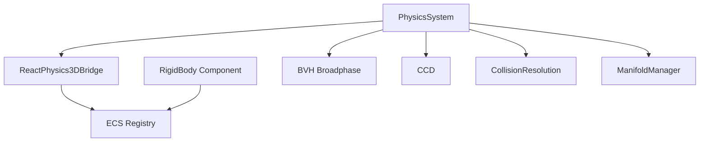
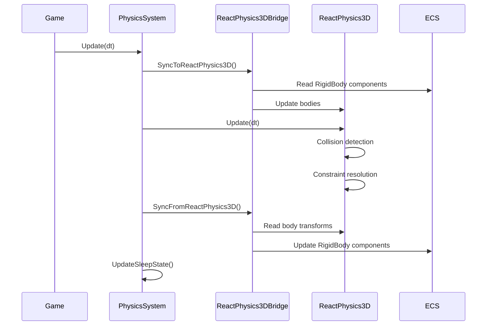

# Physics System

## Overview

The Solstice physics system provides rigid body dynamics, collision detection, and resolution. It integrates with ReactPhysics3D for robust physics simulation while maintaining a custom ECS-based component system. The system supports multiple collider types, continuous collision detection (CCD), and async physics updates.

## Architecture

The physics system consists of:

- **PhysicsSystem**: Singleton manager for physics simulation
- **RigidBody**: Component representing physics objects
- **ReactPhysics3DBridge**: Integration layer with ReactPhysics3D
- **BVH**: Bounding Volume Hierarchy for broadphase collision detection
- **CCD**: Continuous Collision Detection for fast-moving objects
- **CollisionResolution**: Iterative solver for contact constraints
- **ManifoldManager**: Persistent contact manifold management



## Core Concepts

### Physics Update Loop

The physics system follows a standard update loop:

1. **Sync to ReactPhysics3D**: Copy RigidBody component data to ReactPhysics3D bodies
2. **Update Physics World**: ReactPhysics3D performs collision detection and resolution
3. **Sync from ReactPhysics3D**: Copy results back to RigidBody components
4. **Update Sleep State**: Mark bodies as asleep if below threshold



### RigidBody Component

The `RigidBody` component stores all physics properties for an entity:

```cpp
using namespace Solstice::Physics;

// Add RigidBody to entity
auto& rb = registry.Add<RigidBody>(entityId);

// Configure collider
rb.Type = ColliderType::Capsule;
rb.CapsuleHeight = 1.75f;
rb.CapsuleRadius = 0.3f;

// Set mass (automatically sets IsStatic = false if mass > 0)
rb.SetMass(67.0f);

// Configure material properties
rb.Friction = 0.6f;
rb.Restitution = 0.0f;
rb.GravityScale = 1.0f;
rb.LinearDamping = 0.05f;
```

## API Reference

### PhysicsSystem

Singleton system managing physics simulation.

#### Lifecycle

```cpp
// Start physics system
void Start(ECS::Registry& registry);

// Stop physics system
void Stop();
```

#### Update Methods

```cpp
// Synchronous update
void Update(float dt);

// Async update (submits to job system)
void UpdateAsync(float dt);
```

#### Solver Configuration

```cpp
// Set velocity solver iterations (default: 8)
void SetVelocityIterations(int iterations);

// Set position solver iterations (default: 3)
void SetPositionIterations(int iterations);
```

#### Fluid Simulation

```cpp
// Register fluid simulation
void RegisterFluidSimulation(FluidSimulation* fluid);

// Unregister fluid simulation
void UnregisterFluidSimulation(FluidSimulation* fluid);
```

#### Bridge Access

```cpp
// Get ReactPhysics3D bridge
ReactPhysics3DBridge& GetBridge();
```

### RigidBody

Component representing a physics object.

#### Transform Properties

```cpp
Math::Vec3 Position;           // World position
Math::Quaternion Rotation;     // World rotation
Math::Vec3 Velocity;           // Linear velocity
Math::Vec3 AngularVelocity;    // Angular velocity
Math::Vec3 Acceleration;       // Linear acceleration
```

#### Collider Types

```cpp
enum class ColliderType {
    Sphere,        // Sphere collider
    Box,           // Axis-aligned box
    Triangle,      // Triangle mesh
    Capsule,       // Capsule (sphere-swept line)
    Cylinder,      // Oriented cylinder
    ConvexHull,    // General convex polyhedron
    Tetrahedron    // Tetrahedron
};

ColliderType Type;
```

#### Collider Properties

```cpp
// Sphere
float Radius;

// Box
Math::Vec3 HalfExtents;

// Capsule
float CapsuleHeight;
float CapsuleRadius;

// Cylinder
float CylinderHeight;
float CylinderRadius;

// Convex Hull
std::shared_ptr<ConvexHull> Hull;
```

#### Material Properties

```cpp
float Friction;        // Friction coefficient (0-1)
float Restitution;     // Bounciness (0-1, 0 = no bounce, 1 = perfect bounce)
float Mass;            // Mass in kg
float InverseMass;      // 1/Mass (0 for static)
Math::Vec3 InverseInertiaTensor;  // Inverse inertia tensor
```

#### Dynamics Properties

```cpp
float Drag;            // Linear drag coefficient
float AngularDrag;     // Angular drag coefficient
float LinearDamping;   // Exponential damping factor
float QuadraticDrag;   // Quadratic drag coefficient
float GravityScale;    // Gravity multiplier (1.0 = normal, 0.0 = no gravity)
bool IsStatic;         // Static body (infinite mass, doesn't move)
```

#### Forces and Impulses

```cpp
Math::Vec3 Force;              // Accumulated force
Math::Vec3 ConstantForce;       // Continuous force (thrusters, etc.)
std::vector<Math::Vec3> PendingForces;  // Forces queued for next step
std::vector<Math::Vec3> PendingTorques; // Torques queued for next step

// Apply force (accumulated for next step)
void ApplyForce(const Math::Vec3& force);

// Apply torque (accumulated for next step)
void ApplyTorque(const Math::Vec3& torque);

// Apply impulse (immediate velocity change)
void ApplyImpulse(const Math::Vec3& impulse);

// Apply angular impulse (immediate angular velocity change)
void ApplyAngularImpulse(const Math::Vec3& impulse);
```

#### Mass Configuration

```cpp
// Set mass (automatically computes inverse mass and inertia)
void SetMass(float mass);

// Set box inertia (for box colliders)
void SetBoxInertia(float mass, const Math::Vec3& halfExtents);
```

#### Continuous Collision Detection

```cpp
bool EnableCCD;                // Enable CCD for fast-moving objects
float CCDMotionThreshold;      // Minimum velocity to trigger CCD
bool IsGrabbed;                // Special handling for grabbed objects
```

#### Sleep State

```cpp
bool IsAsleep;                 // Whether body is sleeping
int SleepCounter;              // Frames below threshold

// Constants
static constexpr float SLEEP_VELOCITY_THRESHOLD = 0.01f;  // m/s
static constexpr float SLEEP_ANGULAR_THRESHOLD = 0.01f;    // rad/s
static constexpr int SLEEP_FRAMES_REQUIRED = 60;          // frames
```

### ReactPhysics3DBridge

Bridge class managing ReactPhysics3D integration.

#### Lifecycle

```cpp
// Initialize with registry
void Initialize(ECS::Registry& registry);

// Shutdown and cleanup
void Shutdown();
```

#### Synchronization

```cpp
// Sync RigidBody components to ReactPhysics3D (before physics step)
void SyncToReactPhysics3D();

// Sync ReactPhysics3D bodies to RigidBody components (after physics step)
void SyncFromReactPhysics3D();
```

#### Body Management

```cpp
// Create ReactPhysics3D body for RigidBody component
void CreateBody(ECS::EntityId entityId, RigidBody& rigidBody);

// Remove ReactPhysics3D body
void RemoveBody(ECS::EntityId entityId);
```

#### Physics World Access

```cpp
// Get ReactPhysics3D physics world
reactphysics3d::PhysicsWorld* GetPhysicsWorld() const;
```

### BVH (Bounding Volume Hierarchy)

Broadphase collision detection using spatial partitioning.

#### Building

```cpp
// Build BVH from rigid bodies
void Build(const std::vector<RigidBody*>& bodies);
```

#### Queries

```cpp
// Query bodies within AABB
template<typename Func>
void Query(const AABB& queryBounds, Func&& callback);

// Find potential collision pairs
std::vector<std::pair<int, int>> FindPotentialCollisions();

// Find self-collisions
void FindSelfCollisions(std::vector<std::pair<int, int>>& pairs);
```

### CCD (Continuous Collision Detection)

Handles fast-moving objects to prevent tunneling.

#### Swept Sphere Cast

```cpp
// Perform swept sphere cast
// Returns TOI (time of impact) in [0, 1], or >1 if no collision
static float SweptSphereCast(
    const RigidBody& sphere,
    const Math::Vec3& motion,
    const RigidBody& target
);
```

#### System Integration

```cpp
// Perform CCD for all bodies in registry
static void PerformCCD(ECS::Registry& registry, float dt);
```

### CollisionResolution

Iterative solver for contact constraints.

#### Contact Structures

```cpp
// Single contact point
struct ContactPoint {
    Math::Vec3 Position;       // World space position
    Math::Vec3 Normal;         // Contact normal (from B to A)
    float Penetration;         // Penetration depth
    Math::Vec3 LocalPointA;    // Contact in A's local space
    Math::Vec3 LocalPointB;    // Contact in B's local space
};

// Contact manifold (up to 4 contacts)
struct ContactManifold {
    RigidBody* BodyA;
    RigidBody* BodyB;
    std::vector<ContactPoint> Contacts;
    float Friction;
    float Restitution;
};

// Contact constraint for solver
struct ContactConstraint {
    RigidBody* BodyA;
    RigidBody* BodyB;
    Math::Vec3 ContactPoint;
    Math::Vec3 Normal;
    float Penetration;
    // ... solver-specific data
};
```

## Usage Examples

### Basic Physics Setup

```cpp
using namespace Solstice::Physics;
using namespace Solstice::ECS;

// Start physics system
PhysicsSystem& physics = PhysicsSystem::Instance();
physics.Start(registry);

// Configure solver
physics.SetVelocityIterations(8);
physics.SetPositionIterations(3);

// In update loop
physics.Update(deltaTime);
```

### Creating Physics Bodies

```cpp
// Create player entity with physics
EntityId player = registry.Create();

// Add RigidBody component
auto& rb = registry.Add<RigidBody>(player);
rb.Type = ColliderType::Capsule;
rb.CapsuleHeight = 1.75f;
rb.CapsuleRadius = 0.3f;
rb.SetMass(67.0f);
rb.Friction = 0.6f;
rb.Restitution = 0.0f;
rb.GravityScale = 1.0f;
rb.LinearDamping = 0.05f;

// Set initial position
rb.Position = Math::Vec3(0, 1.75f, 0);
```

### Applying Forces

```cpp
// Apply force for next physics step
rb.ApplyForce(Math::Vec3(10.0f, 0, 0));

// Apply constant force (thruster, etc.)
rb.ConstantForce = Math::Vec3(0, 0, -5.0f);

// Apply impulse (immediate velocity change)
rb.ApplyImpulse(Math::Vec3(0, 5.0f, 0));  // Jump
```

### Continuous Collision Detection

```cpp
// Enable CCD for fast-moving objects
rb.EnableCCD = true;
rb.CCDMotionThreshold = 1.0f;  // Enable if velocity > 1 m/s

// Mark as grabbed for special handling
rb.IsGrabbed = true;
```

### Static Bodies

```cpp
// Create static ground
EntityId ground = registry.Create();
auto& groundRb = registry.Add<RigidBody>(ground);
groundRb.Type = ColliderType::Box;
groundRb.HalfExtents = Math::Vec3(50, 1, 50);
groundRb.SetMass(0.0f);  // Sets IsStatic = true
groundRb.Position = Math::Vec3(0, -1, 0);
```

### Async Physics Updates

```cpp
// Submit physics update to job system
physics.UpdateAsync(deltaTime);

// Physics runs in parallel with other systems
// Results are synced back automatically
```

### Querying Physics Bodies

```cpp
// Iterate all physics bodies
registry.ForEach<RigidBody>([](EntityId entity, RigidBody& rb) {
    if (rb.IsStatic) return;
    
    // Process dynamic bodies
    float speed = rb.Velocity.Magnitude();
    if (speed > 10.0f) {
        // Fast-moving object
    }
});
```

## Integration

### With ECS System

The physics system integrates seamlessly with the ECS:

```cpp
// RigidBody is a component
registry.Add<RigidBody>(entityId);

// Physics system operates on registry
PhysicsSystem::Instance().Start(registry);
```

### With Rendering System

Sync physics transforms to scene objects:

```cpp
// In renderer, set physics registry
renderer.SetPhysicsRegistry(&registry);

// Physics transforms are automatically synced before rendering
renderer.RenderScene(scene, camera);
```

### With Transform Component

Sync RigidBody to Transform component:

```cpp
registry.ForEach<RigidBody, ECS::Transform>([](
    EntityId entity,
    RigidBody& rb,
    ECS::Transform& transform
) {
    transform.Position = rb.Position;
    transform.Rotation = rb.Rotation;
});
```

## Best Practices

1. **Mass Configuration**: Always use `SetMass()` or `SetBoxInertia()` instead of setting mass directly to ensure proper inertia calculation.

2. **Static Bodies**: Set mass to 0.0f for static objects to improve performance.

3. **Sleep State**: Let the system automatically put bodies to sleep. Don't manually set `IsAsleep` unless necessary.

4. **CCD Usage**: Enable CCD only for fast-moving objects (bullets, projectiles) to avoid performance overhead.

5. **Force Application**: 
   - Use `ApplyForce()` for continuous forces (thrusters, wind)
   - Use `ApplyImpulse()` for instantaneous changes (jumps, hits)
   - Use `ConstantForce` for persistent forces

6. **Solver Iterations**: 
   - Increase velocity iterations for better stability (8-16)
   - Increase position iterations for better penetration resolution (3-8)

7. **Async Updates**: Use `UpdateAsync()` when physics can run in parallel with other systems.

8. **Collider Selection**: 
   - Use `Sphere` for simple objects
   - Use `Capsule` for characters
   - Use `Box` for static geometry
   - Use `ConvexHull` for complex shapes

9. **Material Properties**: 
   - Friction: 0.0 (ice) to 1.0 (rubber)
   - Restitution: 0.0 (no bounce) to 1.0 (perfect bounce)

10. **Performance**: 
    - Keep static bodies as static (mass = 0)
    - Use appropriate collider complexity
    - Enable sleep for inactive bodies
    - Use BVH for broadphase when needed

## Performance Considerations

- **ReactPhysics3D Integration**: Uses proven physics library for robust simulation
- **Sleep System**: Automatically puts inactive bodies to sleep
- **BVH Broadphase**: Efficient spatial partitioning for collision detection
- **Async Updates**: Physics can run in parallel with other systems
- **SIMD Optimization**: Uses SIMD for force calculations and integration
- **Persistent Manifolds**: Reduces contact generation overhead

## Collider Type Guidelines

- **Sphere**: Best for simple round objects (balls, projectiles)
- **Box**: Best for static geometry and simple rectangular objects
- **Capsule**: Best for characters (smooth movement, no corner catching)
- **Cylinder**: Best for cylindrical objects (barrels, pipes)
- **ConvexHull**: Best for complex shapes (vehicles, debris)
- **Tetrahedron**: Best for simple triangular meshes

## Material Properties Reference

### Friction
- **0.0**: Ice, very slippery
- **0.2**: Wood on wood
- **0.5**: Default, moderate friction
- **0.8**: Rubber on concrete
- **1.0**: Maximum friction

### Restitution
- **0.0**: No bounce (clay, soft materials)
- **0.3**: Low bounce (wood, plastic)
- **0.5**: Moderate bounce (default)
- **0.8**: High bounce (rubber ball)
- **1.0**: Perfect bounce (superball, not physically realistic)

