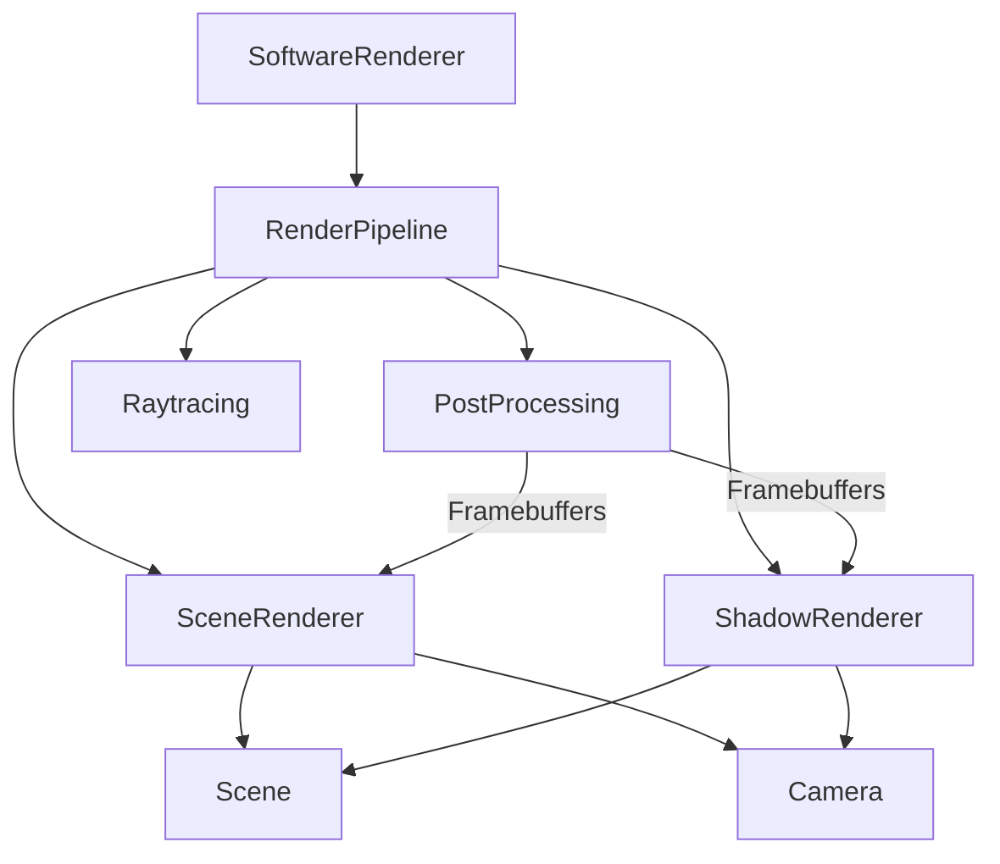
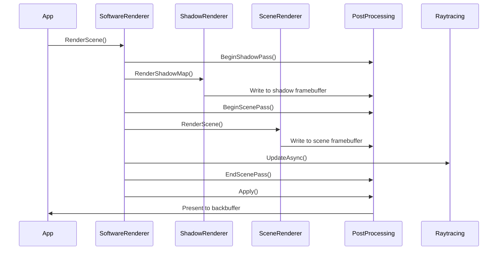

# Rendering System

## Overview

The Solstice rendering system is a CPU-centric software renderer with BGFX integration for display.

Shared graphics utilities (easing, keyframes) live in the **MinGfx** module; the renderer does not depend on MinGfx unless such usage is added later. It provides a complete rendering pipeline including shadow mapping, post-processing, raytracing, and multi-viewport support. The system is designed for retro-modern visuals targeting PS2 to early PS3-level quality.

## Stylized Rendering and Screen Effects

The main render path is BGFX: `vs_standard` / `fs_standard` for the scene pass and `fs_post` for HDR post.

### Per-material stylized controls (`MaterialExtras`)

When a `Core::Material` has a non-null `Extras` pointer, these fields feed the `u_stylize` uniform (see `source/Shaders/vs_standard.sc` and `fs_standard.sc`):

| Field | Role |
|--------|------|
| `CelBands` | `0` = normal PBR key-light response. `2`-`8` = quantize the sun lambert term into that many bands (toon/cel). Point lights are not re-banded in the current shader. |
| `RimOverdrive` | `0` = default rim weight. `> 0` scales the Fresnel-style rim (values around `2-4` read as hot edges). |
| `VertexWobbleAmplitude` | World-space displacement along vertex normals using a cheap sin (good for subtle cloth/water/muscle). Works on any mesh submitted with normals, including CPU-skinned meshes. |
| `VertexWobblePhase` | Added to the sin phase; animate each frame for motion. |

JSON material serialization includes these keys under `Extras` (see `Material.cxx`).

### Screen-space shockwave

`PostProcessing::SetShockwaveSettings` sets `u_shockwaveParams`:
- `x/y` = center in UV (`0..1`)
- `z` = ring radius in aspect-corrected UV space
- `w` = strength (`0` disables)

The post shader refracts color samples (not depth), helping keep TAA and depth-based effects stable.

Typical workflow: on explosion or impact, bump `Strength` for a few frames, animate `RingRadius` outward, then set `Strength` back to `0`.

### Volumetric-style screen fog

Full ray-marched volumes are not in this path; use these options:

1. God rays: `SetVolumetricTexture` + `SetGodRaySettings`.
2. Screen fog: `PostProcessing::SetScreenFogSettings` (`ScreenFogSettings`) for exponential distance fog plus optional height fog (`HeightAnchorY` / `HeightFalloff`), applied in linear HDR before ACES.
3. Fog dither: `PostProcessing::CinematicViewState::ScreenFogDither` (`u_FogDither` in `fs_post`) adds small per-pixel hash noise to reduce banding in broad gradients.

Also available on `PostProcessing::CinematicViewState`: depth-scaled chromatic aberration and smear frames (`u_ChromaticParams`, `u_SmearFrame`) for stylized cinematic passes.

Use god rays for shafts, screen fog for atmospheric depth/ground mist, and dither/cinematic fields for stable gradients and tool previews.

### 2D sprites on 3D bones (integration pattern)

There is no single sprite-socket draw call in the core scene pass today. The intended pattern is:

1. Evaluate animation (for example `Skeleton` / `Pose` or Parallax rig) to get a world matrix for the target bone.
2. Create/update a scene object using a billboard/card mesh (`vs_billboard` / `fs_billboard`) and set its transform from the bone each frame.
3. Use transparent or cutout material and standard transparent depth ordering.

Authoring tools can automate step 2 by parenting a sprite object to a bone name at export and resolving bone index at load time.

## Asset packaging (RELIC)

Asset containers use the **RELIC** (Resource and Level Index Container) format for streaming and mod/DLC layering. See [RelicFormat.md](RelicFormat.md) for bootstrap layout, container header/manifest/dependency table, compression (LZX/zstd), and delta assets.

## Architecture

The rendering system consists of several key components:

- **DefaultRenderer** (`SoftwareRenderer` compatibility alias): Main renderer interface and orchestration
- **SceneRenderer**: Handles scene object rendering and culling
- **ShadowRenderer**: Generates shadow maps for dynamic shadows
- **RenderPipeline**: Coordinates rendering passes
- **PostProcessing**: Manages framebuffers and post-processing effects
- **Raytracing**: Advanced lighting via bitwise raytracing
- **Scene**: Scene graph with SoA (Structure of Arrays) data layout
- **Camera**: View and projection matrix management


```mermaid
graph TB
    SoftwareRenderer[SoftwareRenderer]
    RenderPipeline[RenderPipeline]
    SceneRenderer[SceneRenderer]
    ShadowRenderer[ShadowRenderer]
    PostProcessing[PostProcessing]
    Raytracing[Raytracing]
    Scene[Scene]
    Camera[Camera]
    
    SoftwareRenderer --> RenderPipeline
    RenderPipeline --> ShadowRenderer
    RenderPipeline --> SceneRenderer
    RenderPipeline --> PostProcessing
    RenderPipeline --> Raytracing
    SceneRenderer --> Scene
    ShadowRenderer --> Scene
    SceneRenderer --> Camera
    ShadowRenderer --> Camera
    PostProcessing -->|Framebuffers| SceneRenderer
    PostProcessing -->|Framebuffers| ShadowRenderer
```

## Rendering Pipeline

The rendering pipeline executes in the following order:

1. **Shadow Pass** (View ID 1): Render shadow map from light's perspective
2. **Scene Pass** (View ID 2): Render main scene with lighting and shadows
3. **Post-Process Pass** (View ID 4): Apply post-processing effects
4. **UI Pass** (View ID 3/10/11): Render UI overlay


```mermaid
sequenceDiagram
    participant App
    participant SoftwareRenderer
    participant ShadowRenderer
    participant SceneRenderer
    participant PostProcessing
    participant Raytracing
    
    App->>SoftwareRenderer: RenderScene()
    SoftwareRenderer->>PostProcessing: BeginShadowPass()
    SoftwareRenderer->>ShadowRenderer: RenderShadowMap()
    ShadowRenderer->>PostProcessing: Write to shadow framebuffer
    SoftwareRenderer->>PostProcessing: BeginScenePass()
    SoftwareRenderer->>SceneRenderer: RenderScene()
    SceneRenderer->>PostProcessing: Write to scene framebuffer
    SoftwareRenderer->>Raytracing: UpdateAsync()
    SoftwareRenderer->>PostProcessing: EndScenePass()
    SoftwareRenderer->>PostProcessing: Apply()
    PostProcessing->>App: Present to backbuffer
```

## Forward-pass lighting (scene shader)

The main opaque/transparent mesh pass uses **`vs_standard.sc` / `fs_standard.sc`**. Lighting is a deliberate mix of **readable PBR**, **stylized hooks**, and **controlled cost** on both CPU and GPU.

### Model (per pixel)

| Term | Description |
|------|-------------|
| **Key (sun)** | One **directional** light: Cook–Torrance microfacet specular (GGX distribution, Schlick Fresnel, simplified Smith geometry). Diffuse uses a **wrapped Lambert** factor so silhouettes stay soft without extra fill lights. Cel banding from `MaterialExtras::CelBands` applies to this term only. |
| **Point lights** | Up to **32** stacked lights with the same BRDF as the key; inverse-square attenuation with a smooth range rolloff (see `CalculatePointLight` in `fs_standard.sc`). |
| **Ambient** | Hemisphere blend (ground/sky tint by world **N.y**) scaled by `SceneLightingTune::AmbientIntensity`. When `EnvIrradianceBlend` &gt; 0 and a skybox cubemap is bound, an **optional** normal-facing cubemap sample approximates diffuse irradiance (cheap IBL flavor, not filtered SH). |
| **Shadows** | Single cascade-style matrix from the shadow pass; **2×2 PCF** with slope/ground-biased depth compare. Direct diffuse and specular from the key are masked; ambient is **not** fully killed by shadow so interiors stay legible. **`ShadowAmbientFill`** adds extra hemisphere lift in shadowed areas only. |
| **Reflections / glass** | Environment cubemap along **R** (and refraction for transparent materials). Separate from the irradiance sample; roughness still modulates the forward spec lobe. |

### CPU infrastructure (`SceneRenderer`)

- **Primary directional**: The **first** directional in the light list drives `u_LightDir` / `u_LightColor` (matches shadow and post lighting direction). Extra directionals are ignored on this path; add explicit art or a second pass if you need multiple suns.
- **Point lights**: Only `LightType::Point` is forwarded. **`Spot` is skipped** here (use volumetrics or future spot support). If more than 32 point lights exist, the **32 closest to the camera** are kept (`partial_sort` by squared distance), stabilizing cost and prioritizing what the player sees.
- **Environment irradiance blend** is forced to **0** when no valid skybox cubemap is bound, so shaders do not rely on an undefined cubemap.

Global tune is uploaded as **`u_SceneLighting`** from `SceneLightingTune`:

| Field | Shader component | Role |
|--------|-------------------|------|
| `AmbientIntensity` | `x` | Scales hemisphere + environment-derived ambient. |
| `EnvIrradianceBlend` | `y` | `0` = hemisphere only (no extra cubemap sample for **N**); `0.2–0.4` typical with a good skybox. |
| `KeyDiffuseWrap` | `z` | `0` = standard Lambert; higher = softer terminator (try `0.05–0.15`). |
| `ShadowAmbientFill` | `w` | Extra ambient in penumbra/shadow to avoid pitch-black micro-detail (try `0.4–0.8`). |

Set from C++ on the renderer:

```cpp
Solstice::Render::SceneLightingTune tune;
tune.AmbientIntensity = 1.0f;
tune.EnvIrradianceBlend = 0.28f;
tune.KeyDiffuseWrap = 0.08f;
tune.ShadowAmbientFill = 0.55f;
renderer.SetSceneLightingTune(tune);
```

`SoftwareRenderer::SetSceneLightingTune` forwards to `SceneRenderer`; `GetSceneLightingTune()` is available on `SceneRenderer` for tools.

### Performance notes

- **GPU**: Worst case per shaded pixel includes shadow map PCF, up to 32 point iterations, optional environment **N** sample (only when `EnvIrradianceBlend` &gt; 0), plus reflection/refraction cubemap samples on reflective materials. Stylized modes that keep point counts and env blend low track best on integrated GPUs.
- **CPU**: Light selection is **O(N log 32)** when *N* &gt; 32 points; otherwise linear. Ray tracing / volumetrics in `SoftwareRenderer::RenderScene` are separate toggles and workloads.

### Shader builds

Changing `fs_standard.sc` requires recompiling the scene fragment shader to **`fs_standard.bin`** on your target backends (shaderc scripts or project build step); see `ShaderLoader` search paths (`source/Shaders/bin/`, etc.).

## Core Concepts

### Scene Management

The `Scene` class manages all renderable objects using a Structure of Arrays (SoA) layout for SIMD optimization:

```cpp
using namespace Solstice::Render;

Scene scene;

// Add object to scene
SceneObjectID objId = scene.AddObject(
    meshId,                    // Mesh library ID
    Math::Vec3(0, 0, 0),      // Position
    Math::Quaternion(),       // Rotation
    Math::Vec3(1, 1, 1),      // Scale
    ObjectType::Static        // Object type
);

// Update transforms
scene.SetPosition(objId, Math::Vec3(10, 0, 0));
scene.SetRotation(objId, Math::Quaternion::FromEuler(0, 45, 0));
scene.UpdateTransforms();
```

**SoA Layout Benefits:**
- SIMD-friendly: Process multiple objects simultaneously
- Cache-efficient: Sequential access patterns
- Parallel-friendly: Easy to parallelize operations

### Camera System

The `Camera` class provides view and projection matrix generation:

```cpp
using namespace Solstice::Render;

Camera camera(
    Math::Vec3(0, 1.75f, 3.0f),  // Position
    Math::Vec3(0, 1, 0),         // Up vector
    -90.0f,                      // Yaw
    0.0f                         // Pitch
);

// Get view matrix
Math::Matrix4 view = camera.GetViewMatrix();

// Get frustum for culling
Frustum frustum = camera.GetFrustum(aspectRatio, fov, nearPlane, farPlane);

// Process input
camera.ProcessKeyboard(direction, deltaTime);
camera.ProcessMouseMovement(xOffset, yOffset);
```

**VR Support:**
The camera supports VR stereo rendering with configurable IPD (Inter-pupillary distance):

```cpp
VRCameraConfig vrConfig;
vrConfig.IPD = 0.064f;  // 64mm
vrConfig.IsVR = true;
camera.SetVRConfig(vrConfig);

// Get view matrices for each eye
Math::Matrix4 leftView = camera.GetViewMatrixVR(true);
Math::Matrix4 rightView = camera.GetViewMatrixVR(false);
```

### Multi-Viewport Support

The renderer supports multiple viewports for split-screen or picture-in-picture:

```cpp
SoftwareRenderer renderer(width, height);

// Set number of viewports
renderer.SetViewportCount(2);

// Configure viewport 0
renderer.SetViewport(0, 0, 0, width/2, height);

// Configure viewport 1
renderer.SetViewport(1, width/2, 0, width/2, height);
```

## API Reference

### DefaultRenderer

Main renderer interface for scene rendering.

#### Initialization

```cpp
DefaultRenderer(int width, int height, int tileSize = 16, SDL_Window* window = nullptr);
~DefaultRenderer();
```

#### Scene Rendering

```cpp
// Render scene with default lighting
void RenderScene(Scene& sceneGraph, const Camera& cam);

// Render scene with explicit lights
void RenderScene(Scene& sceneGraph, const Camera& cam, 
                 const std::vector<Physics::LightSource>& lights);

void SetSceneLightingTune(const SceneLightingTune& tune);

// VR stereo rendering
void RenderSceneVR(Scene& sceneGraph, const Camera& cam, bool leftEye);
```

#### Viewport Management

```cpp
void SetViewportCount(uint32_t count);
uint32_t GetViewportCount() const;
void SetViewport(uint32_t index, uint32_t x, uint32_t y, 
                 uint32_t width, uint32_t height);
void GetViewport(uint32_t index, uint32_t& x, uint32_t& y,
                 uint32_t& width, uint32_t& height) const;
```

#### Configuration

```cpp
// Clear buffers
void Clear(const Math::Vec4& color);

// Present to screen
void Present();

// VSync control
void SetVSync(bool enable);

// Optimization
void SetOptimizeStaticBuffers(bool enable);
void SetAsyncRendering(bool enable);
void SetUseSIMD(bool enable);

// Debug
void SetWireframe(bool enable);
void SetShowDebugOverlay(bool enable);
void SetPhysicsDebugMode(bool enable);
void RenderPhysicsDebug(const void* physicsSystem);
```

#### Selection and Hover

```cpp
void SetSelectedObjects(const std::set<SceneObjectID>& objects);
void SetHoveredObject(SceneObjectID objectID);
```

#### Statistics

```cpp
struct RenderStats {
    uint32_t VisibleObjects;
    uint32_t TrianglesSubmitted;
    uint32_t TrianglesCulled;
    uint32_t TrianglesRendered;
    float CullTimeMs;
    float TransformTimeMs;
    float RasterTimeMs;
    float TotalTimeMs;
};

const RenderStats& GetStats() const;
```

### SceneRenderer

Handles scene object rendering, culling, and submission.

#### Initialization

```cpp
void Initialize(bgfx::ProgramHandle sceneProgram,
                bgfx::VertexLayout vertexLayout,
                PostProcessing* postProcessing,
                TextureRegistry* textureRegistry,
                Skybox* skybox,
                bgfx::ProgramHandle skyboxProgram,
                uint32_t width, uint32_t height);
```

#### Rendering

```cpp
void RenderScene(Scene& scene, const Camera& camera,
                 MeshLibrary* meshLib,
                 Core::MaterialLibrary* materialLib,
                 uint32_t& trianglesSubmitted);
```

#### Culling

```cpp
void CullObjects(Scene& scene, const Camera& camera,
                 std::vector<SceneObjectID>& visibleObjects);
```

#### Configuration

```cpp
void SetOptimizeStaticBuffers(bool enable);
void SetWireframe(bool enable);
void SetShowDebugOverlay(bool enable);
void SetSelectedObjects(const std::set<SceneObjectID>& objects);
void SetHoveredObject(SceneObjectID objectID);
void SetLightSources(const std::vector<Physics::LightSource>& lights);
void SetSceneLightingTune(const SceneLightingTune& tune);
const SceneLightingTune& GetSceneLightingTune() const;
```

### SceneLightingTune

POD knobs for `u_SceneLighting` in `fs_standard.sc`; see **Forward-pass lighting** above.

```cpp
struct SceneLightingTune {
    float AmbientIntensity = 1.0f;
    float EnvIrradianceBlend = 0.28f;
    float KeyDiffuseWrap = 0.08f;
    float ShadowAmbientFill = 0.55f;
};
```

### ShadowRenderer

Generates shadow maps for dynamic shadows.

#### Initialization

```cpp
void Initialize(bgfx::ProgramHandle shadowProgram,
                bgfx::VertexLayout vertexLayout,
                PostProcessing* postProcessing,
                uint32_t shadowMapSize = 1024);
```

#### Rendering

```cpp
void RenderShadowMap(Scene& scene, const Camera& camera,
                     MeshLibrary* meshLib,
                     bool optimizeStaticBuffers,
                     uint32_t& visibleObjectsCount);
```

### PostProcessing

Manages framebuffers and post-processing pipeline.

#### Initialization

```cpp
void Initialize(uint32_t width, uint32_t height);
void Resize(uint32_t width, uint32_t height);
void Shutdown();
```

#### Pass Management

```cpp
void BeginShadowPass();
void BeginScenePass();
void EndScenePass();
void Apply(bgfx::ViewId viewId);
```

#### Configuration

```cpp
void SetShadowQuality(int size);
void SetCameraPosition(const Math::Vec3& pos);
void SetLightDirection(const Math::Vec3& direction);
void SetRaytracingTextures(bgfx::TextureHandle shadowTexture,
                          bgfx::TextureHandle aoTexture);
void SetHDRExposure(float exposure);

// Motion Blur
enum class MotionBlurQuality {
    Low,    // 6 samples, 0.75x strength
    Medium, // 12 samples, 1.0x strength
    High    // 24 samples, 1.25x strength
};

struct MotionBlurSettings {
    bool Enabled = false;
    float Strength = 1.0f;
    int SampleCount = 12;
    float DepthScale = 0.5f;
    MotionBlurQuality Quality = MotionBlurQuality::Medium;
};

void SetMotionBlurSettings(const MotionBlurSettings& settings);
void SetMotionBlurQuality(MotionBlurQuality quality);
void SetPreviousViewProj(const Math::Matrix4& prevViewProj);

// Temporal AA
struct TAASettings {
    bool Enabled;
    float BlendFactor;
    float ClampStrength;
    float Sharpen;
};
void SetTAASettings(const TAASettings& settings);
const TAASettings& GetTAASettings() const;
void InvalidateTAAHistory();

// Velocity Buffer
void BeginVelocityPass();
void EndVelocityPass();
bgfx::FrameBufferHandle GetVelocityFramebuffer() const;
bgfx::TextureHandle GetVelocityBuffer() const;
bgfx::TextureHandle GetTAAHistoryTexture() const;

// Per-object velocity tracking
void UpdateObjectVelocity(uint32_t objectId, const Math::Matrix4& currentTransform);
Math::Vec3 GetObjectVelocity(uint32_t objectId) const;
```

#### Resource Access

```cpp
bgfx::FrameBufferHandle GetShadowFramebuffer() const;
bgfx::FrameBufferHandle GetSceneFramebuffer() const;
bgfx::TextureHandle GetShadowMap() const;
bgfx::TextureHandle GetSceneColor() const;
const Math::Matrix4& GetShadowViewProj() const;
```

### Raytracing

Advanced lighting via bitwise raytracing with voxel grids.

#### Initialization

```cpp
void Initialize(uint32_t width, uint32_t height,
                const Math::Vec3& worldMin,
                const Math::Vec3& worldMax);
void Shutdown();
```

#### Voxel Grid

```cpp
void BuildVoxelGrid(const Scene& scene);
void BuildVoxelGridMipmaps();
void SetVoxelResolution(uint32_t resX, uint32_t resY, uint32_t resZ);
```

#### Ray Tracing

```cpp
void TraceShadowRays(const std::vector<Physics::LightSource>& lights,
                     const Scene& scene);
void TraceAORays(const Scene& scene, float radius = 2.0f, int samples = 16);
void TraceRayPacket(const RayPacket& packet,
                    float outHitDistances[4], bool outHits[4]);
```

#### Async Updates

```cpp
void UpdateAsync();
void UpdateAsync(const std::vector<Physics::LightSource>& lights,
                 const Scene& scene);
```

#### Configuration

```cpp
void SetAORadius(float radius);
void SetAOSamples(int samples);
void SetShadowScale(float scale);
void SetAOScale(float scale);
void SetStochasticRatio(float ratio);
void SetTemporalAccumulationFrames(int frames);
void SetUseSSAO(bool use);
```

#### Resource Access

```cpp
bgfx::TextureHandle GetShadowTexture() const;
bgfx::TextureHandle GetAOTexture() const;
```

### Scene

Scene graph with SoA data layout.

#### Object Management

```cpp
SceneObjectID AddObject(uint32_t meshID,
                        const Math::Vec3& position,
                        const Math::Quaternion& rotation = Math::Quaternion(),
                        const Math::Vec3& scale = Math::Vec3(1, 1, 1),
                        ObjectType type = ObjectType::Static);
void RemoveObject(SceneObjectID id);
```

#### Transform Access

```cpp
void SetTransform(SceneObjectID id, const Math::Vec3& pos,
                  const Math::Quaternion& rot, const Math::Vec3& scale);
void SetPosition(SceneObjectID id, const Math::Vec3& pos);
void SetRotation(SceneObjectID id, const Math::Quaternion& rot);
Math::Vec3 GetPosition(SceneObjectID id) const;
Math::Quaternion GetRotation(SceneObjectID id) const;
Math::Vec3 GetScale(SceneObjectID id) const;
const Math::Matrix4& GetWorldMatrix(SceneObjectID id) const;
void UpdateTransforms();
```

#### Culling and Visibility

```cpp
void FrustumCull(const Camera& cam,
                 std::vector<SceneObjectID>& visibleObjects,
                 float aspectRatio = 16.0f / 9.0f);
void UpdateLODs(const Math::Vec3& cameraPos);
```

#### Spatial Queries

```cpp
void QueryOctree(const Math::Vec3& min, const Math::Vec3& max,
                 std::vector<uint32_t>& results);
```

#### Resource Management

```cpp
void SetMeshLibrary(MeshLibrary* library);
void SetMaterialLibrary(Core::MaterialLibrary* library);
MeshLibrary* GetMeshLibrary();
Core::MaterialLibrary* GetMaterialLibrary();
```

### Camera

View and projection matrix management.

#### Construction

```cpp
Camera(Math::Vec3 position = Math::Vec3(0.0f, 0.0f, 3.0f),
       Math::Vec3 up = Math::Vec3(0.0f, 1.0f, 0.0f),
       float yaw = -90.0f,
       float pitch = 0.0f);
```

#### Matrix Generation

```cpp
Math::Matrix4 GetViewMatrix() const;
Frustum GetFrustum(float aspect, float fov, float near, float far) const;

// VR support
Math::Matrix4 GetViewMatrixVR(bool leftEye) const;
Math::Matrix4 GetProjectionMatrixVR(bool leftEye, float aspect) const;
Frustum GetFrustumVR(bool leftEye, float aspect) const;
```

#### Input Processing

```cpp
void ProcessKeyboard(Math::Vec3 direction, float deltaTime);
void ProcessMouseMovement(float xOffset, float yOffset, bool constrainPitch = true);
void ProcessMouseScroll(float yOffset);
```

#### VR Configuration

```cpp
void SetVRConfig(const VRCameraConfig& config);
const VRCameraConfig& GetVRConfig() const;
bool IsVR() const;
```

## Usage Examples

### Basic Scene Rendering

```cpp
using namespace Solstice::Render;

// Initialize renderer
DefaultRenderer renderer(1280, 720);
renderer.SetVSync(true);

// Create scene
Scene scene;
scene.SetMeshLibrary(&meshLibrary);
scene.SetMaterialLibrary(&materialLibrary);

// Add objects
SceneObjectID cube = scene.AddObject(
    cubeMeshId,
    Math::Vec3(0, 0, 0),
    Math::Quaternion(),
    Math::Vec3(1, 1, 1),
    ObjectType::Static
);

// Setup camera
Camera camera(Math::Vec3(0, 1.75f, 5.0f));

// Render loop
while (running) {
    // Update scene
    scene.UpdateTransforms();
    
    // Render
    renderer.RenderScene(scene, camera);
    renderer.Present();
}
```

### Shadow Rendering

```cpp
// Setup post-processing with shadows
PostProcessing postProcessing;
postProcessing.Initialize(1280, 720);
postProcessing.SetLightDirection(Math::Vec3(0.5f, 1.0f, -0.5f).Normalized());

// Setup shadow renderer
ShadowRenderer shadowRenderer;
shadowRenderer.Initialize(shadowProgram, vertexLayout, &postProcessing, 1024);

// In render loop
postProcessing.BeginShadowPass();
shadowRenderer.RenderShadowMap(scene, camera, &meshLibrary, true, visibleCount);
postProcessing.BeginScenePass();
sceneRenderer.RenderScene(scene, camera, &meshLibrary, &materialLibrary, triangles);
postProcessing.EndScenePass();
postProcessing.Apply(0); // Blit to backbuffer
```

### Raytracing Integration

```cpp
// Initialize raytracing
Raytracing raytracing;
raytracing.Initialize(1280, 720, Math::Vec3(-100, -100, -100), Math::Vec3(100, 100, 100));
raytracing.SetAORadius(2.0f);
raytracing.SetAOSamples(16);

// Build voxel grid
raytracing.BuildVoxelGrid(scene);

// In render loop (async)
raytracing.UpdateAsync(lights, scene);

// Integrate with post-processing
postProcessing.SetRaytracingTextures(
    raytracing.GetShadowTexture(),
    raytracing.GetAOTexture()
);
```

### Object Selection

```cpp
// Set selected objects
std::set<SceneObjectID> selected;
selected.insert(cubeId);
selected.insert(sphereId);
renderer.SetSelectedObjects(selected);

// Set hovered object
renderer.SetHoveredObject(cubeId);
```

## Integration

### With Physics System

The renderer can sync physics transforms to the scene:

```cpp
// Set physics registry
renderer.SetPhysicsRegistry(&ecsRegistry);

// Physics transforms are automatically synced before rendering
renderer.RenderScene(scene, camera);
```

### With ECS System

Sync ECS transforms to scene objects:

```cpp
registry.ForEach<ECS::Transform>([&](EntityId entity, ECS::Transform& transform) {
    SceneObjectID sceneId = GetSceneObjectId(entity);
    scene.SetPosition(sceneId, transform.Position);
    scene.SetRotation(sceneId, transform.Rotation);
});
```

### Hybrid integration contract (ECS, Parallax, Jackhammer)

Use this runtime contract for the hybrid scheduler, meshlet batching, and visibility data feeds:

1. **ECS transform feed (dirty-mask + persistent mapping)**
   - Drive transforms via `Scene::SetTransform` / `Scene::SetPosition` and call `Scene::UpdateTransforms()` once per frame before submission.
   - `DefaultRenderer` hot paths are expected to operate with dirty updates only and fixed-capacity command/ring structures (no per-frame heap allocation).
   - Recommended order: physics tick -> ECS write-back -> `Scene::UpdateTransforms()` -> `RenderScene()`.

2. **Parallax material + LOD metadata feed**
   - Populate `Scene` material IDs (`Scene::SetMaterial`) and mesh bounds (`Mesh::BoundsMin/BoundsMax`) at import time.
   - Feed scheduler features from material complexity, depth/distance variance, and motion magnitude from prior-frame transforms.

3. **Jackhammer jobs + telemetry feed**
   - Keep BGFX submission on the render thread.
   - Background jobs can preprocess meshlet clusters, visibility candidates, and ML feature extraction.
   - Feed per-frame telemetry to scheduling with CPU busy ratio, one-frame-delayed GPU busy proxy, and realized CPU/GPU execution time by batch.

4. **Synchronization contract**
   - Do not block on GPU readback in the critical frame path.
   - Treat visibility/occlusion feedback as one-frame delayed.
   - Keep explicit fence boundaries around CPU command build completion, GPU submission completion, and post-process completion.

5. **Migration notes**
   - `DefaultRenderer` is the preferred API surface; `SoftwareRenderer` remains as a compatibility alias.
   - Asset compression paths should use Core `LZX` (`Core/System/LZX.hxx`).

### With UI System

The renderer coordinates with the UI system for proper view ordering:

```cpp
// UI is rendered after post-processing
// View order: Shadow(1) -> Scene(2) -> Post(4) -> UI(3/10/11)
bgfx::ViewId viewOrder[] = {
    PostProcessing::VIEW_SHADOW,
    PostProcessing::VIEW_SCENE,
    0,  // Post-processing output
    3,  // UI overlay
    UISystem::Instance().GetViewId()
};
bgfx::setViewOrder(0, 5, viewOrder);
```

## Best Practices

1. **Update Transforms Before Rendering**: Always call `scene.UpdateTransforms()` before rendering to ensure matrices are up to date.

2. **Use Appropriate Object Types**: 
   - `ObjectType::Static` for never-moving objects (can be baked into BSP)
   - `ObjectType::Dynamic` for moving objects
   - `ObjectType::Skinned` for animated meshes

3. **Optimize Static Buffers**: Enable `SetOptimizeStaticBuffers(true)` for static geometry to reduce draw calls.

4. **Async Rendering**: Enable async rendering for complex scenes with many objects.

5. **SIMD Optimization**: Enable SIMD for vertex processing when available.

6. **LOD Management**: Use `UpdateLODs()` to automatically select appropriate detail levels based on distance.

7. **Culling**: Use `FrustumCull()` to reduce rendered objects before submission.

8. **Shadow Quality**: Balance shadow map size (512-2048) with performance requirements.

9. **Raytracing Settings**: Adjust raytracing quality based on performance:
   - Lower resolution scales for better performance
   - Reduce AO samples for faster updates
   - Use temporal accumulation to spread work across frames

10. **Viewport Management**: Use multi-viewport for split-screen or debugging, but be aware of performance impact.

## Performance Considerations

- **SoA Layout**: Scene uses Structure of Arrays for SIMD-friendly processing
- **Tile-Based Rasterization**: 8×8 or 16×16 tiles for cache efficiency
- **Async Rendering**: Parallel tile rasterization with configurable thresholds
- **Early-Z Rejection**: Depth testing before expensive shading
- **Frustum Culling**: Reduces rendered objects significantly
- **LOD System**: Automatic detail reduction for distant objects
- **Static Buffer Optimization**: Reduces draw calls for static geometry

## View IDs

The rendering system uses specific BGFX view IDs:

- **0**: Reserved/Main output
- **1**: Shadow pass (PostProcessing::VIEW_SHADOW)
- **2**: Scene pass (PostProcessing::VIEW_SCENE)
- **3**: UI overlay
- **4**: Post-processing output
- **10**: Default UI view
- **11**: HUD view (pixel-perfect rendering)

Views are executed in ascending order, so proper ordering is essential for correct rendering.

