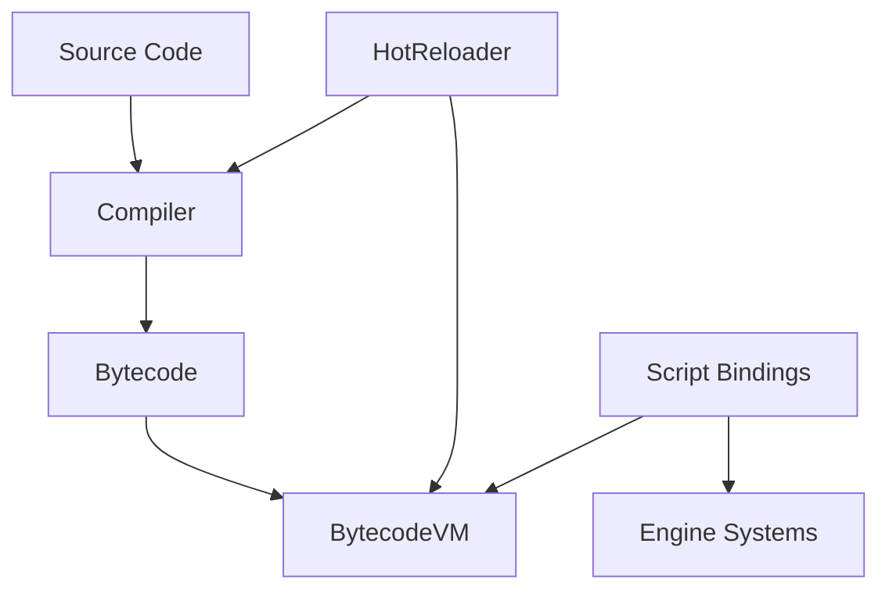

# Scripting System

## Overview

The Solstice scripting system provides a bytecode-based virtual machine for game logic scripting. It supports a stack-based execution model with 16 registers, native function bindings, module system, and hot reloading for live code updates. The system is designed for performance and flexibility.

### Developer automation scripts (Linux/macOS)

For local environment setup and build automation, use the shell scripts in `tools/`:
On Linux, the setup script supports `apt-get`, `dnf`, and `pacman` (Arch Linux).

```bash
# Linux
bash tools/setup_env_linux.sh
bash tools/build_linux.sh
```

```bash
# macOS
bash tools/setup_env_macos.sh
bash tools/build_macos.sh
```

Manual fallback remains available in the repository `README.md` under the Building section.

## Architecture

The scripting system consists of:

- **BytecodeVM**: Stack-based virtual machine with register support
- **Compiler**: Source-to-bytecode compiler
- **HotReloader**: Live code reloading system
- **ScriptBindings**: C++ bindings for engine APIs
- **Collections**: Array, Dictionary, and Set types



## Core Concepts

### Bytecode Format

The VM uses a simple bytecode format with opcodes and operands:

```cpp
enum class OpCode : uint8_t {
    NOP,
    PUSH_CONST,    // Push immediate value
    POP,           // Pop from stack
    DUP,           // Duplicate top of stack
    MOV_REG,       // Move value to register
    LOAD_REG,      // Push value from register
    ADD, SUB, MUL, DIV, MOD, POW, ABS, MIN, MAX,  // Arithmetic
    EQ, NEQ, LT, GT, LE, GE,  // Comparisons
    AND, OR, XOR, NOT, SHL, SHR,  // Bitwise operations
    JMP,           // Jump
    JMP_IF,        // Conditional jump
    CALL,          // Call function
    RET,           // Return
    IMPORT_MODULE, // Import module
    GET_ATTR,      // Get attribute
    SET_ATTR,      // Set attribute
    NEW_OBJ,       // Create object
    ARRAY_GET, ARRAY_SET, ARRAY_PUSH, ARRAY_POP,
    STR_CONCAT, STR_LEN, STR_SUBSTR,  // String operations
    HALT
};
```

### Value System

The VM supports multiple value types:

```cpp
using Value = std::variant<
    int64_t,                    // Integer
    double,                     // Float
    std::string,                // String
    Math::Vec2, Math::Vec3, Math::Vec4,  // Vectors
    Math::Matrix2, Math::Matrix3, Math::Matrix4,  // Matrices
    Math::Quaternion,           // Quaternion
    std::shared_ptr<Array>,     // Array collection
    std::shared_ptr<Dictionary>, // Dictionary collection
    std::shared_ptr<Set>        // Set collection
>;
```

### Execution Model

The VM uses a hybrid stack-register model:

- **Stack**: For expression evaluation and function calls
- **Registers**: 16 registers (R0-R15) for local variables
- **Call Stack**: Stores return addresses for function calls

## API Reference

### BytecodeVM

Main virtual machine interface.

#### Lifecycle

```cpp
BytecodeVM();
```

#### Program Management

```cpp
// Load program
void LoadProgram(const Program& prog);

// Reload program (preserves registers)
void ReloadProgram(const Program& prog);

// Run program
void Run();
```

#### Stack Operations

```cpp
// Push value to stack
void Push(Value v);

// Pop value from stack
Value Pop();

// Peek at stack (without popping)
Value Peek(size_t offset = 0);
```

#### Native Functions

```cpp
using NativeFunc = std::function<Value(const std::vector<Value>& args)>;

// Register native function
void RegisterNative(const std::string& name, NativeFunc func);
```

#### Module System

```cpp
// Add module
void AddModule(const std::string& name, const Program& prog);

// Check if module exists
bool HasModule(const std::string& name) const;

// Get module
const Program& GetModule(const std::string& name) const;
```

#### System Registration

```cpp
struct SystemInfo {
    std::string Name;
    size_t FunctionAddress;
    std::vector<std::string> ComponentNames;
};

// Register ECS system
void RegisterSystem(const SystemInfo& system);
const std::vector<SystemInfo>& GetSystems() const;
```

#### Registry Access

```cpp
// Set ECS registry
void SetRegistry(ECS::Registry* registry);
ECS::Registry* GetRegistry() const;
```

### Program

Bytecode program container.

#### Construction

```cpp
struct Program {
    std::vector<Instruction> Instructions;
    std::unordered_map<std::string, size_t> Exports;
    
    // Add instruction
    void Add(OpCode op, Value operand = 0);
    void AddReg(OpCode op, uint8_t reg);
    
    // Serialization
    void Serialize(std::vector<uint8_t>& out) const;
    static Program Deserialize(const std::vector<uint8_t>& in);
};
```

### Compiler

Source-to-bytecode compiler.

#### Compilation

```cpp
class Compiler {
    // Compile source to bytecode
    Program Compile(const std::string& source);
    
    // Batch compile all files in directory
    std::unordered_map<std::string, Program> BatchCompile(
        const std::filesystem::path& directory
    );
};
```

### HotReloader

Live code reloading system.

#### Lifecycle

```cpp
HotReloader(Compiler& compiler, BytecodeVM& vm);
```

#### File Watching

```cpp
// Add file to watch
void AddWatch(const std::filesystem::path& path);

// Update (check for changes)
void Update();

// Reload callback
using ReloadCallback = std::function<void(const std::string& moduleName, const Program& prog)>;
void OnReload(ReloadCallback callback);
```

### Collections

#### Array

```cpp
class Array {
    // Access
    Value Get(size_t index) const;
    void Set(size_t index, const Value& value);
    
    // Stack operations
    void Push(const Value& value);
    Value Pop();
    
    // Utilities
    size_t Length() const;
    void Clear();
    void Insert(size_t index, const Value& value);
    void Remove(size_t index);
    Array Slice(size_t start, size_t end) const;
    int64_t IndexOf(const Value& value) const;
    
    std::vector<Value> Data;
};
```

#### Dictionary

```cpp
class Dictionary {
    // Access
    Value Get(const std::string& key) const;
    void Set(const std::string& key, const Value& value);
    bool Has(const std::string& key) const;
    void Remove(const std::string& key);
    
    // Utilities
    size_t Size() const;
    void Clear();
    std::shared_ptr<Array> Keys() const;
    std::shared_ptr<Array> Values() const;
    
    std::unordered_map<std::string, Value> Data;
};
```

#### Set

```cpp
class Set {
    // Operations
    void Add(const Value& value);
    void Remove(const Value& value);
    bool Contains(const Value& value) const;
    
    // Utilities
    size_t Size() const;
    void Clear();
    std::shared_ptr<Set> Union(const Set& other) const;
    std::shared_ptr<Set> Intersection(const Set& other) const;
    
    std::unordered_set<Value, ValueHash> Data;
};
```

### ScriptBindings

C++ bindings for engine APIs.

#### Registration

```cpp
// Register all engine bindings
void RegisterScriptBindings(
    BytecodeVM& vm,
    ECS::Registry* registry,
    Render::Scene* scene = nullptr,
    Physics::PhysicsSystem* physicsSystem = nullptr,
    Render::Camera* camera = nullptr
);
```

#### Value Helpers

```cpp
// Extract values from Value variant
float GetFloat(const Value& v);
int64_t GetInt(const Value& v);
std::string GetString(const Value& v);
```

## Usage Examples

### Basic Script Execution

```cpp
using namespace Solstice::Scripting;

// Create VM
BytecodeVM vm;

// Create program
Program prog;
prog.Add(OpCode::PUSH_CONST, (int64_t)10);
prog.Add(OpCode::PUSH_CONST, (int64_t)20);
prog.Add(OpCode::ADD);
prog.Add(OpCode::MOV_REG, 0);  // Store in R0
prog.Add(OpCode::HALT);

// Load and run
vm.LoadProgram(prog);
vm.Run();

// Get result from register
Value result = vm.Peek();  // Should be 30
```

### Native Function Registration

```cpp
// Register native function
vm.RegisterNative("print", [](const std::vector<Value>& args) -> Value {
    for (const auto& arg : args) {
        if (std::holds_alternative<std::string>(arg)) {
            std::cout << std::get<std::string>(arg) << std::endl;
        }
    }
    return (int64_t)0;
});

// Register math function
vm.RegisterNative("sqrt", [](const std::vector<Value>& args) -> Value {
    if (args.empty()) return 0.0;
    double val = GetFloat(args[0]);
    return std::sqrt(val);
});
```

### Module System

```cpp
// Create module
Program mathModule;
mathModule.Add(OpCode::PUSH_CONST, (double)3.14159);
mathModule.Add(OpCode::MOV_REG, 0);  // Store PI in R0
mathModule.Exports["PI"] = 0;  // Export as "PI"

// Add module
vm.AddModule("math", mathModule);

// Use module in program
Program mainProg;
mainProg.Add(OpCode::IMPORT_MODULE, std::string("math"));
mainProg.Add(OpCode::LOAD_REG, 0);  // Load PI from module
```

### Hot Reloading

```cpp
using namespace Solstice::Scripting;

// Create compiler and VM
Compiler compiler;
BytecodeVM vm;

// Create hot reloader
HotReloader reloader(compiler, vm);

// Watch script file
reloader.AddWatch("scripts/game.mw");

// Set reload callback
reloader.OnReload([](const std::string& moduleName, const Program& prog) {
    std::cout << "Reloaded: " << moduleName << std::endl;
});

// In update loop
reloader.Update();  // Checks for file changes and reloads
```

### ECS Integration

```cpp
// Register script bindings
RegisterScriptBindings(vm, &registry, &scene, &physicsSystem, &camera);

// Register ECS system
BytecodeVM::SystemInfo systemInfo;
systemInfo.Name = "HealthSystem";
systemInfo.FunctionAddress = 0;  // Function address in program
systemInfo.ComponentNames = {"Health", "Transform"};
vm.RegisterSystem(systemInfo);
```

### Using Collections

```cpp
// Create array
auto arr = std::make_shared<Array>();
arr->Push((int64_t)1);
arr->Push((int64_t)2);
arr->Push((int64_t)3);

// Access elements
Value first = arr->Get(0);  // 1
arr->Set(1, (int64_t)99);   // Set second element to 99

// Create dictionary
auto dict = std::make_shared<Dictionary>();
dict->Set("health", (double)100.0);
dict->Set("name", std::string("Player"));

// Access
Value health = dict->Get("health");  // 100.0
bool hasName = dict->Has("name");    // true

// Create set
auto set = std::make_shared<Set>();
set->Add((int64_t)1);
set->Add((int64_t)2);
set->Add((int64_t)1);  // Duplicate, ignored
bool contains = set->Contains((int64_t)1);  // true
```

### Compiling Scripts

```cpp
// Compile single script
Compiler compiler;
std::string source = R"(
    push_const 10
    push_const 20
    add
    mov_reg 0
    halt
)";

Program prog = compiler.Compile(source);

// Batch compile
std::unordered_map<std::string, Program> programs = 
    compiler.BatchCompile("scripts/");
```

## Integration

### With ECS System

Scripts can interact with the ECS through bindings:

```cpp
// Register bindings
RegisterScriptBindings(vm, &registry);

// Script can now:
// - Create entities
// - Add/remove components
// - Query entities
// - Update components
```

### With Rendering System

Scripts can control rendering:

```cpp
// Register with scene and camera
RegisterScriptBindings(vm, &registry, &scene, nullptr, &camera);

// Script can now:
// - Add objects to scene
// - Set camera position
// - Control rendering
```

### With Physics System

Scripts can interact with physics:

```cpp
// Register with physics
RegisterScriptBindings(vm, &registry, &scene, &physicsSystem);

// Script can now:
// - Apply forces
// - Set velocities
// - Query collisions
```

## Best Practices

1. **Program Structure**: 
   - Keep programs focused on single tasks
   - Use modules for reusable code
   - Export functions for module interface

2. **Native Functions**: 
   - Use native functions for performance-critical operations
   - Keep native functions simple
   - Document native function signatures

3. **Hot Reloading**: 
   - Use for rapid iteration during development
   - Be careful with state preservation
   - Test reload behavior thoroughly

4. **Collections**: 
   - Use Arrays for ordered data
   - Use Dictionaries for key-value pairs
   - Use Sets for unique value collections

5. **Error Handling**: 
   - Validate stack operations
   - Check register bounds
   - Handle type mismatches gracefully

6. **Performance**: 
   - Minimize stack operations
   - Use registers for frequently accessed values
   - Cache native function lookups

7. **Module Design**: 
   - Keep modules focused
   - Use clear export names
   - Document module interfaces

8. **System Registration**: 
   - Register systems after program load
   - Match component names exactly
   - Use consistent naming conventions

## OpCode Reference

### Stack Operations
- `PUSH_CONST`: Push immediate value to stack
- `POP`: Pop value from stack
- `DUP`: Duplicate top of stack

### Register Operations
- `MOV_REG`: Move value from stack to register
- `LOAD_REG`: Push value from register to stack

### Arithmetic
- `ADD`, `SUB`, `MUL`, `DIV`: Basic arithmetic operations
- `MOD`: Modulo operation
- `POW`: Power operation (a^b)
- `ABS`: Absolute value
- `MIN`, `MAX`: Minimum/maximum of two values
- `INC`: Increment value

### Logic
- `EQ`, `NEQ`, `LT`, `GT`: Comparison operations
- `LE`, `GE`: Less-equal, greater-equal comparisons

### Bitwise Operations
- `AND`, `OR`, `XOR`, `NOT`: Bitwise logical operations
- `SHL`, `SHR`: Shift left, shift right

### String Operations
- `STR_CONCAT`: Concatenate two strings
- `STR_LEN`: Get string length
- `STR_SUBSTR`: Extract substring

### Control Flow
- `JMP`: Unconditional jump
- `JMP_IF`: Conditional jump (if top of stack is true)
- `CALL`: Call function
- `RET`: Return from function

### Object Operations
- `IMPORT_MODULE`: Import module by name
- `GET_ATTR`: Get attribute from object
- `SET_ATTR`: Set attribute on object
- `NEW_OBJ`: Create new object

### Array Operations
- `ARRAY_GET`: Get element at index
- `ARRAY_SET`: Set element at index
- `ARRAY_PUSH`: Push value to end
- `ARRAY_POP`: Pop value from end

## Debugging Support

The VM includes comprehensive debugging support for development and troubleshooting.

### Debug Mode

Enable debug mode to use debugging features:

```cpp
vm.SetDebugMode(true);
```

### Breakpoints

Set breakpoints at specific instruction indices:

```cpp
vm.SetBreakpoint(instructionIndex);
vm.ClearBreakpoint(instructionIndex);
bool hasBreakpoint = vm.HasBreakpoint(instructionIndex);
```

### Step-Through Execution

Execute one instruction at a time:

```cpp
vm.Step(); // Execute single instruction
```

### Call Stack Inspection

Get the current call stack:

```cpp
auto frames = vm.GetCallStack();
for (const auto& frame : frames) {
    std::cout << "Function: " << frame.FunctionName 
              << " at IP: " << frame.ReturnIP << std::endl;
}
```

### Debug Info

Associate source information with instructions:

```cpp
BytecodeVM::DebugInfo info;
info.LineNumber = 42;
info.SourceFile = "script.mw";
info.SourceLine = "let x = 10;";
vm.SetDebugInfo(instructionIndex, info);
```

## Bytecode Optimization

The compiler includes optimization passes to improve performance:

### Constant Folding

Constant expressions are evaluated at compile time:

```cpp
// Before: PUSH_CONST 5, PUSH_CONST 3, ADD
// After:  PUSH_CONST 8
Program optimized = Compiler::OptimizeProgram(program);
```

### Dead Code Elimination

Unreachable code after `HALT` is removed.

### NOP Removal

No-op instructions are removed from the bytecode.

## Pointers and Memory Safety

Moonwalk provides a `Ptr<T>` type for ergonomic, reference-counted pointers with additional static analysis to catch common memory bugs.

### Basics

```moonwalk
// Create a new pointer to a Player instance
let p: Ptr<Player> = Ptr.New(new Player());

// Copying shares ownership (both p and q point to the same Player)
let q: Ptr<Player> = Ptr.New(new Player());
q = p;

// Check validity and access the underlying value
if (Ptr.IsValid(p)) {
    let player = Ptr.Get(p);
    player.score += 10;
}

// Explicitly shorten lifetime of a pointer (this reference)
Ptr.Reset(p);
```

### When analysis kicks in

- The compiler tracks `Ptr<T>` lifetimes at the bytecode level.
- If it can prove that a pointer is:
  - **Used after being reset/freed**, or
  - **Reset/freed twice**,
  it emits a **compile-time error** pinpointing the offending instruction and source location.
- For more complex cases where pointers escape into containers or unknown natives, the analysis is conservative and may refuse to prove safety, but it will still flag obvious local misuse.

### Error examples

```moonwalk
let p: Ptr<Player> = Ptr.New(new Player());
Ptr.Reset(p);
let again = Ptr.Get(p); // compile-time error: use-after-free of Ptr<Player> p

let q: Ptr<Player> = Ptr.New(new Player());
Ptr.Reset(q);
Ptr.Reset(q); // compile-time error: double-free / double-reset of Ptr<Player> q
```

## Error Handling

Enhanced error handling with stack traces and detailed information:

### VMError Exception

```cpp
try {
    vm.Run();
} catch (const VMError& error) {
    std::cout << "Error: " << error.what() << std::endl;
    std::cout << "Instruction: " << error.GetInstructionIndex() << std::endl;
    
    for (const auto& frame : error.GetStackFrames()) {
        std::cout << "  " << frame.FunctionName 
                  << " at line " << frame.LineNumber << std::endl;
    }
}
```

### Last Error

Get the last error without throwing:

```cpp
VMError lastError = vm.GetLastError();
vm.ClearError();
```

## JIT Compilation

The VM includes optional JIT compilation for hot paths:

### Architecture Support

- **x64**: x86-64 code generation (Windows/Linux/macOS)
- **ARM64**: ARM64/AArch64 code generation (Apple Silicon, ARM servers)
- **RISC-V**: RISC-V 64-bit code generation (future hardware)

### Hot Path Detection

Functions are automatically detected as hot paths after 100+ calls:

```cpp
vm.EnableJIT();
// Functions called 100+ times are automatically compiled
```

### Manual Control

```cpp
vm.EnableJIT();
vm.DisableJIT();
bool enabled = vm.IsJITEnabled();
```

**Note:** JIT backends are currently placeholders. Full code generation will be implemented incrementally.

## Built-in Functions

The scripting system provides comprehensive built-in functions for engine integration.

### Math Functions

**Trigonometric:**
- `Math.Sin(x)`, `Math.Cos(x)`, `Math.Tan(x)`
- `Math.Asin(x)`, `Math.Acos(x)`, `Math.Atan(x)`, `Math.Atan2(y, x)`

**Hyperbolic:**
- `Math.Sinh(x)`, `Math.Cosh(x)`, `Math.Tanh(x)`

**Exponential/Logarithmic:**
- `Math.Exp(x)`, `Math.Log(x)`, `Math.Log10(x)`, `Math.Log2(x)`, `Math.Pow(base, exp)`
- `Math.Sqrt(x)`, `Math.Cbrt(x)`

**Rounding:**
- `Math.Floor(x)`, `Math.Ceil(x)`, `Math.Round(x)`, `Math.Trunc(x)`

**Other:**
- `Math.Abs(x)`, `Math.Min(a, b)`, `Math.Max(a, b)`, `Math.Clamp(x, min, max)`
- `Math.Lerp(a, b, t)`, `Math.SmoothStep(edge0, edge1, x)`, `Math.Sign(x)`

**Constants:**
- `Math.PI`, `Math.E`, `Math.TAU`, `Math.DEG2RAD`, `Math.RAD2DEG`

**Iteration:**
- `Math.Range(start, end)` - Creates an array for iteration (e.g., `for i in Range(0, 10)`)

### Physics Functions

- `Physics.ApplyForce(entityId, x, y, z)`
- `Physics.ApplyImpulse(entityId, x, y, z)`
- `Physics.ApplyTorque(entityId, x, y, z)`
- `Physics.SetVelocity(entityId, x, y, z)`
- `Physics.GetVelocity(entityId)`
- `Physics.SetAngularVelocity(entityId, x, y, z)`
- `Physics.GetAngularVelocity(entityId)`
- `Physics.SetMass(entityId, mass)`
- `Physics.GetMass(entityId)`
- `Physics.SetFriction(entityId, friction)`
- `Physics.SetRestitution(entityId, restitution)`
- `Physics.Raycast(origin, direction)` - Placeholder
- `Physics.OverlapSphere(center, radius)` - Placeholder
- `Physics.CreateJoint(...)` - Placeholder
- `Physics.SetGravity(x, y, z)`
- `Physics.GetGravity()`

### Renderer Functions

- `Render.AddObject(meshId, x, y, z, ...)`
- `Render.RemoveObject(objectId)`
- `Render.SetTransform(objectId, x, y, z, ...)`
- `Render.SetPosition(objectId, x, y, z)`
- `Render.SetRotation(objectId, w, x, y, z)`
- `Render.SetScale(objectId, x, y, z)`
- `Render.GetPosition(objectId)`
- `Render.GetRotation(objectId)`
- `Render.GetScale(objectId)`
- `Render.Camera.SetPosition(x, y, z)`
- `Render.Camera.GetPosition()`
- `Render.Camera.ProcessKeyboard(dx, dy, dz, deltaTime)`
- `Render.Camera.ProcessMouseMovement(xOffset, yOffset, constrainPitch)`

### Arzachel Functions

- `Arzachel.PlayAnimation(entityId, animName)` - Placeholder
- `Arzachel.Generate(type, ...)` - Placeholder

### UI Functions

Complete ImGui widget library access:
- Layout: `UI.BeginWindow`, `UI.EndWindow`, `UI.SameLine`, `UI.Separator`
- Widgets: `UI.Button`, `UI.Checkbox`, `UI.SliderFloat`, `UI.InputText`
- Display: `UI.Text`, `UI.Label`, `UI.ProgressBar`
- Containers: `UI.BeginGroup`, `UI.EndGroup`, `UI.BeginChild`, `UI.EndChild`
- Menus: `UI.BeginMenuBar`, `UI.BeginMenu`, `UI.MenuItem`
- Popups: `UI.BeginPopup`, `UI.OpenPopup`, `UI.ClosePopup`
- Tables: `UI.BeginTable`, `UI.TableNextRow`, `UI.TableNextColumn`
- And many more...

### Profiler Functions

- `Profiler.BeginScope(name)`
- `Profiler.EndScope(name)`
- `Profiler.IncrementCounter(name, value)`
- `Profiler.SetCounter(name, value)`
- `Profiler.GetCounter(name)`
- `Profiler.TrackMemoryAlloc(size)`
- `Profiler.TrackMemoryFree(size)`
- `Profiler.GetMemoryUsage()`
- `Profiler.GetPeakMemory()`
- `Profiler.GetLastFrameStats()` - Returns dictionary with frame stats
- `Profiler.BeginFrame()`
- `Profiler.EndFrame()`
- `Profiler.SetEnabled(enabled)`
- `Profiler.IsEnabled()`

## Moonwalk Language Syntax

Moonwalk is a minimalist, ergonomic scripting language designed for game logic. It combines simplicity with powerful features.

### Basic Syntax

#### Variables and Constants

```moonwalk
// Global variables
let GlobalCounter = 0;
let PlayerName = "Alice";

// Local variables (in functions)
function MyFunction() {
    let LocalVar = 42;
    let Message = "Hello";
}
```

#### Type Hints (Optional)

```moonwalk
let Count: int = 0;
let Name: string = "Player";
let Position: Vec3 = Vec3(0, 0, 0);
```

### Operators

#### Arithmetic Operators

```moonwalk
let a = 10;
let b = 3;

let Sum = a + b;        // 13
let Diff = a - b;       // 7
let Prod = a * b;       // 30
let Quot = a / b;       // 3 (integer division)
let Mod = a % b;        // 1
let Pow = Math.Pow(a, b); // 1000
```

#### Comparison Operators

```moonwalk
let x = 5;
let y = 10;

let eq = x == y;        // false
let ne = x != y;        // true
let lt = x < y;         // true
let gt = x > y;         // false
let le = x <= y;        // true
let ge = x >= y;        // false
```

#### Logical Operators

```moonwalk
let a = true;
let b = false;

let and = a && b;       // false
let or = a || b;        // true
let not = !a;           // false
```

#### Bitwise Operators

```moonwalk
let a = 5;  // 0101
let b = 3;  // 0011

let and = a & b;        // 1 (0001)
let or = a | b;         // 7 (0111)
let xor = a ^ b;        // 6 (0110)
let not = ~a;           // Bitwise NOT
let shl = a << 1;       // 10 (1010)
let shr = a >> 1;       // 2 (0010)
```

#### Compound Assignment

```moonwalk
let x = 10;

x += 5;  // x = 15
x -= 3;  // x = 12
x *= 2;  // x = 24
x /= 4;  // x = 6
```

#### Increment/Decrement

```moonwalk
let counter = 0;

counter++;  // Post-increment: counter = 1
++counter;  // Pre-increment: counter = 2
counter--;  // Post-decrement: counter = 1
--counter;  // Pre-decrement: counter = 0
```

### Control Flow

#### If-Else Statements

```moonwalk
if (score > 100) {
    Print("High score!");
} else if (score > 50) {
    Print("Good score!");
} else {
    Print("Try again!");
}
```

#### While Loops

```moonwalk
let i = 0;
while (i < 10) {
    Print(i);
    i++;
}
```

#### For Loops (Iterator-Based)

```moonwalk
// Iterate over array
let items = [1, 2, 3, 4, 5];
for item in items {
    Print(item);
}

// Iterate over range
for i in Math.Range(0, 10) {
    Print(i);
}

// Nested loops
for i in MyArray {
    for j in Math.Range(0, 5) {
        // Do something
    }
}
```

#### For Loops (C-Style)

```moonwalk
// Traditional for loop
for (let i = 0; i < 10; i++) {
    Print(i);
}

// With optional parts
let i = 0;
for (; i < 10; i++) {
    Print(i);
}

for (let j = 0; ; j++) {
    if (j >= 10) break;
    Print(j);
}
```

#### Match Statements (Rust-style)

```moonwalk
match playerState {
    "idle" => { PlayAnimation("Idle"); },
    "walking" => { PlayAnimation("Walk"); },
    "running" => { PlayAnimation("Run"); },
    _ => { PlayAnimation("Idle"); }
}
```

Or with binding and expression arms:

```moonwalk
match value {
    1 => print("one"),
    2 => print("two"),
    x => print("other: " + x),
    _ => print("default")
}
```

#### Break and Continue

```moonwalk
// Break out of loop
for i in items {
    if (i == target) {
        break;  // Exit loop
    }
}

// Continue to next iteration
for i in items {
    if (i < 0) {
        continue;  // Skip this iteration
    }
    Process(i);
}
```

### Enums

```moonwalk
enum State {
    Idle,
    Walking,
    Running
}

enum Direction {
    North = 0,
    South = 1,
    East = 2,
    West = 3
}

let s = State.Walking;
match s {
    State.Idle => print("idle"),
    State.Walking => print("walking"),
    State.Running => print("running"),
    _ => print("unknown")
}
```

### Data Structures

#### Arrays

```moonwalk
// Array literals
let numbers = [1, 2, 3, 4, 5];
let mixed = [1, "hello", 3.14, true];

// Array operations
let arr = Array.New();
arr.Push(10);
arr.Push(20);
let first = arr.Get(0);  // 10
let length = arr.Length();  // 2
```

#### Dictionaries

```moonwalk
// Dictionary literals
let player = {
    "name": "Alice",
    "score": 100,
    "level": 5
};

// Dictionary operations
let dict = Dictionary.New();
dict.Set("key", "value");
let value = dict.Get("key");
let hasKey = dict.Contains("key");
```

#### Ranges

```moonwalk
// Create a range
let range = Math.Range(0, 10);  // 0 to 9

// Use in for loops
for i in Math.Range(0, 10) {
    Print(i);  // Prints 0 through 9
}
```

### Functions

#### Basic Functions

```moonwalk
function Add(a, b) {
    return a + b;
}

let result = Add(5, 3);  // 8
```

#### Functions with Default Parameters

```moonwalk
function Greet(name, greeting = "Hello") {
    return greeting + ", " + name + "!";
}

Greet("Alice");              // "Hello, Alice!"
Greet("Bob", "Hi");          // "Hi, Bob!"
```

#### Variadic Functions

```moonwalk
function Sum(...numbers) {
    let total = 0;
    for n in numbers {
        total += n;
    }
    return total;
}

Sum(1, 2, 3, 4);  // 10
```

#### Arrow Functions

```moonwalk
// Arrow function syntax
let add = (a, b) => a + b;
let square = x => x * x;

let result = add(5, 3);  // 8
let squared = square(4);  // 16
```

#### Lambdas and Closures

```moonwalk
// Lambda syntax: lambda (params) => body
let add = lambda (a, b) => a + b;
let square = lambda (x) => x * x;
let result = add(5, 3);   // 8

// Function reference: &FuncName
function Greet() { print("Hello"); }
let f = &Greet;
f();  // calls Greet

// Functions returning functions
function CreateMultiplier(factor) {
    return lambda (x) => x * factor;
}
let double = CreateMultiplier(2);
double(5);  // 10

// Function references:
// - Use &Name when passing a *named* function as a callback (e.g. Coroutine.Start(&Tick), Events.On("Hit", &OnHit)).
// - Lambdas and inline arrow functions are already function values and are passed directly without &.
```

#### Type Hints in Functions

```moonwalk
function Calculate(a: int, b: int): int {
    return a + b;
}
```

### Modules and Imports

```moonwalk
module MyModule;

import Math;
import Physics;
import Render;

function MyFunction() {
    Math.Sin(3.14);
    Physics.ApplyForce(body, force);
}
```

### Classes and Objects

```moonwalk
class Player {
    let name = "";
    let score = 0;
    
    function GetName() {
        return this.name;
    }
}

let player = new Player();
player.name = "Alice";
player.score = 100;

// Inheritance
class Enemy inherits Player {
    let health = 100;
}

// Manual destruction for class instances
class EnemySpawner {
    destructor {
        // called when an EnemySpawner instance is deleted
        Print("EnemySpawner cleaned up");
    }
}

let spawner = new EnemySpawner();
// ...
delete spawner; // runs EnemySpawner::destructor and then discards the value
```

### Example: Complete Game Script

```moonwalk
module GameLogic;

import Math;
import Physics;
import Render;
import UI;

let PlayerScore = 0;
let Enemies = [];

function SpawnEnemy() {
    let Enemy = {
        "Position": Vec3(0, 0, 0),
        "Health": 100,
        "Speed": 5.0
    };
    Enemies.Push(Enemy);
}

function UpdateEnemies() {
    for Enemy in Enemies {
        Enemy.Position.y += Enemy.Speed;
        
        if (Enemy.Position.y > 100) {
            Enemy.Health = 0;
        }
    }
}

function CheckCollisions() {
    let PlayerPos = Render.GetPlayerPosition();
    
    for Enemy in Enemies {
        let dist = Math.Distance(PlayerPos, Enemy.Position);
        if (dist < 2.0) {
            PlayerScore -= 10;
            Enemy.health = 0;
        }
    }
}

@Entry {
    SpawnEnemy();
    
    while (true) {
        UpdateEnemies();
        CheckCollisions();
        
        UI.Text("Score: " + playerScore);
        
        if (UI.Button("Spawn Enemy")) {
            SpawnEnemy();
        }
    }
}
```

### Best Practices

1. **Use meaningful variable names**: `PlayerHealth` instead of `ph`
2. **Leverage iterator-based for loops**: More readable than C-style loops
3. **Use dictionary literals**: Clean syntax for configuration data
4. **Take advantage of built-in functions**: Don't reimplement math operations
5. **Use type hints for clarity**: Especially in function signatures
6. **Break complex logic into functions**: Keep functions focused and small
7. **Use modules for organization**: Group related functionality together

## Coroutines

Moonwalk supports **coroutines**: script functions that can pause (yield) and resume later, driven by the game loop. This is useful for spread-out logic (e.g. wait N frames, wait T seconds, or run a function in the “background”).

### How it works

- The VM can **yield** when a native such as `WaitFrames` or `WaitSeconds` is called. Execution state (program, IP, stack, call stack, registers) is saved and execution returns to the engine.
- **ScriptManager** keeps a list of suspended coroutines. Each frame it calls `Update(DeltaTime)`, which advances time and frame counters, then resumes any coroutine whose wait condition is satisfied.
- A coroutine runs until it hits `HALT`/return (then it is removed) or yields again (then its state is updated and it stays in the list).

### Script API (when using ScriptManager / game engine)

| API | Description |
|-----|-------------|
| `WaitFrames(n)` | Yield for `n` frames. Resumes when the engine has advanced the frame counter by `n`. |
| `WaitSeconds(t)` | Yield for `t` seconds (game time). Resumes when `GetGameTime()` has advanced by `t`. |
| `WaitUntil(condition)` | Yield until `condition()` returns true. `condition` is a script function with no arguments; each frame the engine calls it and resumes the coroutine when the result is truthy (non-zero number, non-empty string). |
| `Coroutine.Start(func)` | Start a new coroutine running the script function `func` (a function reference). It is queued and run when due; it can itself use `WaitFrames` / `WaitSeconds`. |

### Example: wait and repeat

```moonwalk
function tickEverySecond() {
    while true {
        Print("Tick");
        WaitSeconds(1.0);
    }
}

// Example: yield until a condition is true (e.g. a global flag set elsewhere)
let ready = 0;
function isReady() {
    return ready >= 1;
}

@Entry {
    Coroutine.Start(&tickEverySecond);
    Print("Started background tick");
    WaitUntil(&isReady);  // script would set ready = 1 elsewhere (e.g. from an event) to resume
    Print("Ready");
}
```

### Example: main module yields

If the **main module** (e.g. run via `ExecuteModule`) calls `WaitFrames` or `WaitSeconds`, it yields and is added to the coroutine list. The engine’s next `Update()` will resume it when the wait is over. So a “main” script can be a long-running coroutine.

### Engine integration

- **GameBase** (or your game’s main loop) should call `ScriptManager::Update(DeltaTime)` every frame. This updates internal time and frame counters and resumes all due coroutines.
- Coroutines are single-threaded: one runs at a time on the VM. No extra locking is required for script state.

---

## Events and callbacks

Moonwalk provides a simple **event/callback** system: script (or C++) can register handlers for named events and emit events with optional payloads.

### Script API

| API | Description |
|-----|-------------|
| `Events.On(eventName, handlerFunc)` | Register a script function as a handler for `eventName`. `handlerFunc` is a function reference (e.g. `&myHandler`). When the event is emitted, the VM calls the handler with the event’s arguments. |
| `Events.Emit(eventName, arg1, arg2, ...)` | Emit `eventName` with the given arguments. All registered handlers for that name are invoked with those arguments. |

### Example: script subscribes and emits

```moonwalk
function onPlayerHit(entityId, damage) {
    Print("Entity " + entityId + " took " + damage + " damage");
}

@Entry {
    Events.On("PlayerHit", &onPlayerHit);
    Events.Emit("PlayerHit", 42, 10);
}
```

### C++ / engine integration

- The VM exposes `RegisterEventHandler(eventName, ScriptFunc)` and `EmitEvent(eventName, args)`.
- From C++, you can emit events (e.g. after a physics collision, input, or timer) by calling `BytecodeVM::EmitEvent(name, args)`. Handlers registered from script will be run; they execute in the same thread as the caller (no lock is taken inside `EmitEvent` to avoid deadlock when a native calls it from within script).
- **ScriptManager** holds the VM; games that use ScriptManager can get the VM with `GetVM()` and then call `EmitEvent` when appropriate (e.g. in a collision callback or input handler).

### Best practices

- Use clear, namespaced-like event names (e.g. `"Physics.Collision"`, `"Input.Jump"`) to avoid clashes.
- Handlers should be quick; avoid long loops or heavy work so the frame stays responsive.
- Events are process-wide: all modules share the same event bus. Uniqueness is by string name only.

## Performance Considerations

- **Stack-Based Execution**: Efficient for expression evaluation
- **Register Support**: Fast local variable access
- **Native Functions**: Direct C++ calls for performance
- **Module Caching**: Modules are cached after first load
- **Hot Reloading**: Minimal overhead when files unchanged
- **Bytecode Optimization**: Constant folding and dead code elimination reduce instruction count
- **JIT Compilation**: Hot paths are compiled to native code (when implemented)

