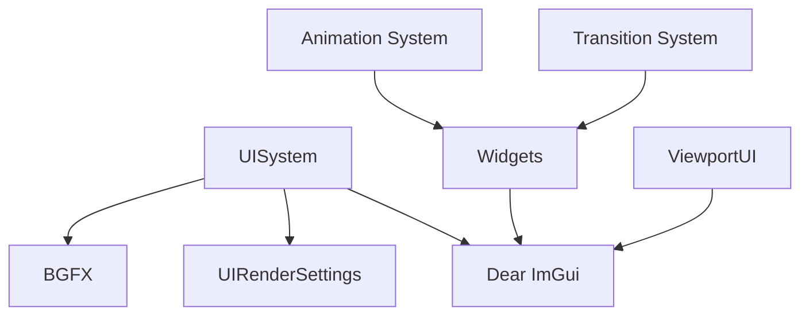

# User Interface System

## Overview

The Solstice UI system provides immediate-mode GUI rendering using Dear ImGui with BGFX integration. It supports customizable rendering settings, separate HUD and UI rendering, world-space UI elements, and a comprehensive widget library. The system is designed for both in-game HUDs and editor/debug interfaces.

## Architecture

The UI system consists of:

- **UISystem**: Singleton manager for ImGui integration and rendering
- **UIRenderSettings**: Configurable rendering parameters for different UI layers
- **Widgets**: Comprehensive widget library wrapping ImGui
- **ViewportUI**: World-space and screen-space UI elements
- **Animation**: Keyframe-based animation system (uses **MinGfx** for easing and keyframe types)
- **Transition**: State transition system for UI elements



## Core Concepts

### UIRenderSettings

The `UIRenderSettings` struct allows different UI layers to specify their own rendering parameters:

```cpp
using namespace Solstice::UI;

// Default UI settings (View ID 10, blending enabled)
UIRenderSettings defaultSettings = UIRenderSettings::Default();

// HUD settings (View ID 11, pixel-perfect rendering)
UIRenderSettings hudSettings = UIRenderSettings::HUD();

// Custom settings
UIRenderSettings customSettings(12, false, true, false);
// View ID 12, no point filtering, blending enabled, no depth test
```

**Settings:**
- **ViewId**: BGFX view ID for rendering
- **UsePointFiltering**: Pixel-perfect filtering (false for smooth rendering)
- **UseBlending**: Alpha blending enabled
- **UseDepthTest**: Depth testing enabled

### Frame Lifecycle

The UI system follows a standard frame lifecycle:

```cpp
// 1. New frame (call at start of frame)
UISystem::Instance().NewFrame();

// 2. Build UI (ImGui calls)
ImGui::Begin("Window");
ImGui::Text("Hello World");
ImGui::End();

// 3. Render (call at end of frame)
UISystem::Instance().Render();  // Default settings
// OR
UISystem::Instance().RenderWithSettings(hudSettings);  // Custom settings
```

### Direct HUD Rendering

For pixel-perfect HUD elements, use `ImGui::GetBackgroundDrawList()`:

```cpp
ImDrawList* drawList = ImGui::GetBackgroundDrawList();

// Draw directly to screen (bypasses windows)
drawList->AddRectFilled(
    ImVec2(10, 10),
    ImVec2(210, 40),
    IM_COL32(255, 0, 0, 255)
);
```

## API Reference

### UISystem

Singleton system managing ImGui integration.

#### Lifecycle

```cpp
// Initialize (MUST be called AFTER BGFX is initialized)
void Initialize(SDL_Window* window);

// Shutdown
void Shutdown();
```

#### Frame Management

```cpp
// Start new frame (call at start of frame)
void NewFrame();

// Render with default settings (View ID 10)
void Render();

// Render with custom settings
void RenderWithSettings(const UIRenderSettings& settings);
```

#### Event Handling

```cpp
// Process SDL events
bool ProcessEvent(const SDL_Event* event);

// Check if ImGui wants to capture input
bool WantCaptureMouse() const;
bool WantCaptureKeyboard() const;
```

#### Configuration

```cpp
// Set default view ID
void SetViewId(bgfx::ViewId viewId);
bgfx::ViewId GetViewId() const;
```

#### Font Access

```cpp
// Get font handles
ImFont* GetFontRegular() const;
ImFont* GetFontBold() const;
ImFont* GetFontItalic() const;
ImFont* GetFontBoldItalic() const;
```

#### Context Sharing

```cpp
// Get ImGui context for DLL/EXE sharing
void* GetImGuiContext() const;
```

### UIRenderSettings

Configurable rendering settings for UI layers.

#### Construction

```cpp
// Default constructor (View ID 10, no point filtering, blending, no depth test)
UIRenderSettings();

// Custom constructor
UIRenderSettings(bgfx::ViewId viewId, bool pointFiltering, bool blending, bool depthTest);

// Factory methods
static UIRenderSettings Default();  // View ID 10
static UIRenderSettings HUD();      // View ID 11, pixel-perfect
```

#### Properties

```cpp
bgfx::ViewId ViewId;           // BGFX view ID
bool UsePointFiltering;        // Pixel-perfect filtering
bool UseBlending;              // Alpha blending
bool UseDepthTest;             // Depth testing
```

### Widgets

Comprehensive widget library in `Solstice::UI::Widgets` namespace.

#### Layout

```cpp
// Windows
void BeginWindow(const std::string& title);
void EndWindow();

// Layout helpers
void SameLine();
void Separator();
void Spacing();
bool CollapsingHeader(const std::string& label, bool defaultOpen = false);
void BeginChild(const std::string& id, float width = 0.0f, float height = 0.0f, bool border = false);
void EndChild();
```

#### Text

```cpp
// Basic text
void Text(const std::string& content);
void Label(const std::string& label, const std::string& text);

// Text styles
void TextBold(const std::string& text);
void TextUnderlined(const std::string& text, const ImVec4& color = ImVec4(1,1,1,1));
void TextStrikethrough(const std::string& text, const ImVec4& color = ImVec4(1,1,1,1));

// Text animations
void TypewriterText(const std::string& text, float progress);
void PulsingText(const std::string& text, float time, float speed = 1.0f);
void RainbowText(const std::string& text, float time, float speed = 1.0f);
```

#### Controls

```cpp
// Buttons
bool Button(const std::string& label, const std::function<void()>& onClick = nullptr);
bool SmallButton(const std::string& label);
bool ArrowButton(const std::string& str_id, ImGuiDir dir);
bool InvisibleButton(const std::string& str_id, const ImVec2& size, ImGuiButtonFlags flags = 0);

// Checkboxes and radio buttons
bool Checkbox(const std::string& label, bool& value);
bool RadioButton(const std::string& label, bool active);
bool RadioButton(const std::string& label, int* v, int v_button);

// Sliders
bool SliderFloat(const std::string& label, float& value, float min, float max);
bool SliderInt(const std::string& label, int& value, int min, int max);
bool SliderFloat3(const std::string& label, float* value, float min, float max);
bool SliderAngle(const std::string& label, float* v_rad, float v_degrees_min = -360.0f, float v_degrees_max = +360.0f);

// Input
bool InputText(const std::string& label, std::string& value);
bool InputTextMultiline(const std::string& label, std::string& value, const ImVec2& size = ImVec2(0, 0));
bool InputFloat(const std::string& label, float* v, float step = 0.0f, float step_fast = 0.0f);
bool InputInt(const std::string& label, int* v, int step = 1, int step_fast = 100);

// Drag controls
bool DragFloat(const std::string& label, float* v, float v_speed = 1.0f, float v_min = 0.0f, float v_max = 0.0f);
bool DragInt(const std::string& label, int* v, float v_speed = 1.0f, int v_min = 0, int v_max = 0);

// Combo boxes
bool Combo(const std::string& label, int* current_item, const std::vector<std::string>& items);
bool ComboFlags(const std::string& label, unsigned int* flags, const std::vector<std::pair<std::string, unsigned int>>& items);

// Color pickers
bool ColorEdit3(const std::string& label, float* col);
bool ColorEdit4(const std::string& label, float* col);
bool ColorPicker(const std::string& label, float col[3], ImGuiColorEditFlags flags = 0);
bool ColorPicker4(const std::string& label, float col[4], ImGuiColorEditFlags flags = 0);
```

#### Data Display

```cpp
// Progress bars
void ProgressBar(float fraction, const std::string& overlay = "");
void CircularProgressBar(float fraction, float radius = 20.0f, const std::string& overlay = "");
void LoadingSpinner(const std::string& label, float radius = 10.0f, float thickness = 2.0f);

// Lists and tables
bool ListBox(const std::string& label, int* current_item, const std::vector<std::string>& items);
bool Selectable(const std::string& label, bool selected = false);
bool BeginTable(const std::string& str_id, int column, ImGuiTableFlags flags = 0);
void EndTable();
void TableNextRow();
bool TableNextColumn();
void TableSetupColumn(const std::string& label);
void TableHeadersRow();
void TableHeader(const std::string& label);

// Plots
void PlotLines(const std::string& label, const float* values, int values_count);
void PlotHistogram(const std::string& label, const float* values, int values_count);
```

#### Dialogs and Popups

```cpp
// Modals
bool BeginPopupModal(const std::string& name, bool* p_open = nullptr);
void EndPopup();
void OpenPopup(const std::string& name);
void CloseCurrentPopup();

// Context menus
bool BeginPopupContextItem(const std::string& str_id = "");
bool BeginPopupContextWindow(const std::string& str_id = "");
bool BeginPopupContextVoid(const std::string& str_id = "");

// Confirmation dialog
void ConfirmationDialog(const std::string& id, const std::string& title, 
                        const std::string& message, const std::function<void()>& onConfirm);
```

#### Navigation

```cpp
// Tabs
bool BeginTabBar(const std::string& str_id, ImGuiTabBarFlags flags = 0);
void EndTabBar();
bool BeginTabItem(const std::string& label, bool* p_open = nullptr);
void EndTabItem();

// Trees
bool TreeNode(const std::string& label);
bool TreeNodeEx(const std::string& label, ImGuiTreeNodeFlags flags = 0);
void TreePop();

// Menus
bool BeginMenuBar();
void EndMenuBar();
bool BeginMenu(const std::string& label, bool enabled = true);
void EndMenu();
bool MenuItem(const std::string& label, const std::string& shortcut = "", bool selected = false);
```

#### Effects

```cpp
// Transparency
void PushTransparency(float alpha);
void PopTransparency();

// Tooltips
void Tooltip(const std::string& text);
void EnhancedTooltip(const std::string& text, const ImVec4& color = ImVec4(1, 1, 1, 1));
```

### ViewportUI

World-space and screen-space UI elements.

#### World-Space Elements

```cpp
// World-space dialog (billboard in 3D)
class WorldSpaceDialog {
    void SetPosition(const Math::Vec3& position);
    void SetSize(float width, float height);
    void SetVisible(bool visible);
    void SetContentCallback(std::function<void()> callback);
    void Render(const Math::Matrix4& viewMatrix, const Math::Matrix4& projectionMatrix,
                int screenWidth, int screenHeight);
};

// World-space label
class WorldSpaceLabel {
    void SetPosition(const Math::Vec3& position);
    void SetText(const std::string& text);
    void SetVisible(bool visible);
    void Render(const Math::Matrix4& viewMatrix, const Math::Matrix4& projectionMatrix,
                int screenWidth, int screenHeight);
};

// World-space button
class WorldSpaceButton {
    void SetPosition(const Math::Vec3& position);
    void SetSize(float width, float height);
    void SetLabel(const std::string& label);
    void SetOnClick(std::function<void()> callback);
    bool Render(const Math::Matrix4& viewMatrix, const Math::Matrix4& projectionMatrix,
                int screenWidth, int screenHeight);  // Returns true if clicked
};
```

#### Screen-Space Overlays

```cpp
// Anchor positions
enum class Anchor {
    TopLeft, TopCenter, TopRight,
    CenterLeft, Center, CenterRight,
    BottomLeft, BottomCenter, BottomRight
};

// Overlay dialog
class OverlayDialog {
    void SetTitle(const std::string& title);
    void SetPosition(Anchor anchorPos, float offsetX = 0.0f, float offsetY = 0.0f);
    void SetSize(float width, float height);
    void SetContentCallback(std::function<void()> callback);
    bool Begin();
    void End();
};

// Overlay list
class OverlayList {
    void SetItems(const std::vector<std::string>& items);
    int GetSelectedIndex() const;
    void SetOnSelectionChanged(std::function<void(int, const std::string&)> callback);
    void Render();
};

// Overlay slider
class OverlaySlider {
    void SetPosition(Anchor anchorPos, float offsetX = 0.0f, float offsetY = 0.0f);
    bool Render();  // Returns true if value changed
};
```

## Usage Examples

### Basic UI Setup

```cpp
using namespace Solstice::UI;

// Initialize (after BGFX)
UISystem& ui = UISystem::Instance();
ui.Initialize(window);

// In render loop
ui.NewFrame();

// Build UI
ImGui::Begin("My Window");
ImGui::Text("Hello World");
if (ImGui::Button("Click Me")) {
    // Handle click
}
ImGui::End();

// Render
ui.Render();
```

### HUD Rendering with Custom Settings

```cpp
// Render HUD with pixel-perfect settings
UIRenderSettings hudSettings = UIRenderSettings::HUD();
ui.RenderWithSettings(hudSettings);

// Or render regular UI with default settings
ui.Render();  // Uses UIRenderSettings::Default()
```

### Direct HUD Drawing

```cpp
// Draw directly to screen (bypasses ImGui windows)
ImDrawList* drawList = ImGui::GetBackgroundDrawList();

// Health bar
float healthPercent = 0.75f;
ImVec2 barMin(20, screenHeight - 60);
ImVec2 barMax(220, screenHeight - 30);
drawList->AddRectFilled(barMin, barMax, IM_COL32(50, 50, 50, 255));
ImVec2 fillMax(barMin.x + (barMax.x - barMin.x) * healthPercent, barMax.y);
drawList->AddRectFilled(barMin, fillMax, IM_COL32(255, 0, 0, 255));
```

### World-Space UI

```cpp
using namespace Solstice::UI::ViewportUI;

// Create world-space dialog
WorldSpaceDialog dialog(Math::Vec3(0, 2, 0), 200.0f, 150.0f);
dialog.SetContentCallback([]() {
    ImGui::Text("World Space UI");
    if (ImGui::Button("Close")) {
        // Close dialog
    }
});

// Render in render loop
Math::Matrix4 view = camera.GetViewMatrix();
Math::Matrix4 proj = camera.GetProjectionMatrix();
dialog.Render(view, proj, screenWidth, screenHeight);
```

### Screen-Space Overlay

```cpp
// Create overlay dialog
OverlayDialog overlay("Settings", Anchor::Center, 0, 0);
overlay.SetSize(400, 300);
overlay.SetContentCallback([]() {
    static float volume = 0.5f;
    ImGui::SliderFloat("Volume", &volume, 0.0f, 1.0f);
});

// Render
if (overlay.Begin()) {
    // Content callback is called here
    overlay.End();
}
```

### Using Widgets

```cpp
using namespace Solstice::UI::Widgets;

// Window
BeginWindow("My Window");
Text("Content here");
if (Button("Click Me", []() {
    // Handle click
})) {
    // Button was clicked
}
EndWindow();

// Slider
static float value = 0.5f;
SliderFloat("Value", value, 0.0f, 1.0f);

// Color picker
static float color[3] = {1.0f, 0.5f, 0.0f};
ColorEdit3("Color", color);
```

## Integration

### With Rendering System

The UI system coordinates with the renderer for proper view ordering:

```cpp
// UI is rendered after post-processing
// View order: Shadow(1) -> Scene(2) -> Post(4) -> UI(3/10/11)
bgfx::ViewId viewOrder[] = {
    PostProcessing::VIEW_SHADOW,
    PostProcessing::VIEW_SCENE,
    0,  // Post-processing output
    3,  // UI overlay
    UISystem::Instance().GetViewId()
};
bgfx::setViewOrder(0, 5, viewOrder);
```

### With Game Systems

The UI system integrates with game systems for HUD rendering:

```cpp
// In game render loop
UISystem::Instance().NewFrame();

// Render game HUD
hud.Render(registry, camera, screenWidth, screenHeight);

// Render UI with HUD settings
UIRenderSettings hudSettings = UIRenderSettings::HUD();
UISystem::Instance().RenderWithSettings(hudSettings);
```

### Event Handling

```cpp
// Process SDL events
SDL_Event event;
while (SDL_PollEvent(&event)) {
    // Let UI process events first
    if (UISystem::Instance().ProcessEvent(&event)) {
        continue;  // UI consumed the event
    }
    
    // Process game events
    // ...
}
```

## Best Practices

1. **Initialization Order**: Always initialize UISystem AFTER BGFX is initialized.

2. **Frame Lifecycle**: 
   - Call `NewFrame()` at the start of each frame
   - Build UI with ImGui calls
   - Call `Render()` or `RenderWithSettings()` at the end

3. **HUD vs UI**: 
   - Use `UIRenderSettings::HUD()` for pixel-perfect HUD elements
   - Use `UIRenderSettings::Default()` for regular UI windows
   - Use `ImGui::GetBackgroundDrawList()` for direct screen drawing

4. **View IDs**: 
   - Default UI: View ID 10
   - HUD: View ID 11
   - Custom: Use unique view IDs for additional layers

5. **Font Usage**: 
   - Use `GetFontRegular()` for normal text
   - Use `GetFontBold()` for emphasis
   - Use `GetFontItalic()` for italic text
   - Use `GetFontBoldItalic()` for bold italic

6. **World-Space UI**: 
   - Use `WorldSpaceDialog` for 3D billboards
   - Use `WorldSpaceLabel` for simple text
   - Use `WorldSpaceButton` for interactive 3D elements

7. **Screen-Space Overlays**: 
   - Use `Anchor` enum for positioning
   - Use `OverlayDialog` for modal dialogs
   - Use `OverlayList` for selection menus

8. **Performance**: 
   - Minimize window count
   - Use `BeginChild()` for scrollable content
   - Use `SetNextWindowSize()` to constrain window sizes

9. **Input Capture**: 
   - Check `WantCaptureMouse()` and `WantCaptureKeyboard()` before processing game input
   - UI automatically captures input when hovering/active

10. **Context Sharing**: 
    - Use `GetImGuiContext()` for DLL/EXE context sharing
    - Call `ImGui::SetCurrentContext()` in the main executable

## Performance Considerations

- **ImGui Integration**: Uses efficient immediate-mode rendering
- **BGFX Rendering**: Hardware-accelerated UI rendering
- **Font Caching**: Fonts are loaded once and cached
- **Texture Management**: Automatic texture creation and cleanup
- **View Separation**: Separate views for HUD and UI prevent unnecessary rendering

## View ID Reference

- **0**: Reserved/Main output
- **3**: UI overlay (legacy)
- **10**: Default UI view (UIRenderSettings::Default())
- **11**: HUD view (UIRenderSettings::HUD())

Views are executed in ascending order, so proper ordering is essential for correct rendering.

