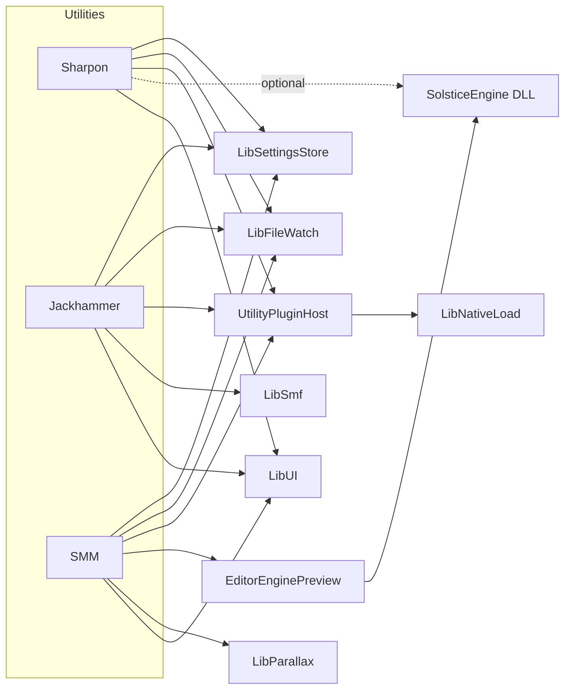

# Solstice utilities (authoring tools)

Solstice ships three **desktop authoring utilities** under [`utilities/`](../utilities/). They share **[LibUI](../utilities/LibUI/)** (SDL3 + ImGui) and are optional at configure time (see **Build** below).

| Name | CMake target | Executable (typical) | Libraries |
| --- | --- | --- | --- |
| **Sharpon** | `Sharpon` | `Sharpon` | LibUI + [UtilityPluginHost](../utilities/UtilityPluginHost/); optional **SolsticeEngine** DLL for Moonwalk and JSON APIs |
| **Jackhammer** | `LevelEditor` | `LevelEditor` | LibUI + [LibSmf](../SDK/LibSmf/) (`.smf`) + UtilityPluginHost |
| **SMM** (Solstice Movie Maker) | `MovieMaker` | `MovieMaker` | LibUI + [LibParallax](../SDK/LibParallax/) + `UI` module + **[EditorEnginePreview](../utilities/EditorEnginePreview/)** (offscreen 3D capture) + UtilityPluginHost; optional **ffmpeg** CLI |

**CMake names:** *Jackhammer* is the product name for the **LevelEditor** target. *SMM* is the product name for the **MovieMaker** target (project files use `.smm.json`).

SDK libraries [LibSmf](../SDK/LibSmf/) and [LibParallax](../SDK/LibParallax/) are always configured with the main CMake tree; only the three apps above and **LibUI** are gated by **`SOLSTICE_BUILD_UTILITIES`**. Authoring tools also share **[LibNativeLoad](#libnativeload-plugin-and-utilitypluginhost)** (UTF-8 native module loading), **[LibFileWatch](#libfilewatch-autoreload)** (debounced polling file watcher), and **[LibSettingsStore](#libsettingsstore-tool-preferences)** (JSON settings next to the executable). See the sections below for APIs and CMake usage.



## UtilityPluginHost (shared native plugins)

**Location:** [`utilities/UtilityPluginHost/`](../utilities/UtilityPluginHost/). Small **static** library: loads native modules via SDK **[LibNativeLoad](../SDK/LibNativeLoad/)** (`Solstice::NativeLoad::DynamicLibrary`), and exposes a **`UtilityPluginHost`** registry (load/unload, optional **hot-reload** session with a **different replacement file path** — on Windows do not replace the same path while the DLL is loaded; copy to a new name first). Links **Dear ImGui** for **[`UtilityPluginUi.hxx`](../utilities/UtilityPluginHost/UtilityPluginUi.hxx)** — **`DrawPluginManagerWindow`** (shared **Plugins** window used by Jackhammer and SMM).

All three authoring tools load optional **`plugins/`** next to the executable (`.dll` / `.so` / `.dylib`). C symbol names are documented in [`UtilityPluginAbi.hxx`](../utilities/UtilityPluginHost/UtilityPluginAbi.hxx) (`SharponPlugin_*`, `LevelEditorPlugin_*`, `MovieMakerPlugin_*`). The host calls optional `OnLoad` / `OnUnload` around module lifetime.

## Technology Preview 1 (utilities)

Early-adopter scope for **Jackhammer** and **SMM**: unsaved-change prompts where applicable; **snapshot Undo/Redo** via shared **[`LibUI::Undo::SnapshotStack`](../utilities/LibUI/Undo/SnapshotStack.hxx)** (full-map edits in Jackhammer, serialized Parallax bytes in SMM, Moonwalk buffer lines in Sharpon). **LibSmf** exposes a single validation API in **[`SmfValidate.hxx`](../SDK/LibSmf/include/Smf/SmfValidate.hxx)** (load, codec round-trip, and editor structure messages); Jackhammer’s **Validate map** uses it and still optionally cross-checks **`SolsticeV1_SmfValidateBinary`** when the engine DLL is present. **Jackhammer** adds **Hammer-style** viewport affordances, spatial BSP/octree panels, bounded previews, and I/O error banners. **SMM** uses a compact SFM-style workspace with menu-bar file operations, a **unified 3D + MG composite viewport** (optional legacy split tabs), **dockable curve / graph / particle** panels, **`.smat` + optional texture-map** preview on schematic cubes via **EditorEnginePreview**, **raster/audio** import for MG and audio elements, **particle sprites** in the viewport, and **Parallax-backed particle export** (`SmmParticleEmitterElement` / `SMM_ParticleEmitter` merged on save). It also keeps a scrollable timeline, direct **`.prlx`** / video export, and Jackhammer-style selected-Actor glTF import/export. Tooling JSON is evolving; SMM project files write **`.smm.json` version 1** for project metadata while scene data stays in **`.prlx`** (TP1). Sharpon groups **Console**, **Profiler**, **Plugins**, and **Open workspace folder…** under **View**. **LibFileWatch** drives optional **autoreload** of active utility files where enabled. These are Technology Preview tools, not production-grade workflows across the board.

## Cleaning build trees (`tools/scorch.py` / `tools/nuke.py`)

- **[`tools/scorch.py`](../tools/scorch.py)** — Deletes common CMake/build/CPM output directories (for example `out/`, `build/`, `.cpm-cache`) under the repo. Does **not** run `git`; untracked sources are kept. Use `--dry-run` to list paths.
- **[`tools/nuke.py`](../tools/nuke.py)** — **Destructive:** `git fetch`, `git reset --hard` (to `HEAD`, or `origin/<branch>` with `--use-origin`), then `git clean -fdx`. Requires **`--i-really-mean-it`**. Use `--dry-run` to print commands only.

## Distribution (zip / deb / msi)

After building, use **[Packaging.md](Packaging.md)** and [`tools/packaging/*.fst`](../tools/packaging/) with [`tools/package_executables.py`](../tools/package_executables.py) to stage **`SDL3`**, **SolsticeEngine**, **shaders**, **fonts** (and optional **ffmpeg** for SMM) from `${CMAKE_BINARY_DIR}/bin` into portable archives or installers. **Optional:** set **`SOLSTICE_PACKAGE_UTILITIES_POSTBUILD=ON`** at configure time to produce **`${CMAKE_BINARY_DIR}/packages/<utility>-<Config>.zip`** automatically after each utility link (default **OFF**).

## Build flag

- **`SOLSTICE_BUILD_UTILITIES`** (default **ON**): when OFF, CMake skips **`utilities/LibUI`**, **Sharpon**, **LevelEditor**, and **MovieMaker**, so CI or minimal trees configure faster. **LibSmf** and **LibParallax** still configure as part of the main project.

## SolsticeEngine DLL

**Sharpon** loads the engine shared library for Moonwalk compile/run and narrative/cutscene validation. Place **`SolsticeEngine.dll`** (or `libsolsticeengine.so`) next to the tool executable, or run from the CMake output `bin` directory where the build places the DLL.

Exports are documented in [SolsticeAPI.md](SolsticeAPI.md).

## Sharpon (Moonwalk + JSON)

**Libraries:** LibUI only at link time; **SolsticeEngine** at runtime for scripting and validation APIs.

**Windows:** the build copies **`SDL3.dll`** and **`SolsticeEngine.dll`** next to `Sharpon.exe` when those targets exist (LibUI is static; there is no `LibUI.dll`). See [utilities/Sharpon/CMakeLists.txt](../utilities/Sharpon/CMakeLists.txt).

- Edit **Moonwalk** scripts, **compile** (`SolsticeV1_ScriptingCompile`), **run** (`SolsticeV1_ScriptingExecute`).
- **Narrative JSON**: validate (`SolsticeV1_NarrativeValidateJSON`), convert to YAML (`SolsticeV1_NarrativeJSONToYAML`).
- **Cutscene JSON**: validate (`SolsticeV1_CutsceneValidateJSON`) — same rules as runtime [CutscenePlayer](../source/Game/Cutscene/CutscenePlayer.hxx).
- **Workspace**: open a **folder** as the script/asset root (persisted with other editor state) — **File → Open Workspace Folder…** or **View → Open workspace folder…**.
- **Undo/Redo**: Moonwalk editor history uses **`LibUI::Undo::SnapshotStack<std::string>`** ([`LibUI/Undo/SnapshotStack.hxx`](../utilities/LibUI/Undo/SnapshotStack.hxx)) with the existing ImGui callback (`CallbackEdit` / `UndoSentinel`); **Edit → Undo/Redo** matches stack availability.
- **View** menu: toggles for **Console**, **Profiler**, and **Plugins**, plus workspace folder (same as File).
- **Docs**: use **Help → Open documentation folder** when the repo `docs/` path can be resolved.

### Sharpon plugins (optional)

Native plugins are loaded from a **`plugins/`** directory next to the Sharpon executable. Export from the module (see [`utilities/Sharpon/Plugin.hxx`](../utilities/Sharpon/Plugin.hxx) and [`UtilityPluginAbi.hxx`](../utilities/UtilityPluginHost/UtilityPluginAbi.hxx)):

- **`extern "C" const char* SharponPlugin_GetName(void)`** — display name (recommended for a friendly label).
- **`extern "C" void SharponPlugin_OnLoad(void)`** — optional; called after load.
- **`extern "C" void SharponPlugin_OnUnload(void)`** — optional; called before unload.

The **UtilityPluginHost** loader resolves these after `LoadLibrary` / `dlopen`. Keep plugins small and side-effect free.

**Authoring a minimal plugin (CMake sketch):** add a shared library target that links only what it needs, output name `MyPlugin.dll` (or `.so`), and export the symbols above. Install or copy the artifact into **`plugins/`** beside the tool executable. Avoid linking **LibSmf** / **LibParallax** in the same plugin as the host unless you understand ODR and ABI stability; prefer a narrow C API or host-provided callbacks for deep integration.

## Jackhammer (LevelEditor, `.smf`)

A dedicated reference for every Jackhammer tool (geometry, **terrain** scaffold, **measure**, **vertex snap**, **prefabs**, **AABB CSG** / XOR, and module layout) lives in **[Jackhammer.md](Jackhammer.md)**. The table below and the next sections remain the short overview.

**Example project:** [`example/JhSmfProject/`](../example/JhSmfProject/) — **`JackhammerDemo.smf`** with **SMAL** lights/zones, **BSP** + **octree**, **`teapot.gltf`** mesh entities, **`.smat`**, **PPM** texture, **WAV** audio, and path-table rows; see **[`example/JhSmfProject/README.md`](../example/JhSmfProject/README.md)**. Regenerate via **`SOLSTICE_BUILD_JH_SMF_DEMO_GEN`** and target **`JhSmfProjectGen`** ([`tools/JhSmfProjectGen.cxx`](../tools/JhSmfProjectGen.cxx)).

**Libraries:** LibUI + **LibSmf** for Solstice Map Format v1. Shared editor logic lives in `Main.cxx` + **`JackhammerApp.cxx`**, and in **`JackhammerSpatial`**, **`JackhammerViewportDraw`**, **`JackhammerMeshOps`**, **`JackhammerTexturePaint`**, **`JackhammerBspTextureOps`**, **`JackhammerLightmapBake`**, **`JackhammerPrefabs`**, **`JackhammerViewportGeoTools`**, **`JackhammerArzachelProps`**, and **`JackhammerParticles`** (see [Jackhammer.md](Jackhammer.md) for a full file map).

**Windows:** **`LibUI.dll`** and **`SDL3.dll`** are copied next to **`LevelEditor.exe`** (see [utilities/LevelEditor/CMakeLists.txt](../utilities/LevelEditor/CMakeLists.txt)). LibSmf is static; no extra DLL for maps. **[`EditorEnginePreview`](../utilities/EditorEnginePreview/CMakeLists.txt)** links the static **`Material`** library ( **`ReadSmat`** / `.smat` I/O is not re-exported through **`SolsticeEngine.dll`** alone).

- Open/save **`.smf`** via LibSmf (`Solstice::Smf::LoadSmfFromFile` / `SaveSmfToFile` — see **LibSmf** below). Optional **ZSTD** compression: uncompressed `SmfFileHeader` first, then compressed tail (`Flags` bit 0); Jackhammer exposes **ZSTD compress** on save.
- **Validate map** (toolbar / **F7**) uses **`Solstice::Smf::ValidateSmfMap`** from [`SmfValidate.hxx`](../SDK/LibSmf/include/Smf/SmfValidate.hxx): serialize the current map (respecting **ZSTD compress**), load/round-trip check, **`ValidateMapStructure`**, then optionally **`SolsticeV1_SmfValidateBinary`** on the same bytes when the engine DLL is available ([SolsticeAPI.md](SolsticeAPI.md) / [`Smf.h`](../SDK/SolsticeAPI/V1/Smf.h)). **Apply gameplay (DLL)** (**F8** / toolbar) serializes the current map and calls **`SolsticeV1_SmfApplyGameplay`** (Windows), matching the engine’s acoustic-zone, authoring-light, and **fluid volume** registration path. The **Validation** section shows LibSmf notes, engine validate output, **apply gameplay** output, and structure messages; **Copy report to clipboard** includes all of the above. Structure messages include duplicate entity names, empty class, duplicate property keys, **path table** empty/duplicate paths, spatial (BSP/octree) index checks, duplicate **acoustic zone** / **authoring light** names, and duplicate **fluid volume** names (plus resolution budget warnings) — see [`SmfMapEditor.hxx`](../SDK/LibSmf/include/Smf/SmfMapEditor.hxx).
- **Gameplay** panel: **acoustic zones** (reverb preset, bounds, wetness, priority, …), **authoring lights** (type, transform, color, attenuation, range, spot cones), and optional **fluid volumes** (Navier–Stokes / **`NSSolver`** grid: bounds, **Nx/Ny/Nz**, diffusion, viscosity, Boussinesq / MacCormack / visualization flags), persisted as **`SMAL` v1** gameplay extras (Solstice Map Format **v1**). For zones: **Fit selected zone to ALL entity origins** (padding slider) sets **Center** / **Extents** from the axis-aligned bounds of every entity **`origin`** / **`position`** (`Vec3`); **Spherical** uses the minimal bounding sphere of that box (uniform **Extents**); otherwise half-extents per axis.
- **New map** templates provide a minimal valid map to start from.
- **Undo/Redo**: full-map snapshots via **`LibUI::Undo::SnapshotStack<Solstice::Smf::SmfMap>`** ([`LibUI/Undo/SnapshotStack.hxx`](../utilities/LibUI/Undo/SnapshotStack.hxx)); **Edit → Undo/Redo** for discrete operations (entities, path table, template, viewport placement, etc.).
- **Map overview** (default-open panel): entity/path counts, **entities by class**, BSP/octree presence, acoustic zone, authoring light, and **fluid volume** counts.
- **Entity list**: filter by **name** and **class** (substring, case-insensitive); **Prev** / **Next** and **PgUp** / **PgDn** to change selection; **Duplicate** assigns a **unique** entity name (avoids duplicate-name validation errors). **Add particle emitter** creates a **`ParticleEmitter`** entity (`origin`, optional **`particleRate`** float — authoring only; viewport **Pt** overlay draws markers). **Mesh** entities (or any with a model path) get a **Mesh transform (preview cube)** section: **`scale`** (`Vec3`), **`pitch`** / **`yaw`** / **`roll`** (degrees, +X / +Y / +Z) applied in **`EditorEnginePreview`** only, plus an optional **Mesh workshop (scratch buffer)** panel (see below) for **`JackhammerMeshOps`** on an in-memory mesh — not written to the `.smf` or glTF path until you add export glue.
- **File → Reload from disk**: reloads the current path when clean; if the map is dirty, confirms before discarding edits.
- **Engine viewport** (Hammer-inspired workflow): **Persp / Top / Front / Side**, **Focus** selection, **optional Place snap** with **1–32 world-unit presets**, **Ctrl+LMB** on XZ to move the selected entity origin when **Active geometry tool = None** (Y preserved) — with **Block / Measure / Terrain** tools, **LMB** is reserved (orbit moves to **RMB**; see [Jackhammer.md](Jackhammer.md)). **Arrow keys** **nudge** the selected origin on XZ when the viewport is hovered (uses Place snap if set, otherwise **grid cell**). **Grid cell** and **half-extent** control the drawn ground grid. Toggle **BSP** / **octree** / **authoring light** / **Pt** (particle-emitter markers) overlays, depth limits, and (for entities) diffuse texture tint in the preview.
- **Material preview (`.smat`)** — same **[`EditorEnginePreview`](../utilities/EditorEnginePreview/EditorEnginePreview.hxx)** path as SMM: the viewport toolbar has **Preview .smat**, **Selected entity only**, and **Optional maps** (albedo / normal / roughness) with **Browse** and typed paths. Paths are **map-relative** (preferred) or absolute; they are resolved against the **current `.smf` directory** for the offscreen pass. If an entity defines **`materialPath`** or **`smatPath`**, that value **overrides** the toolbar `.smat` for preview on that entity. **Optional maps** apply to every cube drawn under the same selection filter as `.smat` (not per-entity unless you assign textures on the entity — see below).
- **Entity materials & PBR paths** — **Material (.smat)** on the selected entity edits **`materialPath`** / **`smatPath`** (browse, clear, **From preview toolbar**). Optional **`normalTexture`** / **`normalMap`** and **`roughnessTexture`** / **`roughnessMap`** string properties with browse. **Apply toolbar preview maps → entity** copies non-empty toolbar map paths into **`diffuseTexture`**, **`normalTexture`**, and **`roughnessTexture`** on the selection. **Diffuse texture** browse now stores **paths relative to the map** when possible (consistent with BSP face textures).
- **Environment / skybox** — optional **[`SmfSkybox`](../SDK/LibSmf/include/Smf/SmfMap.hxx)** on the map (cubemap **six face paths**, **brightness**, **yaw** around +Y, **enabled**). Persisted in **`SMAL` v1** gameplay extras (after zones + lights). **Environment / Skybox** panel in Jackhammer; **map overview** shows skybox on/off. Runtime rendering still needs engine support to consume the block.
- **World hooks (paths only)** — **[`SmfWorldAuthoringHooks`](../SDK/LibSmf/include/Smf/SmfMap.hxx)** (`ScriptPath`, `CutscenePath`, `WorldSpaceUiPath`): map-relative or absolute strings for Moonwalk, cutscene/narrative JSON, and world-space UI assets. **No** embedded script bodies or in-editor cutscene/UI authoring — links only. Saved in **`SMAL` v1** after the skybox block in [`SmfBinary.cxx`](../SDK/LibSmf/src/SmfBinary.cxx).
- **Fluid volumes (`FLD1`)** — **[`SmfFluidVolume`](../SDK/LibSmf/include/Smf/SmfMap.hxx)** records (name, AABB, grid resolution, diffusion/viscosity, reference density, pressure iterations, optional Boussinesq tuning, MacCormack / volume-clip flags). Optional **`FLD1`** chunk after world hooks in **`SMAL` v1**; omitted when there are no volumes. Authoring allows **4–128** cells per axis; **LibSmf** warns when **Nx·Ny·Nz** exceeds a **262 144** interior-cell **budget** (runtime **`ApplyGameplay`** additionally clamps and shrinks the grid until within budget so registration stays bounded). The engine rebuilds **`FluidSimulation`** instances only when a **hash of fluid authoring** changes (not every editor frame), then registers them with **`PhysicsSystem`** — see [`MapSerializer.cxx`](../source/Arzachel/MapSerializer.cxx).
- **Large maps & stability** — entity list uses a **bounded scan** (filters on huge maps) and **list virtualization**; viewport caps **mesh preview** entities, **authoring-light** overlays, **origin markers**, and **diffuse tint** cache size. **F7 / F8** validation and optional **`SolsticeEngine.dll`** checks are wrapped for **C++** exceptions; on **Windows**, engine entry points are also guarded with **SEH** so access violations in the DLL are reported instead of taking down the editor. **Plugin reload** is exception-safe.
- **Gameplay audio** — zone **music** / **ambience** import filters include **mp3** in addition to wav/ogg/flac (file is copied under **`assets/audio/`**; runtime decode depends on engine/SDL mixer). **Duplicate zone** clones the selected acoustic zone with a **unique name**. **Center on selected entity** moves the zone **Center** to the current entity **`origin` / `position`**. **Clear** beside each path clears **Music** or **Ambience** without removing the zone.
- **Spatial geometry ops** — **BSP:** configurable **Plane D nudge** (**D−** / **D+**), and **Rotate N +90°** about **Y** or **X** (disabled for **canonical box brush** so opposing faces stay aligned). **Octree:** **Duplicate node (clear children)**, and **Inflate** / **Deflate** bounds with a margin slider (deflate fails safely if the AABB would collapse).
- **Stability:** offscreen RGB capture is **size-clamped** and **pixel-budget** limited; **preview entities** are **capped** (label when truncated); **CaptureOrbitRgb** and diffuse **thumbnail decode** are **OOM-guarded**; map **undo push** ignores **bad_alloc** like SMM; failed open/save/reload surfaces a red **Dismiss** error line in addition to the status string.

#### Spatial (BSP / Octree) in Jackhammer

Authoring data lives in the SMF **spatial section (format version 1)**. Optional per-BSP-node **slab** and **texture** fields are stored after a **BPEX** tail (maps without BPEX still load; older writers omit the tail).

**BSP:** add/remove/duplicate nodes; **approx. tree height** from root; **directed-cycle** warning if **Front/Back** child pointers form a cycle (invalid tree). **Jump to index**, **copy index**, **go to parent** / **front child** / **back child**. **Plane:** edit **N** and **D**, normalize **N**, **flip plane** (negate **N** and **D**, swap front/back textures), **snap D** to a grid, presets (floor ±Y, walls ±X/±Z). **Children / leaf:** edit indices, **swap front/back child links**, **allocate** two new empty child nodes when both slots are **-1**. **Copy plane + slab as text** puts a plain-text dump (including **n·D** anchor) on the clipboard.

**Textures:** front/back paths (browse or type) accept common raster images (PNG/JPEG/BMP/TGA/WebP/GIF/HDR/PNM, plus all files for engine-specific assets); **apply arbitrary image** to the selected face or all faces; optional back-side application; **swap**; **copy** front→back or back→front; **front** or **both** from the selected entity’s diffuse; **set every node’s front texture** to the current node’s front. Use the main **Material preview** toolbar and/or entity **Material (.smat)** + **Apply toolbar preview maps** when you want **`.smat`** and optional **PBR maps** on schematic cubes, separate from BSP face image paths. Viewport **gizmo** uses a **two-tone** circle (front vs back) when textures are used for tinting.

**Texture alignment (UV):** per-face **shift / scale / rotate** for front or back, optional on disk after BPEX via **BXT1** (see [`SmfAuthoringBspNode`](../SDK/LibSmf/include/Smf/SmfSpatial.hxx)). Jackhammer exposes **Fit** (world units per repeat × axis-aligned slab face size via [`JhBspSlabFaceWorldSize`](../utilities/LevelEditor/JackhammerSpatial.hxx)), **Center** shift, **+90°** rotate, and reset. Preview may ignore UV until the engine reads **`SmfBspFaceTextureXform`**.

**Face texture paint (2D):** under the BSP panel for the selected node, a collapsible **Face texture paint** section targets **front** or **back** paths, loads or blanks a working RGBA canvas, brush (radius / hardness / erase-to-alpha), fill, and **Save PNG** / **Save as…** (paths resolved vs the map directory; uses **`LibUI::Tools::SaveRgba8ToPngFile`** from [`RgbaImageFile.hxx`](../utilities/LibUI/Tools/RgbaImageFile.hxx)). This edits the **image file** backing the BSP face, not triangle UVs in a glTF.

**Slab (finite AABB):** optional **Slab valid** with min/max; **vertex manipulation** edits the eight **AABB corners** (brush footprint for the selected node); **Sync axis-aligned plane D from slab** aligns **PlaneD** with **SlabMin/Max** when **N** is ±X/±Y/±Z (non–box-brush BSP nodes). Quick cubes **±1 / ±2 / ±4 / ±8 m**; **snap**; cube around the **selected** entity origin; **fit slab to ALL entity origins** (padding). **BSP box brush:** six linked planes; **Slab extrude** (**face push +X … −Z**) with positive/negative step. **Full brush CSG (axis-aligned AABBs):** operand **B** — **hull union** (single bounding AABB of **A∪B**); **exact union** ([`SmfAabbBooleanUnionAllPieces`](../utilities/LevelEditor/JackhammerSpatial.hxx) → all **A\\B** pieces plus **B**, up to seven boxes); **intersect** (exact single AABB); **subtract all** (every **A\\B** piece, up to six, into the piece buffer); **subtract largest** (one box); **strip** heuristic; **mirror** / **copy B** / **expand** / **inset**. **Apply** in the UI copies one buffered piece onto the selected slab (for multi-piece unions/subtracts).

**Octree:** subdivide selected into eight children; **fit selected** or **root** bounds to all entity origins (+ padding); **snap** min/max to grid; **copy** octree bounds → BSP selected slab, or BSP slab → selected octree node (requires BSP with a valid slab).

#### Mesh workshop (`JackhammerMeshOps`)

**Headers / sources:** [`JackhammerMeshOps.hxx`](../utilities/LevelEditor/JackhammerMeshOps.hxx), [`JackhammerMeshOps.cxx`](../utilities/LevelEditor/JackhammerMeshOps.cxx). Types live in namespace **`Jackhammer::MeshOps`**.

- **`JhTriangleMesh`** — `positions`, triangle `indices` (multiple of 3), optional per-vertex **`normals`** / **`uvs`** (same length as `positions` when used).
- **Maya-style sew:** **`SewBorderChains`** pairs two **open boundary chains** of equal vertex count. Each step along a chain must be an undirected **boundary** edge (exactly one adjacent triangle). For each *i*, vertices **A[i]** and **B[i]** are merged; **`JhSewPositionPolicy`** chooses **keep A**, **keep B**, or **midpoint** for the merged position. Chains are tracked across merges via an internal index remap (safe for sequential welds).
- **Cleanup / DCC-style helpers:** **`WeldVerticesByDistance`** (merge closer than ε), **`RemoveDegenerateTriangles`**, **`FlipTriangleWinding`**, **`RecalculateNormals`** (area-weighted fan), **`SubdivideTrianglesMidpoint`** (one 4-way split per triangle, shared edge midpoints), **`ScaleMeshAboutCentroid`**, **`LaplacianSmoothUniform`** (uniform neighbor average, factor × iterations).
- **Demos:** **`MakeUnitCube`**, **`MakeTwoStackedSquaresDemo`** (two separated quads — the entity-panel **Sew demo chains (0–3 vs 4–7)** button exercises the sew path).

The UI **scratch buffer** is ephemeral (session memory only). Hook **`JhTriangleMesh`** to glTF I/O or map blobs when you need persistence.

- **Technology Preview 1:** window title; **Help → About** and **Help → Keyboard shortcuts…** (**F7** validate, **F8** apply gameplay, file ops, undo chords, viewport and spatial tips); unsaved prompts on **New**, **Open**, and quit when the map is dirty; default-open **Validation** section in the main panel; **View → Plugins** uses the same `plugins/` folder with **`LevelEditorPlugin_*`** exports (see `UtilityPluginAbi.hxx`). **SMAL** stays **v1** with SMF **v1**; older dev builds may still carry legacy numeric **2–4** tags in the extras header until re-saved.

### Jackhammer plugins (optional)

Same `plugins/` directory as other tools; export **`LevelEditorPlugin_GetName`**, optional **`OnLoad`** / **`OnUnload`** (see `UtilityPluginAbi.hxx`).

## SMM — Solstice Movie Maker (`MovieMaker`, `.prlx`)

**Libraries:** LibUI + **LibParallax** (Parallax scene I/O and evaluation) + **`UI`** (motion-graphics compositor) + **[EditorEnginePreview](../utilities/EditorEnginePreview/)** (hidden SDL window + **SolsticeEngine** / bgfx offscreen pass for schematic cubes). **ffmpeg** is an optional **CLI** on `PATH` or copied next to the exe when configured in CMake — not linked libav.

**Windows:** **`LibUI.dll`**, **`SDL3.dll`**, and **`SolsticeEngine.dll`** are copied next to **`MovieMaker.exe`** (engine required for **EditorEnginePreview**); if **`SOLSTICE_FFMPEG_EXECUTABLE`** is set, **ffmpeg** may be copied beside the exe (see [utilities/MovieMaker/CMakeLists.txt](../utilities/MovieMaker/CMakeLists.txt)).

- Import assets, edit a **Parallax** scene, and export **`.prlx`** through `LibParallax::SaveScene`. **TP1** keeps the file header at **format v1** (see [`ParallaxTypes.hxx`](../SDK/LibParallax/include/Parallax/ParallaxTypes.hxx)); `MergeBuiltinSchemaAttributes` patches built-in **schema** on load so added **`SceneRoot`** / **`ActorElement`** fields keep correct **attribute types**. Optional **ZSTD**: uncompressed 92-byte `FileHeader` at offset 0, then compressed tail (`Flags` bit 0); UI checkbox **ZSTD compress** and project field `compressPrlx`. PARALLAX export normalizes paths, creates parent folders, updates recent paths, and reports status in the workspace. **Before each save/export**, SMM merges the **particle editor** into a scene element **`SMM_ParticleEmitter`** (schema **`SmmParticleEmitterElement`**) so particle settings and **sprite asset hashes** round-trip in the file.
- **World & skybox (Parallax)**: the **`SceneRoot`** block can store **skybox** enable/brightness/yaw and **six face image paths** (Jackhammer/SMF-style world cubemap semantics). SMM surfaces this under **Properties** as **Environment / skybox (Scene root)**.
- **Actors (Arzachel, LOD, presets)**: each **`ActorElement`** can store **`ArzachelRigidBodyDamage`** (feeds the Arzachel **`Damaged`** pipeline at runtime), **LOD distance** hints, and **animation** / **destruction** preset **strings** alongside the glTF-backed **`MeshAsset`**. SMM’s **Arzachel, LOD, animation presets** section edits these; `EvaluateScene` fills **`ActorArzachelAuthoring`** for tools and the engine.
- **Unified viewport (default):** one panel composites **schematic 3D** (EditorEnginePreview) with a **CPU MG** layer (src-over blend) and optional **particle** billboards (solid disks or **imported sprite** textures via OpenGL). **Viewer chrome** includes **MG overlay** opacity, **camera projection** (perspective / ortho top-front-side), **Reset view**, optional **Framing guides (unified view)** (10% **safe** rect, **thirds** grid, **center cross** on the letterboxed image), **`.smat`** assignment to preview cubes (with **Actors only** / **Selected element only**), and optional **albedo / normal / roughness** map paths for the same preview pass. A short **overlay label** summarizes MG and sprite counts and flags.
- **MG preview** (standalone or composite) rasterizes `EvaluateMG` (CPU → OpenGL texture). Root **`MGTextElement`** / **`MGSpriteElement`** nodes composite in ascending **`Depth`** (float attribute, default 0); higher **Depth** draws on top within the 2D layer (unified viewport still blends the whole MG layer over 3D RGB). Raster size is **clamped** (max edge and total pixel budget) and allocation uses **OOM handling** so huge viewports do not take down the process.
- **Schematic 3D** uses **[`EditorEnginePreview`](../utilities/EditorEnginePreview/EditorEnginePreview.hxx)** (`EvaluateScene` + orbit capture). The offscreen buffer size is **clamped** like MG; entity submission is **capped** with an on-viewport label when the scene exceeds the cap, and capture is wrapped for **out-of-memory** failures.
- **Editing modules** (optional **View** docks): **[`utilities/MovieMaker/Editing/`](../utilities/MovieMaker/Editing/)** — **curve** editor (float / Vec3 lanes, keyframe drag), **graph** editor (driver links, bake at playhead), **particle** panel (sim parameters, sprite path, **Write / Read emitter** to scene). A **bridge** keeps timeline/curve selection aligned with Parallax channels and MG tracks (`SmmCurveGraphBridge`, etc.). **User INI keyframe presets** are loaded from **`presets/Keyframe`** (exe dir + project parent); see [Presets.md](Presets.md). **2D (MG):** **Properties** adds nominal comp size, nudge, align, and linked **W/H** (see [SMM.md](SMM.md)).
- **Workflow code** lives under [`utilities/MovieMaker/Workflow/`](../utilities/MovieMaker/Workflow/) (`ClampPlayhead`, optional **loop** clamp, **arrow-key tick step** from ticks/sec and playback speed, keyframe nudges); UI calls these APIs instead of duplicating logic.
- **Project file** (`.smm.json`, JSON **`"version": 1`** — **Technology Preview 1**; fields evolve without a separate schema bump): remembers last paths, import roots, optional ffmpeg path hints, `compressPrlx`, and video export fields. **File → Save Project** / **Ctrl+S** opens a native save dialog until a project path is chosen, then saves to that path afterward. Scene data remains in `.prlx`; project metadata stays in `.smm.json`.
- **Authoring sidecar (no `version` bump):** a tab-separated **`<project-stem>.smm.authoring.tsv`** next to the `.smm.json` stores **Technology Preview 1** metadata for a **simplified asset database** (tags, **proxy** flag, optional **resolves-to** full-quality hash), **prefab** rows (schema + `Key=value;` attribute seeds), and **lipsync** line stubs. The **Authoring** left-bar tab loads/edits it; **Save Project** rewrites the TSV after the JSON. See [SMM.md](SMM.md).
- **Timeline (SFM-style):** keyframe tracks sit below the viewer, with playhead dragging, **zoom** (0.1×–32×), horizontal scrolling for long/zoomed timelines, and vertical scrolling when the number of tracks exceeds the visible area. Focus the **timeline canvas** and use **Ctrl+wheel**, **Ctrl+Plus/Minus** (numpad **+** / **−**), or **Ctrl+0** (100%) to change zoom; the line next to the zoom slider lists the same shortcuts.
- **Viewer layout:** **View** can show a **unified** viewport and/or legacy **`3D Viewport`** / **`2D MG`** tabs for split debugging.
- **Media import:** **raster** and **audio** flows (Assets / File) import into **`DevSessionAssetResolver`** and assign **MG sprite** or **`AudioSourceElement`** fields where applicable. **Audio** properties show a **waveform** with **click-to-seek** and **drag-to-scrub**; the playhead line **follows the pointer** while scrubbing for clear feedback.
- **glTF Actor workflow:** SMM exposes **Import glTF to selected Actor…** and **Export selected Actor glTF…** in **File**, plus matching buttons in **Assets**. Import assigns the asset hash to the selected `ActorElement` `MeshAsset`; export writes that resolver-backed mesh asset back to `.gltf` / `.glb`.
- **Export flow:** **File → Export…** opens the export window directly. The older explicit “enable export flow” gate has been removed.
- **ffmpeg**: optional CLI; the UI shows whether encoding is available (including **`SOLSTICE_HAVE_FFMPEG_CLI`** at CMake configure), normalizes quoted paths, creates output directories, and can copy a diagnostic command.
- **Scene undo/redo**: **`LibUI::Undo::SnapshotStack<std::vector<std::byte>>`** saves **`SaveSceneToBytes`** snapshots (depth capped; respects **ZSTD compress** with the scene; push may fail quietly on **OOM**); **Undo scene** / **Redo scene** and **Ctrl+Z** / **Ctrl+Y** (or **Ctrl+Shift+Z** redo) when ImGui is not capturing text; stacks clear on **New scene** and **Import PARALLAX**. After apply, the playhead is **loop-clamped** when a loop region is enabled. When the **Particles** editor panel is focused, the same menu shortcuts and chord keys apply **particle editor** undo/redo (separate stack) instead of the scene; focus elsewhere to target the scene.
- **Technology Preview 1:** title bar reflects the preview; **File**, **Edit**, **View**, and **Help → About** follow normal desktop menu layout. **New scene** clears the Parallax document (with unsaved prompt when needed); **Import PARALLAX** / quit similarly guard unsaved scene edits; failed imports/exports set a workspace status line. **Import PARALLAX** also **reloads the particle editor** from **`SMM_ParticleEmitter`** when present. **Add keyframe at playhead** for the selected element uses `AddChannel` / `AddKeyframe` ([`ParallaxScene.hxx`](../SDK/LibParallax/include/Parallax/ParallaxScene.hxx)); scene summary and light validation come from [`ParallaxEditorHelpers.hxx`](../SDK/LibParallax/include/Parallax/ParallaxEditorHelpers.hxx). **Left** / **Right** step the playhead by tick; **Home** / **End** jump to timeline bounds when ImGui is not capturing text.

### SMM plugins (optional)

Export **`MovieMakerPlugin_GetName`**, optional **`OnLoad`** / **`OnUnload`** (see `UtilityPluginAbi.hxx`). Same `plugins/` folder next to `MovieMaker`.

Authoring and format details: [MotionGraphics.md](MotionGraphics.md). Workspace details: [SMM.md](SMM.md).

---

## LibUI (shared by Sharpon, Jackhammer, SMM)

**Location:** [`utilities/LibUI/`](../utilities/LibUI/). Built as a **shared library** (**`LibUI.dll`** on Windows).

**Role:** SDL3 window integration and a **separate ImGui context** from the game (`LibUI::Core::Context` in [`LibUI/Core/Core.hxx`](../utilities/LibUI/Core/Core.hxx)). Convenience API in **`LibUI::Core`** (`Initialize`, `Shutdown`, `NewFrame`, `Render`, `ProcessEvent`) and higher-level wrappers in **`LibUI::Widgets`**, **`Graphics`**, **`Animation`**, **`Icons`**, **`FileDialogs`**, **`AssetBrowser`**.

**Cross-tool UI helpers (`LibUI::Tools`):** [`LibUI/Tools/RecentPathsUi.hxx`](../utilities/LibUI/Tools/RecentPathsUi.hxx) — **`DrawRecentPathsCollapsible`** lists **`Core::RecentPathGet`** rows with an **Open** callback (Jackhammer queues open; SMM fills the import path field). [`LibUI/Tools/ClipboardButton.hxx`](../utilities/LibUI/Tools/ClipboardButton.hxx) — **`CopyTextButton`** for one-click clipboard copy (e.g. validation reports). [`LibUI/Tools/UnsavedChangesModal.hxx`](../utilities/LibUI/Tools/UnsavedChangesModal.hxx) — **`DrawUnsavedModalButtons`** with **`UnsavedModalButtonConfig`** (triple **Save / Discard / Cancel** for Jackhammer, or **Discard / Cancel** for SMM); message text and follow-up (save dialogs, etc.) stay in each app. [`LibUI/Tools/AppAbout.hxx`](../utilities/LibUI/Tools/AppAbout.hxx) — **`DrawAboutWindow`** (**`AboutWindowContent`**: headline, optional subtitle, body, footnote) and **`DrawTechnologyPreviewHeadline`** for the shared gold **Technology Preview** line. Native **Plugins** windows are shared via [`UtilityPluginHost/UtilityPluginUi.hxx`](../utilities/UtilityPluginHost/UtilityPluginUi.hxx) (**`DrawPluginManagerWindow`**), used by Jackhammer, SMM, and Sharpon.

**Undo:** [`LibUI/Undo/SnapshotStack.hxx`](../utilities/LibUI/Undo/SnapshotStack.hxx) — template **`LibUI::Undo::SnapshotStack<T>`** for deep snapshots (`PushBeforeChange`, `Undo`/`Redo`, `Clear`, `CanUndo`/`CanRedo`, optional **`SetAfterApply`**). Used by **Jackhammer** (`SmfMap`), **SMM** (serialized `std::vector<std::byte>` for Parallax), and **Sharpon** (Moonwalk `std::string`).

**Timeline widget:** [`LibUI/Timeline/TimelineWidget.hxx`](../utilities/LibUI/Timeline/TimelineWidget.hxx) — SMM’s animation track strip; with the embedded **`timeline_canvas`** child focused, **Ctrl+mouse wheel**, **Ctrl+Plus** / **Ctrl+Minus** (numpad **+** / **−**), and **Ctrl+0** adjust `TimelineState::zoom` without using the zoom slider.

**Includes:** CMake sets the public include directory to the **parent** of `LibUI/`, so use:

- `#include "LibUI/Core/Core.hxx"`
- `#include "LibUI/Widgets/Widgets.hxx"` (and other module headers as needed)
- `#include "LibUI/Tools/RecentPathsUi.hxx"` / **`ClipboardButton.hxx`** for shared tool chrome

**CMake pattern:** `target_link_libraries(MyTool PRIVATE LibUI)` plus OpenGL (`opengl32` on Windows or `OpenGL::GL`). On Windows, post-build copy **`LibUI.dll`** and **`SDL3.dll`** to the executable directory (mirror Sharpon or LevelEditor).

**Persistence:** ImGui state is saved under the SDL base path as **`solstice_tools_imgui.ini`**. Recent paths (newline-separated, max 16) live in **`solstice_tools_recent.txt`**; index **0** is most recent. See comments in [`Core.hxx`](../utilities/LibUI/Core/Core.hxx).

**Offscreen:** `NewFrameOffscreen` / `RenderOffscreen` support ImGui frames without the SDL backend when an OpenGL3 backend is already initialized.

**Viewport math:** [`LibUI/Viewport/ViewportMath.hxx`](../utilities/LibUI/Viewport/ViewportMath.hxx) — orbit → view/projection (column-major for OpenGL), XZ grid and world crosses for editor previews. Also: **`ScreenToWorldOnPlane`** (full 3D hit on ``dot(n,p)=D``), **`WorldDeltaOnHorizontalPlane`** (drag delta on ``y = const``), **`IntersectRayAxisAlignedBox`** (ray vs AABB for picking), building on **`ScreenToWorldRay`** / **`IntersectRayPlane`**.

**More `LibUI::Tools`:** [`LibUI/Tools/RgbaImageFile.hxx`](../utilities/LibUI/Tools/RgbaImageFile.hxx) — **`LoadImageFileToRgba8`** / **`AverageRgbFromRgba8`** (stb_image inside **LibUI**; used by Jackhammer for diffuse thumbnails / tint). [`LibUI/Tools/ViewportSpatialPick.hxx`](../utilities/LibUI/Tools/ViewportSpatialPick.hxx) — **`PickClosestAxisAlignedBoxAlongRay`** for viewport hit-testing a list of axis-aligned boxes (e.g. octree cells). SMM can use the same viewport helpers for future ground-plane drags or asset probes without duplicating math.

**Icons:** Optional icon font: set environment variable **`SOLSTICE_ICON_FONT`** to a `.ttf` path (e.g. Font Awesome 4 `fontawesome-webfont.ttf`) before launch; [`LibUI/Icons/Icons.hxx`](../utilities/LibUI/Icons/Icons.hxx) loads it and uses PUA glyphs for toolbar buttons. **`TryLoadIconAtlasFromFiles`** is reserved for a future PNG/JSON atlas (not implemented yet).

---

## LibSmf (Jackhammer and map tools)

**Location:** [`SDK/LibSmf/`](../SDK/LibSmf/). **Static** library — no separate DLL.

**Role:** Read/write **Solstice Map Format v1** (`.smf`) without loading the full engine for basic I/O.

**Main types and entry points** ([`Smf/SmfBinary.hxx`](../SDK/LibSmf/include/Smf/SmfBinary.hxx), [`SmfMap.hxx`](../SDK/LibSmf/include/Smf/SmfMap.hxx)):

- **`Solstice::Smf::SmfMap`** — entities, properties, path table, optional authoring BSP/octree, and **`SMAL`** gameplay extras: **`SmfAcousticZone`** (reverb preset / wetness / bounds; matches engine **`Core::Audio::AcousticZone`** / JSON map tooling), **`SmfAuthoringLight`** (point/spot/directional + **`Physics::LightSource`**-aligned fields), optional **`SmfSkybox`**, **`SmfWorldAuthoringHooks`**, and **`SmfFluidVolume`** list (**`FLD1`** on disk after hooks). On-disk format is declared **1.0** (see **`SMF_FORMAT_VERSION_*`** in **`SmfTypes.hxx`**); readers still load older dev minors (e.g. 2–3) when present.
- **`LoadSmfFromFile`**, **`SaveSmfToFile`**, **`LoadSmfFromBytes`**, **`SaveSmfToBytes`**.
- **`SmfTypes.hxx`** — attribute types and values; **`SmfWire.hxx`** — low-level buffer helpers for the codec.
- **`SmfMapEditor.hxx`** — editor helpers: entity/property lookup by name, **`ValidateMapStructure`** for duplicate names / class / property-key issues, path table empty/duplicate paths, spatial graph sanity, and duplicate **acoustic zone** / **authoring light** names (tooling only; not a substitute for codec validation).
- **`SmfValidate.hxx`** — unified checks for tools and tests:
  - **`SmfValidationReport`** — `loadOk`, `roundTripOk`, stage notes, optional **`SmfFileHeader`**, **`structure`** messages, **`IsFullyValid()`** (load + round-trip + no structure **Error**-severity entries).
  - **`ValidateSmfBytes`**, **`ValidateSmfFile`** — parse bytes / read file, run **`ValidateMapStructure`**, then **serialize → parse** round-trip (uncompressed save in the round-trip step).
  - **`ValidateSmfMap`** — serialize the in-memory map (optional ZSTD tail, matching editor save), then the same pipeline as **`ValidateSmfBytes`**.

**Engine parity (optional):** Apps that load **SolsticeEngine** can call **`SolsticeV1_SmfValidateBinary`** on serialized bytes, or **`SolsticeV1_SmfApplyGameplay`** to push acoustic zones and authoring lights into **`AudioManager`** and the cached authoring-light list used by rendering ([SolsticeAPI.md](SolsticeAPI.md)); those entry points are not linked inside LibSmf.

---

## LibParallax (SMM / `.prlx`)

**Location:** [`SDK/LibParallax/`](../SDK/LibParallax/). **Static** library with a **large** link closure (Core, Math, MinGfx, Skeleton, Arzachel, Physics, Scripting, Render, Entity, etc.; it also links **LibSmf** privately for shared wire/codec concerns).

**Role:** **`.prlx`** scene load/save, timeline evaluation, motion-graphics (`EvaluateMG`), and related helpers.

**Entry points** ([`Parallax/ParallaxScene.hxx`](../SDK/LibParallax/include/Parallax/ParallaxScene.hxx), [`Parallax.hxx`](../SDK/LibParallax/include/Parallax/Parallax.hxx)):

- **File/bytes:** `LoadScene`, `SaveScene`, `LoadSceneFromBytes`, `SaveSceneToBytes`, `CreateScene`.
- **Editing:** `RegisterBuiltinSchemas`, `AddElement`, `SetAttribute`, channels and keyframes, MG elements/tracks (`AddMGElement`, `AddMGTrack`, `AddMGKeyframe`, …). Built-in schemas include **`SmmParticleEmitterElement`** (MovieMaker particle export; element name **`SMM_ParticleEmitter`**) alongside cameras, actors, lights, audio, and MG types.
- **Evaluation:** `EvaluateScene`, `EvaluateChannel`, `EvaluateMG`; **`ParallaxStreamReader`** in [`ParallaxStream.hxx`](../SDK/LibParallax/include/Parallax/ParallaxStream.hxx) opens a file and evaluates by tick.
- **Authoring helpers:** [`ParallaxEditorHelpers.hxx`](../SDK/LibParallax/include/Parallax/ParallaxEditorHelpers.hxx) — **`GetParallaxSceneSummary`**, **`ValidateParallaxSceneEditing`** (timeline/MG index sanity) for tools and previews.

**Assets:** Implementations may use **`IAssetResolver`** ([`IAssetResolver.hxx`](../SDK/LibParallax/include/Parallax/IAssetResolver.hxx)) with Relic or dev-session resolvers for packaged vs local assets.

**Semantics and authoring:** [MotionGraphics.md](MotionGraphics.md). **ffmpeg** beside SMM is for export/diagnostics only, not part of LibParallax.

---

## LibNativeLoad (Plugin and UtilityPluginHost)

**Location:** [`SDK/LibNativeLoad/`](../SDK/LibNativeLoad/). **Static** library.

**Role:** Load native shared modules (**`.dll`** / **`.so`** / **`.dylib`**) using UTF-8 paths on all platforms (wide Win32 APIs on Windows). Used by **[Plugin](../source/Plugin/CMakeLists.txt)** and **[UtilityPluginHost](../utilities/UtilityPluginHost/CMakeLists.txt)** so tools and the engine resolve symbols without duplicating platform load code.

**Main types** ([`NativeLoad/DynamicLibrary.hxx`](../SDK/LibNativeLoad/include/Solstice/NativeLoad/DynamicLibrary.hxx)):

- **`Solstice::NativeLoad::DynamicLibrary`** — `Load(pathUtf8)`, `GetSymbol(name)`, `Unload`, move-only RAII.

**CMake pattern:** `target_link_libraries(MyTarget PRIVATE LibNativeLoad)` and include `Solstice/NativeLoad/DynamicLibrary.hxx` (include directory is [`SDK/LibNativeLoad/include`](../SDK/LibNativeLoad/include)).

---

## LibFileWatch (autoreload)

**Location:** [`SDK/LibFileWatch/`](../SDK/LibFileWatch/). **Static** library.

**Role:** Main-thread-friendly **polling** file watcher with **debounced** notifications (avoids double-firing on rapid saves). Used by **Sharpon**, **Jackhammer**, and **SMM** for optional autoreload of the active script, `.smf`, or project/Parallax paths.

**Main types** ([`FileWatch/FileWatcher.hxx`](../SDK/LibFileWatch/include/Solstice/FileWatch/FileWatcher.hxx)):

- **`Solstice::FileWatch::FileWatcher`** — `AddPath`, `RemovePath`, `Poll` once per frame, `SetCallback` for change notifications.

**CMake pattern:** `target_link_libraries(MyTool PRIVATE LibFileWatch)` (see per-tool `CMakeLists.txt` under [`utilities/`](../utilities/)).

---

## LibSettingsStore (tool preferences)

**Location:** [`SDK/LibSettingsStore/`](../SDK/LibSettingsStore/). **Static** library.

**Role:** Small **JSON** object persisted as **`solstice_settings_<appSlug>.json`** next to the executable (path from `SDL_GetBasePath()` when provided). String-backed storage with typed helpers for bool and int64.

**Main types** ([`SettingsStore/SettingsStore.hxx`](../SDK/LibSettingsStore/include/Solstice/SettingsStore/SettingsStore.hxx)):

- **`Solstice::SettingsStore::PathNextToExecutable`** — resolve settings file path for an app slug.
- **`Solstice::SettingsStore::Store`** — `Load` / `Save`, `GetString` / `SetString`, `GetBool` / `SetBool`, `GetInt64` / `SetInt64`.
- Well-known keys such as **`kKeyWatchMapFile`**, **`kKeyCompressSmf`**, **`kKeyWatchProjectAndPrlx`** (optional; tools may use custom keys).

**CMake pattern:** `target_link_libraries(MyTool PRIVATE LibSettingsStore)`.

---

## Suggested project layout (games)

```
MyGame/
  assets/           # textures, audio, multimedia, glTF, etc.
  scripts/          # Moonwalk (.mw)
  levels/           # .smf maps
  motion/           # .prlx Parallax scenes (optional)
```

## Basic task checklist

1. **Build** with **`SOLSTICE_BUILD_UTILITIES`** ON; confirm **`Sharpon`**, **`LevelEditor`**, **`MovieMaker`** appear in the IDE/solution.
2. **Sharpon**: open workspace folder, compile a one-line `@Entry { print("ok"); }`, run, see output.
3. **Sharpon**: open `example/VisualNovel/assets/sample_narrative.json`, **Validate**; same for `sample_cutscene.json`.
4. **Jackhammer**: open **`example/JhSmfProject/JackhammerDemo.smf`** (or **New map**, save `.smf`), **Validate map** (**F7**), optionally **Apply gameplay** (**F8**) with **SolsticeEngine** beside the exe; exercise **Spatial (BSP / Octree)**, **Gameplay** audio/lights, and **Material preview** as needed.
5. **SMM**: create/save a project (`.smm.json` `version` 1 metadata), add an Actor, import/export a glTF asset, export `.prlx`, and try MP4 export if ffmpeg is available.

## See also

- [Scripting.md](Scripting.md) — Moonwalk language and natives.
- [Narrative.md](Narrative.md) — narrative and cutscene JSON formats.
- [MotionGraphics.md](MotionGraphics.md) — Parallax and motion graphics.
- [SolsticeAPI.md](SolsticeAPI.md) — SolsticeEngine C API (V1), including SMF validation.
