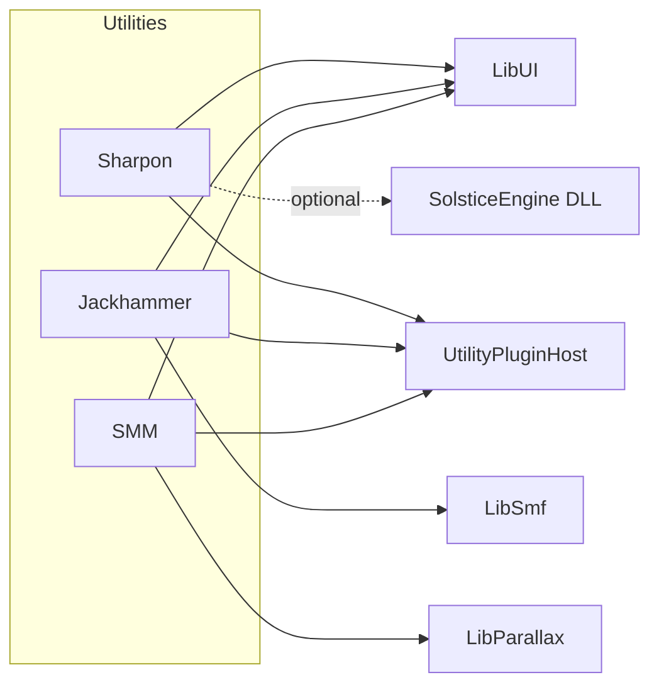

# Solstice utilities (authoring tools)

Solstice ships three **desktop authoring utilities** under [`utilities/`](../utilities/). They share **[LibUI](../utilities/LibUI/)** (SDL3 + ImGui) and are optional at configure time (see **Build** below).

| Name | CMake target | Executable (typical) | Libraries |
| --- | --- | --- | --- |
| **Sharpon** | `Sharpon` | `Sharpon` | LibUI + [UtilityPluginHost](../utilities/UtilityPluginHost/); optional **SolsticeEngine** DLL for Moonwalk and JSON APIs |
| **Jackhammer** | `LevelEditor` | `LevelEditor` | LibUI + [LibSmf](../SDK/LibSmf/) (`.smf`) + UtilityPluginHost |
| **SMM** (Solstice Movie Maker) | `MovieMaker` | `MovieMaker` | LibUI + [LibParallax](../SDK/LibParallax/) + `UI` module + UtilityPluginHost; optional **ffmpeg** CLI |

**CMake names:** *Jackhammer* is the product name for the **LevelEditor** target. *SMM* is the product name for the **MovieMaker** target (project files use `.smm.json`).

SDK libraries [LibSmf](../SDK/LibSmf/) and [LibParallax](../SDK/LibParallax/) are always configured with the main CMake tree; only the three apps above and **LibUI** are gated by **`SOLSTICE_BUILD_UTILITIES`**.



## UtilityPluginHost (shared native plugins)

**Location:** [`utilities/UtilityPluginHost/`](../utilities/UtilityPluginHost/). Small **static** library: UTF-8 `DynamicLibrary` load, a **`UtilityPluginHost`** registry (load/unload, optional **hot-reload** session with a **different replacement file path** — on Windows do not replace the same path while the DLL is loaded; copy to a new name first).

All three authoring tools load optional **`plugins/`** next to the executable (`.dll` / `.so` / `.dylib`). C symbol names are documented in [`UtilityPluginAbi.hxx`](../utilities/UtilityPluginHost/UtilityPluginAbi.hxx) (`SharponPlugin_*`, `LevelEditorPlugin_*`, `MovieMakerPlugin_*`). The host calls optional `OnLoad` / `OnUnload` around module lifetime.

## Technology Preview 1 (utilities)

Early-adopter scope for **Jackhammer** and **SMM**: unsaved-change prompts where applicable, **Undo/Redo** for discrete map edits in Jackhammer, **LibSmf** structural checks surfaced in the validate path, minimal **Parallax channel/keyframe** authoring in SMM, clearer **.prlx** vs **`.smm.json`** copy, and **About** / **Plugins** entry points. Not a full BSP editor or DAW-style timeline.

## Build flag

- **`SOLSTICE_BUILD_UTILITIES`** (default **ON**): when OFF, CMake skips **`utilities/LibUI`**, **Sharpon**, **LevelEditor**, and **MovieMaker**, so CI or minimal trees configure faster. **LibSmf** and **LibParallax** still configure as part of the main project.

## SolsticeEngine DLL

**Sharpon** loads the engine shared library for Moonwalk compile/run and narrative/cutscene validation. Place **`SolsticeEngine.dll`** (or `libsolsticeengine.so`) next to the tool executable, or run from the CMake output `bin` directory where the build places the DLL.

Exports are documented in [SolsticeAPI.md](SolsticeAPI.md).

## Sharpon (Moonwalk + JSON)

**Libraries:** LibUI only at link time; **SolsticeEngine** at runtime for scripting and validation APIs.

**Windows:** the build copies **`LibUI.dll`**, **`SDL3.dll`**, and **`SolsticeEngine.dll`** next to `Sharpon.exe` when those targets exist (see [utilities/Sharpon/CMakeLists.txt](../utilities/Sharpon/CMakeLists.txt)).

- Edit **Moonwalk** scripts, **compile** (`SolsticeV1_ScriptingCompile`), **run** (`SolsticeV1_ScriptingExecute`).
- **Narrative JSON**: validate (`SolsticeV1_NarrativeValidateJSON`), convert to YAML (`SolsticeV1_NarrativeJSONToYAML`).
- **Cutscene JSON**: validate (`SolsticeV1_CutsceneValidateJSON`) — same rules as runtime [CutscenePlayer](../source/Game/Cutscene/CutscenePlayer.hxx).
- **Workspace**: open a **folder** as the script/asset root (persisted with other editor state).
- **Docs**: use **Help → Open documentation folder** when the repo `docs/` path can be resolved.

### Sharpon plugins (optional)

Native plugins are loaded from a **`plugins/`** directory next to the Sharpon executable. Export from the module (see [`utilities/Sharpon/Plugin.hxx`](../utilities/Sharpon/Plugin.hxx) and [`UtilityPluginAbi.hxx`](../utilities/UtilityPluginHost/UtilityPluginAbi.hxx)):

- **`extern "C" const char* SharponPlugin_GetName(void)`** — display name (recommended for a friendly label).
- **`extern "C" void SharponPlugin_OnLoad(void)`** — optional; called after load.
- **`extern "C" void SharponPlugin_OnUnload(void)`** — optional; called before unload.

The **UtilityPluginHost** loader resolves these after `LoadLibrary` / `dlopen`. Keep plugins small and side-effect free.

**Authoring a minimal plugin (CMake sketch):** add a shared library target that links only what it needs, output name `MyPlugin.dll` (or `.so`), and export the symbols above. Install or copy the artifact into **`plugins/`** beside the tool executable. Avoid linking **LibSmf** / **LibParallax** in the same plugin as the host unless you understand ODR and ABI stability; prefer a narrow C API or host-provided callbacks for deep integration.

## Jackhammer (LevelEditor, `.smf`)

**Libraries:** LibUI + **LibSmf** for Solstice Map Format v1.

**Windows:** **`LibUI.dll`** and **`SDL3.dll`** are copied next to **`LevelEditor.exe`** (see [utilities/LevelEditor/CMakeLists.txt](../utilities/LevelEditor/CMakeLists.txt)). LibSmf is static; no extra DLL for maps.

- Open/save **`.smf`** via LibSmf (`Solstice::Smf::LoadSmfFromFile` / `SaveSmfToFile` — see **LibSmf** below). Optional **ZSTD** compression: uncompressed `SmfFileHeader` first, then compressed tail (`Flags` bit 0); Jackhammer exposes **ZSTD compress** on save.
- **Validate map** checks the in-memory map against the binary codec (and can cross-check with **`SolsticeV1_SmfValidateBinary`** when the engine DLL is available — same validation surface as [SolsticeAPI.md](SolsticeAPI.md) / [`Smf.h`](../SDK/SolsticeAPI/V1/Smf.h)). Additional **in-memory structure** messages (duplicate entity names, empty class, duplicate property keys) come from [`SmfMapEditor.hxx`](../SDK/LibSmf/include/Smf/SmfMapEditor.hxx) and appear after validation when relevant.
- **New map** templates provide a minimal valid map to start from.
- **Technology Preview 1:** window title and **Help → About**; **Edit → Undo/Redo** for discrete operations (entities, path table, template, viewport placement); unsaved prompts on **New**, **Open**, and quit when the map is dirty; **View → Plugins** uses the same `plugins/` folder with **`LevelEditorPlugin_*`** exports (see `UtilityPluginAbi.hxx`).

### Jackhammer plugins (optional)

Same `plugins/` directory as other tools; export **`LevelEditorPlugin_GetName`**, optional **`OnLoad`** / **`OnUnload`** (see `UtilityPluginAbi.hxx`).

## SMM — Solstice Movie Maker (`MovieMaker`, `.prlx`)

**Libraries:** LibUI + **LibParallax** (Parallax scene I/O and evaluation) + **`UI`** (motion-graphics compositor). **ffmpeg** is an optional **CLI** on `PATH` or copied next to the exe when configured in CMake — not linked libav.

**Windows:** **`LibUI.dll`** and **`SDL3.dll`** are copied next to **`MovieMaker.exe`**; if **`SOLSTICE_FFMPEG_EXECUTABLE`** is set, **ffmpeg** may be copied beside the exe (see [utilities/MovieMaker/CMakeLists.txt](../utilities/MovieMaker/CMakeLists.txt)).

- Import assets, edit a minimal **Parallax** scene, save **`.prlx`**. Optional **ZSTD**: uncompressed 92-byte `FileHeader` at offset 0, then compressed tail (`Flags` bit 0); UI checkbox **ZSTD compress** and project field `compressPrlx`.
- **MG preview** rasterizes `EvaluateMG` in the viewport (CPU → OpenGL texture).
- **Workflow code** lives under [`utilities/MovieMaker/Workflow/`](../utilities/MovieMaker/Workflow/) (timeline helpers, keyframe nudges); UI calls these APIs instead of duplicating logic.
- **Project file** (`.smm.json`): remembers last paths, import roots, optional ffmpeg path hints, and `compressPrlx`.
- **ffmpeg**: optional CLI; the UI shows whether encoding is available and can copy a diagnostic command.
- **Technology Preview 1:** title bar reflects the preview; **New scene** clears the Parallax document (with unsaved prompt when needed); **Import PARALLAX** / quit similarly guard unsaved scene edits; **Add keyframe at playhead** for the selected element uses `AddChannel` / `AddKeyframe` ([`ParallaxScene.hxx`](../SDK/LibParallax/include/Parallax/ParallaxScene.hxx)); scene summary and light validation come from [`ParallaxEditorHelpers.hxx`](../SDK/LibParallax/include/Parallax/ParallaxEditorHelpers.hxx). **Export .prlx** marks the scene saved for dirty tracking. Arrow / Home / End nudge the playhead when ImGui is not capturing text.

### SMM plugins (optional)

Export **`MovieMakerPlugin_GetName`**, optional **`OnLoad`** / **`OnUnload`** (see `UtilityPluginAbi.hxx`). Same `plugins/` folder next to `MovieMaker`.

Authoring and format details: [MotionGraphics.md](MotionGraphics.md).

---

## LibUI (shared by Sharpon, Jackhammer, SMM)

**Location:** [`utilities/LibUI/`](../utilities/LibUI/). Built as a **shared library** (**`LibUI.dll`** on Windows).

**Role:** SDL3 window integration and a **separate ImGui context** from the game (`LibUI::Core::Context` in [`LibUI/Core/Core.hxx`](../utilities/LibUI/Core/Core.hxx)). Convenience API in **`LibUI::Core`** (`Initialize`, `Shutdown`, `NewFrame`, `Render`, `ProcessEvent`) and higher-level wrappers in **`LibUI::Widgets`**, **`Graphics`**, **`Animation`**, **`Icons`**, **`FileDialogs`**, **`AssetBrowser`**.

**Includes:** CMake sets the public include directory to the **parent** of `LibUI/`, so use:

- `#include "LibUI/Core/Core.hxx"`
- `#include "LibUI/Widgets/Widgets.hxx"` (and other module headers as needed)

**CMake pattern:** `target_link_libraries(MyTool PRIVATE LibUI)` plus OpenGL (`opengl32` on Windows or `OpenGL::GL`). On Windows, post-build copy **`LibUI.dll`** and **`SDL3.dll`** to the executable directory (mirror Sharpon or LevelEditor).

**Persistence:** ImGui state is saved under the SDL base path as **`solstice_tools_imgui.ini`**. Recent paths (newline-separated, max 16) live in **`solstice_tools_recent.txt`**; index **0** is most recent. See comments in [`Core.hxx`](../utilities/LibUI/Core/Core.hxx).

**Offscreen:** `NewFrameOffscreen` / `RenderOffscreen` support ImGui frames without the SDL backend when an OpenGL3 backend is already initialized.

**Viewport math:** [`LibUI/Viewport/ViewportMath.hxx`](../utilities/LibUI/Viewport/ViewportMath.hxx) — orbit → view/projection (column-major for OpenGL), XZ grid and world crosses for editor previews.

**Icons:** Optional icon font: set environment variable **`SOLSTICE_ICON_FONT`** to a `.ttf` path (e.g. Font Awesome 4 `fontawesome-webfont.ttf`) before launch; [`LibUI/Icons/Icons.hxx`](../utilities/LibUI/Icons/Icons.hxx) loads it and uses PUA glyphs for toolbar buttons. **`TryLoadIconAtlasFromFiles`** is reserved for a future PNG/JSON atlas (not implemented yet).

---

## LibSmf (Jackhammer and map tools)

**Location:** [`SDK/LibSmf/`](../SDK/LibSmf/). **Static** library — no separate DLL.

**Role:** Read/write **Solstice Map Format v1** (`.smf`) without loading the full engine for basic I/O.

**Main types and entry points** ([`Smf/SmfBinary.hxx`](../SDK/LibSmf/include/Smf/SmfBinary.hxx), [`SmfMap.hxx`](../SDK/LibSmf/include/Smf/SmfMap.hxx)):

- **`Solstice::Smf::SmfMap`** — entities, properties, path table.
- **`LoadSmfFromFile`**, **`SaveSmfToFile`**, **`LoadSmfFromBytes`**, **`SaveSmfToBytes`**.
- **`SmfTypes.hxx`** — attribute types and values; **`SmfWire.hxx`** — low-level buffer helpers for the codec.
- **`SmfMapEditor.hxx`** — editor helpers: entity/property lookup by name, **`ValidateMapStructure`** for duplicate names / class / property-key issues (tooling only; not a substitute for codec validation).

**Validation:** For parity with the engine, use **`SolsticeV1_SmfValidateBinary`** on the serialized bytes when the SolsticeEngine DLL is available ([SolsticeAPI.md](SolsticeAPI.md)).

---

## LibParallax (SMM / `.prlx`)

**Location:** [`SDK/LibParallax/`](../SDK/LibParallax/). **Static** library with a **large** link closure (Core, Math, MinGfx, Skeleton, Arzachel, Physics, Scripting, Render, Entity, etc.; it also links **LibSmf** privately for shared wire/codec concerns).

**Role:** **`.prlx`** scene load/save, timeline evaluation, motion-graphics (`EvaluateMG`), and related helpers.

**Entry points** ([`Parallax/ParallaxScene.hxx`](../SDK/LibParallax/include/Parallax/ParallaxScene.hxx), [`Parallax.hxx`](../SDK/LibParallax/include/Parallax/Parallax.hxx)):

- **File/bytes:** `LoadScene`, `SaveScene`, `LoadSceneFromBytes`, `SaveSceneToBytes`, `CreateScene`.
- **Editing:** `RegisterBuiltinSchemas`, `AddElement`, `SetAttribute`, channels and keyframes, MG elements/tracks (`AddMGElement`, `AddMGTrack`, `AddMGKeyframe`, …).
- **Evaluation:** `EvaluateScene`, `EvaluateChannel`, `EvaluateMG`; **`ParallaxStreamReader`** in [`ParallaxStream.hxx`](../SDK/LibParallax/include/Parallax/ParallaxStream.hxx) opens a file and evaluates by tick.
- **Authoring helpers:** [`ParallaxEditorHelpers.hxx`](../SDK/LibParallax/include/Parallax/ParallaxEditorHelpers.hxx) — **`GetParallaxSceneSummary`**, **`ValidateParallaxSceneEditing`** (timeline/MG index sanity) for tools and previews.

**Assets:** Implementations may use **`IAssetResolver`** ([`IAssetResolver.hxx`](../SDK/LibParallax/include/Parallax/IAssetResolver.hxx)) with Relic or dev-session resolvers for packaged vs local assets.

**Semantics and authoring:** [MotionGraphics.md](MotionGraphics.md). **ffmpeg** beside SMM is for export/diagnostics only, not part of LibParallax.

---

## Suggested project layout (games)

```
MyGame/
  assets/           # textures, audio, multimedia, glTF, etc.
  scripts/          # Moonwalk (.mw)
  levels/           # .smf maps
  motion/           # .prlx Parallax scenes (optional)
```

## Basic task checklist

1. **Build** with **`SOLSTICE_BUILD_UTILITIES`** ON; confirm **`Sharpon`**, **`LevelEditor`**, **`MovieMaker`** appear in the IDE/solution.
2. **Sharpon**: open workspace folder, compile a one-line `@Entry { print("ok"); }`, run, see output.
3. **Sharpon**: open `example/VisualNovel/assets/sample_narrative.json`, **Validate**; same for `sample_cutscene.json`.
4. **Jackhammer**: **New map**, save `.smf`, **Validate map**, reopen.
5. **SMM**: create/save a project (`.smm.json`), import one file, save `.prlx`, reopen project.

## See also

- [Scripting.md](Scripting.md) — Moonwalk language and natives.
- [Narrative.md](Narrative.md) — narrative and cutscene JSON formats.
- [MotionGraphics.md](MotionGraphics.md) — Parallax and motion graphics.
- [SolsticeAPI.md](SolsticeAPI.md) — SolsticeEngine C API (V1), including SMF validation.
